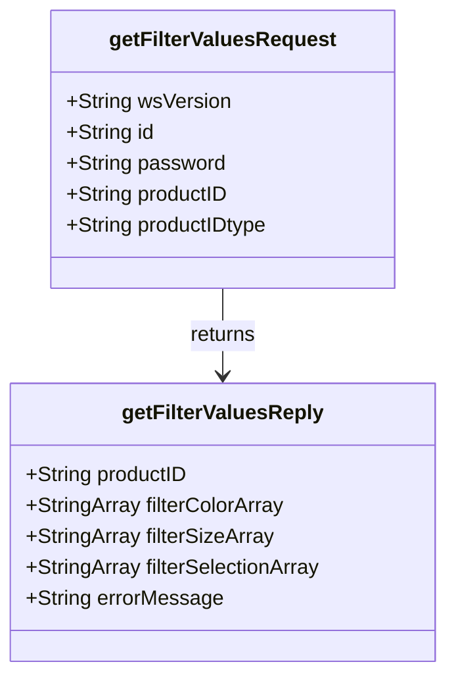
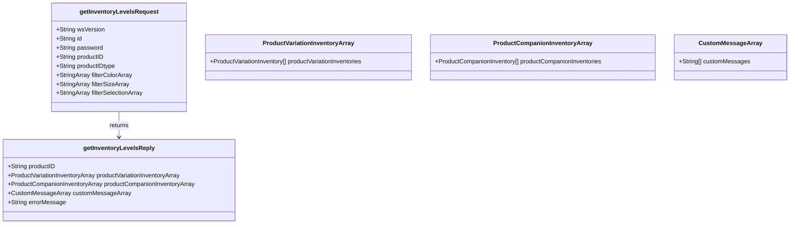

# **PROMOTIONAL PRODUCTS DATA INTERFACE SPECIFICATION FOR WEB SERVICES**

# Inventory Interface Standards

Version: 1.2.1

Date: 14-Apr-2015

Document Change Log

| Version | Date       | Reason for Change | Author |
| ------- | ---------- | ----------------- | ------ |
| .1      | 2014-2-10  | Initial Draft | Eric Shonebarger, CIO Hit Promotional Products |
| .2      | 2014-02-19 | Review by BIC Graphic personnel: Removed authentication standard in lieu of all parties using following their standards. Added ProductIDType to Request: Added companion inventory to Reply: Added multiple array detail fields | Tim Nale, Director IT BIC Graphic |
| .3      | 2014-03-03 | Modified Custom Attributes to ARRAY Added reference to Data Mining / Abuse | Tim Nale, Director IT BIC Graphic |
| 1.0     | 2014-03-27 | Modified Quantity Available data type; added version control | Tim Nale, Director IT BIC Graphic |
| 1.0.0   | 2014-04-28 | Updated casing on field names and Array Naming convention | Jon Norris, System Operations Manager Starline |
| 1.2.0   | 2015-3-24  | Added Color, Size, and Generic Selection Criteria. Added controlled list of Error Codes | Tim Nale, Director IT BIC Graphic |
| 1.2.1   | 2015-3-31  | Correct getFilterValue Request and Reply for proper naming of uniqueness | Tim Nale, Director IT BIC Graphic |
| 1.2.1   | 2015-4-14  | Added entryType to ProductCompanionInventory documentation. This was already in WSDL just excluded from documentation.  Modified error code 115 to include "not"  Added error code 120: generic way to handle required fields  Added error code 125: generic way to handle "not supported" error messages  Corrected typo in field name to match WSDL in "GetFiltervaluesReply" from "filterSelectionsArray" to "filterSelectionArray"  Corrected typo in field name to match WSDL in "Request" from "filterSelectionsArray" to "filterSelectionArray" | Jon Norris, VP Operations, Starline |

## Abstract and Recommended Audience

This document describes the technologies for integration of suppliers and distributors in the Promotional Products Industry. This document will discuss in detail the technology required in order to build the interface. Additionally, this document will provide sample code in order to use the interface.

This document will assume that the reader is fluent in web based technologies, and has knowledge of the language they plan to consume the web service in.

Background Information

All specifications will be built using the Simple Object Access Protocol (SOAP) over HTTPS as the foundation for the web services protocol stack in order to provide a standards based secure form of communication.

More information on SOAP can be found at [http://www.w3.org/TR/soap12-part1/](http://www.w3.org/TR/soap12-part1/)

Previous Versions

Inventory 1.0.0 - replaced 04/01/2015:

[View Documentation](https://tools.promostandards.org/9-webservice-documentation/7-inventory?tmpl=component)

## Inventory

There will be two functions available as part of this web service.

- getFilterValues()
- getInventoryLevels()

### Function: getFilterValues()

This function is optional and can be called to get the List of Values that can be passed to the getInventoryLevels function to limit the result set.

### GetFilterValuesRequest Object

| Field         | Description                                              | Data Type             | Required? |
| ------------- | -------------------------------------------------------- | --------------------- | --------- |
| wsVersion     | The Standard Version of the Web Service being referenced | 64 STRING: Enumerated | TRUE      |
| id            | The customerID or any other agreed upon ID.              | 64 STRING             | TRUE      |
| password      | The password associated with the customerID.             | 64 STRING             | FALSE     |
| productID     | Item's ID                                                | 64 STRING             | TRUE      |
| productIDtype | productID type (Distributor, Supplier)                   | 64 STRING             | TRUE      |

### GetFilterValuesReply Object

| Field                | Description | Data Type | Required? |
| -------------------- | ----------- | --------- | --------- |
| productID            | The associated product. | 64 STRING | TRUE |
| filterColorArray     | An array of different selections the product is offered and can be provided as a filter to Inventory Service getInventoryLevels. | 256 STRING ARRAY | FALSE |
| filterSizeArray      | An array of different selections the product is offered and can be provided as a filter to Inventory Service getInventoryLevels. | 256 STRING ARRAY | FALSE |
| filterSelectionArray | An array of different selections other than Color and Size the product is offered and can be provided as a filter to Inventory Service getInventoryLevels. | 256 STRING ARRAY | FALSE |
| errorMessage         | Response for any error requiring notification to requestor | 256 STRING: Enumerated | FALSE |

### Function: getInventoryLevels()

This function will provide the results of the current Inventory Levels for the product enquired filter by the criteria provided.

### Request:

| Field | Description | Data Type | Required? |
| --- | --- | --- | --- |
| wsVersion | The Standard Version of the Web Service being referenced | 64 STRING: Enumerated | TRUE |
| id | The customerID or any other agreed upon ID. | 64 STRING | TRUE |
| password | The password associated with the customerID. | 64 STRING | FALSE |
| productID | Item's ID | 64 STRING | TRUE |
| productIDtype | productID type (Distributor, Supplier) | 64 STRING | TRUE |
| filterColorArray | An array of different Colors the Inventory is requested | 256 STRING ARRAY | FALSE |
| filterSizeArray | An array of different Sizes the Inventory is requested | 256 STRING ARRAY | FALSE |
| filterSelectionArray | An array of different selections (generic) other than Color and Size the Inventory is requested | 256 STRING ARRAY | FALSE |

### Reply:

| Field     | Description | Data Type | Required? |
| --------- | --- | --- | --- |
| productID | The associated product. | 64 STRING | TRUE |
| productVariationInventoryArray | An array of inventory levels grouped by variation. | ARRAY | FALSE |
| productCompanionInventoryArray | Array of companion items' inventory levels. | ARRAY | FALSE |
| errorMessage | Response for any error requiring notification to requestor | 256 STRING: Enumerated | FALSE |
| CustomMessageArray | An array of custom data that the supplier/distributor is free to implement in any way they see fit. | ARRAY | FALSE |

### ProductVariationInventory Object

| Field | Description | Data Type | Required? |
| --- | --- | --- | --- |
| partID | The associated part | 64 STRING | TRUE |
| partDescription | Part's description | 256 STRING | FALSE |
| partBrand | Part's brand | 64 STRING | FALSE |
| priceVariance | Variance from requested part's price | 64 STRING | FALSE |
| quantityAvailable | The quantity available | 64 STRING | TRUE |
| attributeColor | Description of the color of the part | 64 STRING | FALSE |
| attributeSize | Description of the size of the part | 64 STRING | FALSE |
| attributeSelection | Description of the generic selection criteria of the part | 64 STRING | FALSE |
| AttributeFlexArray | Array of the part's attributes | ARRAY | FALSE |
| customProductMessage | Message from the supplier regarding the stock | 256 STRING | FALSE |
| entryType | Record type (exact, alternate) | 64 STRING | FALSE |
| validTimestamp | Datetime inventory is available | ISO 8601 | FALSE |

### ProductCompanionInventory Object

| Field | Description | Data Type | Required? |
| ------ | --- | --- | --- |
| partID | The companion part | 64 STRING | TRUE |
| partDescription | Part's description | 256 STRING | FALSE |
| partBrand | Part's brand | 64 STRING | FALSE |
| price | Companion item price | 64 STRING | FALSE |
| quantityAvailable | The quantity available | 64 STRING | TRUE |
| attributeColor | Description of the color of the part | 64 STRING | FALSE |
| attributeSize | Description of the size of the part | 64 STRING | FALSE |
| attributeSelection | Description of the generic selection criteria of the part | 64 STRING | FALSE |
| entryType | Record type (exact, alternate) | 64 STRING | FALSE |
| AttributeFlexArray | Array of the part's attributes | ARRAY | FALSE |
| customProductMessage | Message from the supplier regarding the stock | 256 STRING | FALSE |
| validTimestamp | Datetime inventory is available | ISO 8601 | FALSE |

### CustomMessage Object

Suppliers and distributors are free to use the custom array however they wish.

### AttributeFlex Object

| Field | Description     | Data Type  | Required? |
| ----- | --------------- | ---------- | --------- |
| ID    | Attribute ID    | 64 STRING  | FALSE     |
| Name  | Attribute Name  | 64 STRING  | FALSE     |
| Value | Attribute Value | 256 STRING | FALSE     |

The Supplier can use this ARRAY to define additional unique attributes about the product. An example could be for an item which has choices about thickness which can be made.

In this ID = "1"; Name = "Thickness"; Value = "0.10 inches"

## CustomProductMessage Object

Suppliers and distributors are free to use this custom message String however they wish.

Enumerated Type Restrictions

| wsVersion | The Standard Version of the Web Service being referenced | 64 STRING: Enumerated | 1.0.0  1.2.1 |
| --------- | -------------------------------------------------------- | --------------------- | ----------- |

| errorMessage | Response for any error requiring notification to requestor               | 256 STRING: Enumerated | 100: ID (customerID) not found  105: Authentication Credentials failed  110: Authentication Credentials required 115: wsVersion not found 120: The following field(s) are required [Comma Delimited field names] 125: Not Supported 200: ProductID not found 205: ProductColor not found 210: ProductSize not found 999: General Error – Contact the System Service Provider  |
| ------------ | ---------------------------------------------------------------------------- | ---------------------- | ------------------------------ |
    

## Code Samples

To be published under separate specification: "Inventory Interface Supplier/Distributor Developer Guide"

[Inventory Interface Supplier Developer Guide 1.2.1](https://docs.google.com/document/d/1fiFJy9_7ZHCR7sh7nQIr5PykXynXJYIkpxuTwOOfqCU/edit?usp=sharing)

### DATA MINING / ABUSE GUIDELINE

The use of services detailed within this specification are to be conducted within the current guidelines of the "Interface Data Use Guidelines Standards"

## Validation of Services

Before you publish your endpoint, please ensure that it adheres to the [promostandards.org](https://promostandards.org) spec by using the web service validation tool.

[https://services.promostandards.org/webserviceValidator/home](https://services.promostandards.org/webserviceValidator/home)

Select the service, version, method and input your endpoint. If the endpoint is correct you should receive a message of:

"The XML response is valid."

© 2021 PromoStandards

## Diagrams

### getFilterValues

### getInventoryLevels

