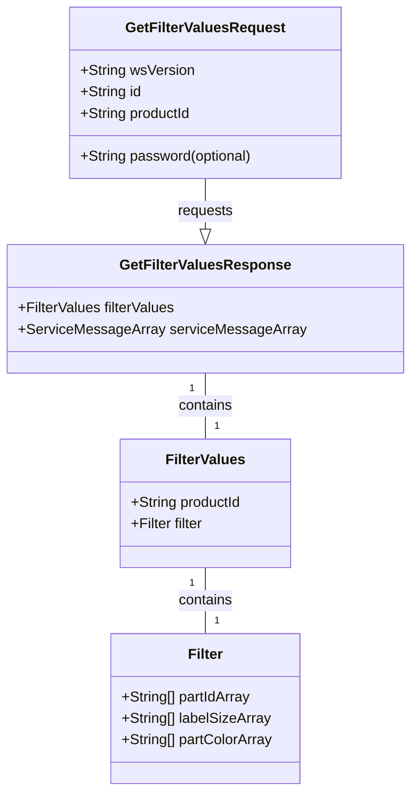
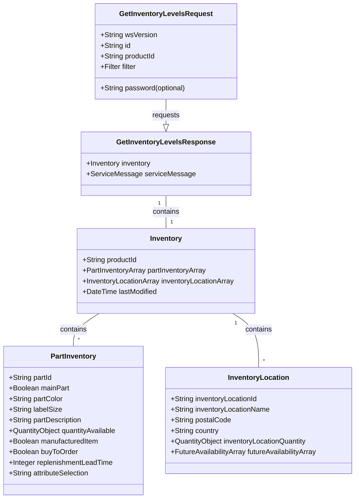
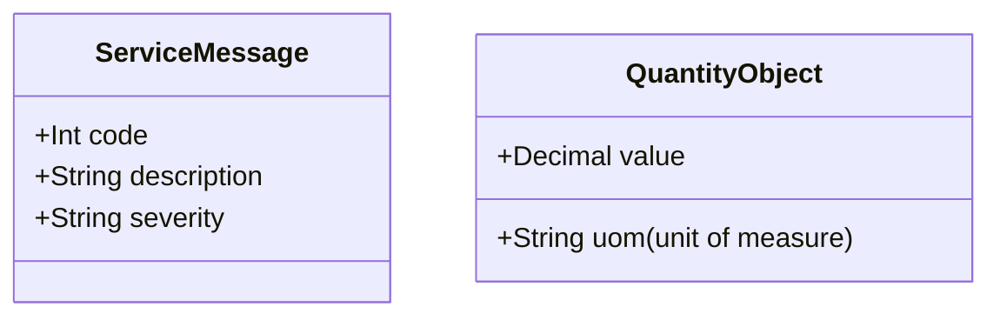

# **PROMOTIONAL PRODUCTS DATA INTERFACE SPECIFICATION FOR WEB SERVICES**

## **Inventory 2.0.0**
**Version**: 2.0.0  
**Date**: 2017-17-03  

---

## **Document Change Log**

| Version  | Date       | Reason for Change                                                                  | Author  |
| -------- | ---------- | ---------------------------------------------------------------------------------- | ------- |
| 2.0.0RC1 | 11/03/2017 | Initial Draft                                                                      | Raj Mukherjee, Integration Team Lead, Hit Promotional Products Inc  Eric Shonebarger, CIO, Hit Promotional Products Inc |
| 2.0.0RC2 | 11/17/2017 | Renamed `GetFilterValuesReply` to `GetFilterValuesReponse` Renamed `InventoryRequest` to `GetInventoryLevelsRequest` Renamed `InventoryReply` to `GetInventoryLevelsResponse` Changed id in `GetInventoryLevelsRequest` to be required Changed password in `GetInventoryLevelsRequest` to be optional All token types have been changed to strings.  We used tokens very early on and then switched to strings. Added `ErrorMessageArray` to match PO spec.  Updated `ErrorMessage` object to include severity element. Simplified filtering in both `GetInventoryLevelsRequest` and `GetyFilterValuesResponse` to use an object called "Filter". `futureAvailableInventoryQuantity` and `futureAvailableInventoryTimeStamp` changed to required. The `FutureAvailabilityArray` is optional, so when specifying an element in the array, it must have this info. Changed `address1`,`address2`,`address3` and `address4` to string array and renamed to `addressLines` to match the PO spec. Updated default endpoint location to "[Endpoint URL]" Renamed `partSize` to `labelSize` to match ProductData spec. Renamed `colorName` to `partColor` to match ProductData spec. Renamed `filterSize` to `labelSizeEnum` to match ProductData spec. Renamed `futureAvailableInventoryTimeStamp` to `arrivalDate` Changed `quantityAvailable` to use `Quantity` object Changed `onOrderQuantity` to use `Quantity` object Changed `futureAvailableInventoryQuantity` to use `Quantity` object Changed `warehouseName` to be optional Changed `Address` object to be optional | Paul Fleischman, Technical Lead, PCNA |
| 2.0.0RC2 | 11/20/2017 | Renamed `Warehouse` object to `InventoryLocation` Renamed `warehouseName` to `inventoryLocationName` Renamed `warehouseQuantity` to `inventoryLocationQuantity` Renamed `warehouseId` to `inventoryLocationId` | Paul Fleischman, Technical Lead, PCNA |
| 2.0.0RC3 | 12/7/2017  | Renamed `ErrorMessage` to `ServiceMessage` | Paul Fleischman, Technical Lead, PCNA |
| 2.0.0RC4 | 02/26/2018 | Changes made based on February meeting: Removed `partId` element from `GetFilterValuesRequest` Created a `partIdArray` within the Filter object Changed the `FilterArray` to not be an array within `GetFilterValuesResponse`. A single instance is all that is needed because of the new `partIdArray` within the Filter object. | Paul Fleischman, Technical Lead, PCNA |
| 2.0.0RC4 | 05/10/2018 | On the `SharedObjectsInventory.xsd`: o added mentioned `partIdArray` definition o Removed `FilterValues` definition o Replaced the `partId` with a `partIdArray` on the Filter definition. | Raj Mukherjee, Integration Team Lead, Hit Promotional Products Inc  Tim Dietrich, NetSuite Integrator / PromoStandards Implementer |
| 2.0.0    | 07/24/2018 | On the `SharedObjectsInventory.xsd`: added `replenishmentLeadTime` Removed `SelectionArray` definition from Filter object | Raj Mukherjee, Integration Team Lead, Hit Promotional Products Inc |

---

## **Contributors**
- **Raj Mukherjee**, Integration Team Lead, Hit Promotional Products, Inc
- **Paul Fleischman**, Technical Lead, PCNA
- **Eric Shonebarger**, CIO, Hit Promotional Products, Inc
- **Jon Norris**, VP of Operations, Starline

---

## **Abstract and Recommended Audience**
This document describes the technologies for integration of suppliers and distributors in the Promotional Products Industry. It provides details on the technology required to build the interface and offers sample code. The reader is expected to be fluent in web-based technologies.

---

## **Background Information**
Specifications are built using the Simple Object Access Protocol (SOAP) over HTTPS for secure communication. More information on SOAP can be found at [w3.org](http://www.w3.org/TR/soap12-part1/).

---

## **Service Details**

- **Function: [getFilterValues()](#function-getfiltervalues)**: 
  
  Gets the different variations on a product, broken out by size, colour, selection.
  
- **Function: [getInventoryLevels()](#function-getinventorylevels)**: 
  
  Provides inventory levels for a product by product and inventory location. It also provides future stock details.

---

## **Function: getFilterValues()**

**Description**: Gets the different variations on a product, broken out by size, color, and selection.

### **Request: GetFilterValuesRequest**

| Field | Description | WSDL Data Type | SQL Data Type | Required? |
|-------|-------------|----------------|---------------|-----------|
| wsVersion | The Standard Version of the Web Service being referenced. Values are enumerated \{2.0.0\} | STRING | VARCHAR(64) | TRUE |
| id | The customerId or any other agreed upon Id. | STRING | VARCHAR(64) | TRUE |
| password | The password associated with the customerId. | STRING | VARCHAR(64) | FALSE |
| productId | The Product Id | STRING | VARCHAR(64) | TRUE |

### **Reply: GetFilterValuesResponse**

| Field | Description | WSDL Data Type | SQL Data Type | Required? |
|-------|-------------|----------------|---------------|-----------|
| [FilterValues](#filtervalues) | An object containing the variations of a product by size, color, selection, etc. | OBJECT | OBJECT | FALSE |
| [ServiceMessageArray](#servicemessage-object) | Error message object Array | OBJECT ARRAY | OBJECT ARRAY | FALSE |

### **FilterValues**

| Field | Description | WSDL Data Type | SQL Data Type | Required? |
|-------|-------------|----------------|---------------|-----------|
| productId | The product id | VARCHAR(64) | VARCHAR(64) | TRUE |
| [Filter](#filter) | A Filter Object that contains the variations of a product by part, size, and/or color. | OBJECT | OBJECT | TRUE |

---

## **Function: getInventoryLevels()**

**Description**: Gets the different inventory levels for the product broken out by product and inventory location. It also provides details on future stock for the product.

### **Request: getInventoryLevelsRequest**

| Field | Description | WSDL Data Type | SQL Data Type | Required? |
|-------|-------------|----------------|---------------|-----------|
| wsVersion | The Standard Version of the Web Service being referenced. Values are enumerated \{2.0.0\} | STRING | VARCHAR(64) | TRUE |
| id | The customer Id or any other agreed upon Id. | STRING | VARCHAR(64) | TRUE |
| password | The password associated with the Id. | STRING | VARCHAR(64) | FALSE |
| productId | The Product Id | STRING | VARCHAR(64) | TRUE |
| [Filter](#filter) | Filter the response of `getInventoryLevels` by using a portion of the filter information received in the response of `GetFilterValuesRequest`. | OBJECT | OBJECT | FALSE |

### **Reply: getInventoryLevelsResponse**

| Field | Description | WSDL Data Type | SQL Data Type | Required? |
|-------|-------------|----------------|---------------|-----------|
| [Inventory](#inventory) | An object containing inventory by part and inventory location. Also shows future inventory by part and inventory location. | OBJECT | OBJECT | FALSE |
| [ServiceMessageArray](#servicemessage-object) | Service message object | OBJECT | OBJECT | FALSE |

### **Inventory**

| Field     | Description | WSDL Data Type | SQL Data Type | Required? |
|-----------|-------------|----------------|---------------|-----------|
| productId | The product id | VARCHAR(64) | VARCHAR(64) | TRUE |
| [PartInventoryArray](#partinventory) | An array of ProductVariation objects | OBJECT ARRAY | OBJECT ARRAY | FALSE |

---

### PartInventoryArray

An array of ProductVariation objects

### PartInventory

| Field                  | Description                                                                                                                                                            | WSDL Data Type       | SQL Data Type      | Required? |
|------------------------|------------------------------------------------------------------------------------------------------------------------------------------------------------------------|----------------------|--------------------|-----------|
| partId                 | The part id                                                                                                                                                            | VARCHAR(64)          | VARCHAR(64)        | TRUE      |
| mainPart               | A boolean value indicating if this is a main part of the product. In a tumbler with an optional lid configuration, the parts associated with the tumbler would be set to TRUE. The parts associated with the Lid would be set to false. | BOOLEAN             | BOOLEAN            | TRUE      |
| partColor              | Description of the color of the part                                                                                                                                   | VARCHAR(64)          | VARCHAR(64)        | FALSE     |
| labelSize              | The apparel items tagged size. Enumerated values: \{6XS,5XS,4XS,3XS,2XS,XS,S,M,L,XL,2XL,3XL,4XL,5XL,6XL,CUSTOM\} CUSTOM is used for any size that does not match one of the other sizes. For example 7XL and 8XL would return CUSTOM. To identify the actual size when CUSTOM is returned, reference the Product Data endpoint. | ENUMERATED STRING   | VARCHAR(6)         | FALSE     |
| partDescription        | Description of the part                                                                                                                                                 | VARCHAR(256)         | VARCHAR(256)       | FALSE     |
| quantityAvailable      | A quantity object containing the sum of inventory of all inventory locations of the part                                                                                | QUANTITY OBJECT      | QUANTITY OBJECT    | FALSE     |
| manufacturedItem       | Indicates that the supplier produces this part according to demand. The supplier may keep a limited amount of inventory or inventory may be 0.                          | BOOLEAN             | BOOLEAN            | TRUE      |
| buyToOrder             | Indicates that the supplier purchases this product to order. The supplier may keep a limited amount of inventory, show available inventory to buy, or it might be 0.   | BOOLEAN             | BOOLEAN            | TRUE      |
| replenishmentLeadTime  | Time to replenish buy to order or made to order                                                                                                                         | INT(3)               | INT(3)             | FALSE     |
| attributeSelection     | A string describing the attribute of the product other than size and color                                                                                             | VARCHAR(64)          | VARCHAR(64)        | FALSE     |
| [InventoryLocationArray](#inventorylocation) | An array of InventoryLocation objects                                                                                                                                   | ARRAY                | ARRAY              | FALSE     |
| lastModified           | A date timestamp in UTC specifying the last time inventory was modified.                                                                                                | DATETIME             | DATETIME           | FALSE     |

## InventoryLocation

| Field                      | Description                                                                                     | WSDL Data Type  | SQL Data Type   | Required? |
|----------------------------|-------------------------------------------------------------------------------------------------|-----------------|-----------------|-----------|
| inventoryLocationId        | The inventory location id                                                                       | VARCHAR(64)     | VARCHAR(64)     | TRUE      |
| inventoryLocationName      | The name of the inventory location                                                              | VARCHAR(64)     | VARCHAR(64)     | FALSE     |
| postalCode                 | The postal code                                                                                 | STRING          | VARCHAR(10)     | FALSE     |
| country                    | The country in ISO 3166-2 format                                                                | STRING          | VARCHAR(2)      | FALSE     |
| [inventoryLocationQuantity](#quantity)  | An object which contains available to order quantity for this inventory location                | QUANTITY OBJECT | QUANTITY OBJECT | TRUE      |
| [FutureAvailabilityArray](#futureavailability-object)    | Array of FutureAvailability objects                                                             | OBJECT ARRAY    | OBJECT ARRAY    | FALSE     |

## **FutureAvailabilityArray**

This array provides details about the future availability of specific parts of a product.

### FutureAvailability

| Field | Description | WSDL Data Type | SQL Data Type | Required? |
|-------|-------------|----------------|---------------|-----------|
| [Quantity](#quantity) | Future net available inventory quantity for the part/inventory location combination indicating goods on order or future quantity at manufactured goods. | QUANTITY OBJECT | QUANTITY OBJECT | TRUE |
| availableOn | A date timestamp in UTC specifying the valid timestamp depicting when the inventory will be available for allocation to sales orders. | DATETIME | DATETIME | TRUE |

## **Filter**

| Field | Description | WSDL Data Type | SQL Data Type | Required? |
|-------|-------------|----------------|---------------|-----------|
| partIdArray | A list of part ids to be used when filtering | STRING ARRAY | VARCHAR(64) | FALSE |
| LabelSizeArray | An array of labelSize object | STRING ARRAY | VARCHAR(64) | FALSE |
| PartColorArray | A list of colors to be used when filtering | STRING ARRAY | VARCHAR(64) | FALSE |

## **Quantity**

This object provides details about the quantity value and its unit of measure.

| Field | Description | WSDL Data Type | SQL Data Type | Required? |
|-------|-------------|----------------|---------------|-----------|
| value | The quantity value. | DECIMAL | DECIMAL(12,4) | TRUE |
| uom   | The unit of measure; values are enumerated. Values include:  BX (Box),  CA (Case),  DZ (Dozen),  EA (Each),  KT (Kit),  PR (Pair),  PK (Package),  RL (Roll),  ST (Set),  SL (Sleeve),  TH (Thousand) | ENUMERATED STRING | VARCHAR(2) | TRUE |

## **Appendix A: Error Messages**

### **ServiceMessage Object**

| Field | Description | WSDL Data Type | SQL Data Type | Required? |
|-------|-------------|----------------|---------------|-----------|
| code  | The numerical value of the code | INT | INT | TRUE |
| description | Response for any message requiring notification to requestor | STRING | VARCHAR(256) | TRUE |
| severity | 	The severity of the message.  Values are enumerated: \{`Error`, `Information`, `Warning`\} | ENUMERATED STRING | VARCHAR(64) | TRUE |

## **Standardized Codes**

 Codes range from `100-199` for standardized error codes.
 The number `999` is reserved for a "General Error - Contact System Service Provider".

| Code  | Description                                                              |
| ----- | ------------------------------------------------------------------------ |
| 100   | ID (customerID) not found |
| 104   | This account is unauthorized to use this service.  Please contact the service provider |
| 105   | Authentication Credentials failed |
| 110   |  Authentication Credentials required |
| 115   | wsVersion not found |
| 120   | The following field(s) are required [Comma Delimited field names] |
| 125   | Not Supported |
| 999   | General Error – Contact the System Service Provider Details: [Details] |

**Service Specific Code**: These error codes are only for this service.

| Code  | Description                                                              |
| ----- | ------------------------------------------------------------------------ |
| 600   | Product Id not found  |
| 610   | Data violation: \{0\} (Occurs when a supplier does a pre-check on the data and finds that there is a mismatch of data and/or there are incorrect calculations)| 
| 620   | Field is not supported: \{0\} |
| 630   | Part Id not found |

---

## Diagrams

### getFilterValues

### getInventoryLevels

### Class Diagram for ServiceMessage and QuantityObject
  
