# PROMOTIONAL PRODUCTS DATA INTERFACE SPECIFICATION FOR WEB SERVICES

## Invoice 1.0.0

**Version**: 1.0.0  
**Release Date**: 2020-01-27  

## Document Change Log

| Version |  Date      | Reason for Change | Authors |
|---------|------------|-------------------|---------|
| 1.0.0   | 2020-01-27 | Version 1.0.0 Release | Stephen Luisser - Essent Corporation Peter Tu - AnyPromo Paul Fleischman - PCNA |

## Contributors
The following have contributed to the creation of this specification:

*Authors:*
- **Stephen Luisser** - Essent Corporation
- **Peter Tu** - AnyPromo
- **Paul Fleischman** - PCNA

## Abstract and Recommended Audience
This document describes the technologies for the integration of suppliers and distributors in the Promotional Products Industry. It provides sample code for the interface and assumes the reader is fluent in web-based technologies.

## Background Information
All specifications will be built using the Simple Object Access Protocol (SOAP) over HTTPS as the
foundation for the web services protocol stack in order to provide a standards based secure form of
communication.
More information on SOAP can be found at [w3](http://www.w3.org/TR/soap12-part1/).

## **Service Details:**
- [getInvoices](#getinvoices)
- [getVoidedInvoices](#getvoidedinvoices)

## **`getInvoices()`**

This function sends invoices based on the criteria provided in the `queryType` field.

### **Request: GetInvoiceRequest**

| Field             | Description                                               | Data Type      | Required |
|-------------------|-----------------------------------------------------------|----------------|----------|
| wsVersion         | Standard Version of the Web Service (e.g., \{1.0.0\})       | 64 STRING      | TRUE     |
| id                | customerId or other agreed upon Id                        | 64 STRING      | TRUE     |
| password          | Password associated with customerId                       | 64 STRING      | FALSE    |
| queryType         | Type of invoice query requested                           | Enumerated INT | TRUE     |
| referenceNumber   | PO number for queryType =1 or invoice number for queryType = 2 | 64 STRING | FALSE |
| requestedDate     | Date of the invoice for queryType = 3                          | DATE           | FALSE    |
| availableTimeStamp| Beginning date time since an invoice was made available in UTC | DATETIME | FALSE |

### **GetInvoiceRequest queryType**

| queryType | Short Name                 | Description |
|-----------|----------------------------|-------------|
| 1         | PO Number Search           | Search for invoices by purchase order number |
| 2         | Invoice Number Search      | Search for invoice by invoice number |
| 3         | Date Search                | Search for invoices with an invoice date specified by the requestedDate |
| 4         | Available Date Time Search | Search for invoices that were made available by a date time greater than the value specified by availableTimeStamp |

### **Reply: GetInvoiceResponse**

| Field              | Description                        | Data Type | Required |
|--------------------|------------------------------------|-----------|----------|
| [InvoiceArray](#invoice-object)       | Array of invoice objects           | ARRAY     | FALSE    |
| [ServiceMessageArray](#servicemessage-object)| Array of ServiceMessage objects    | OBJECT    | FALSE    |

## **Invoice Object**

| Field                   | Description                                                                 | Data Type   | Required |
|-------------------------|-----------------------------------------------------------------------------|-------------|----------|
| invoiceNumber           | The invoice number                                                          | 64 STRING   | TRUE     |
| invoiceType             | The type of invoice; values are enumerated: `INVOICE`, `CREDIT MEMO`        | 64 STRING   | TRUE     |
| invoiceDate             | The date the invoice was generated                                          | DATE        | TRUE     |
| purchaseOrderNumber     | The purchase order number                                                   | 64 STRING   | FALSE    |
| purchaseOrderVersion    | The version of the purchase order number                                    | 64 STRING   | FALSE    |
| [BillTo](#accountinfo-object)                  | The Bill To Address (AccountInfo Object)                                    | OBJECT      | FALSE    |
| [SoldTo](#accountinfo-object)                  | The Sold To Address (AccountInfo Object)                                    | OBJECT      | FALSE    |
| invoiceComments         | General comments for the invoice                                            | STRING      | FALSE    |
| paymentTerms            | The terms of the invoice                                                    | 64 STRING   | FALSE    |
| paymentDueDate          | The Date the invoice must be paid in full without incurring late charges    | DATE        | TRUE     |
| currency                | The currency of the invoice in ISO4217 format                               | STRING      | TRUE     |
| fobId                   | The fob point of the invoice                                                | 64 STRING   | FALSE    |
| salesAmount             | The amount of the sale in the specified currency                            | DOUBLE      | TRUE     |
| shippingAmount          | The amount of the shipping charges in the specified currency                | DOUBLE      | TRUE     |
| handlingAmount          | The amount of the handling charges in the specified currency                | DOUBLE      | TRUE     |
| taxAmount               | The total amount of taxes in the currency specified                         | DOUBLE      | TRUE     |
| invoiceAmount           | The total amount of the invoice in the currency specified. Note: invoiceAmount = salesAmount + shippingAmount + handlingAmount + taxAmount | DOUBLE      | TRUE     |
| advancePaymentAmount    | The amount of any advanced payments in the currency specified. If the source system does not support including prepayments on an invoice this value should be set to zero. | DOUBLE      | TRUE     |
| invoiceAmountDue        | The total of the invoice amount due after applying any prepayments in the currency specified. Note: invoiceAmountDue = invoiceAmount - advancePaymentAmount | DOUBLE      | TRUE     |
| invoiceDocumentUrl      | The url to be able to download the physical invoice document.               | 1024 STRING | FALSE    |
| [InvoiceLineItemsArray](#invoicelineitem-object)   | An array of invoice line item objects                                       | OBJECT ARRAY    | TRUE     |
| [SalesOrderNumbersArray](#salesordernumber-object)  | An array of sales order numbers included in the invoice                    | 64 STRING ARRAY | FALSE    |
| [TaxArray](#tax-object)                | An array of tax objects. The sum of the taxes within this array should equal the value in the taxAmount field. | OBJECT ARRAY    | FALSE    |
| invoicePaymentUrl       | The url used to submit payment for the invoice                             | 1024 STRING    | FALSE    |

## **InvoiceLineItem Object**

| Field                        | Description                                                   | Data Type   | Required |
|------------------------------|---------------------------------------------------------------|-------------|----------|
| invoiceLineItemNumber        | The line item number of the line item                         | DOUBLE     | FALSE    |
| productId                    | The productId when the line item applies to a product         | 64 STRING  | FALSE    |
| partId                       | The partId when the line item applies to a product            | 64 STRING  | FALSE    |
| chargeId                     | The chargeId when the line item applies to a charge           | 64 STRING  | TRUE     |
| purchaseOrderLineItemNumber  | The line item number of the purchase order that the invoice references | 64 STRING | FALSE |
| orderedQuantity              | The quantity ordered by the referenced purchase order         | DOUBLE     | FALSE    |
| invoiceQuantity              | The quantity of the line item invoiced                        | DOUBLE     | TRUE     |
| backOrderedQuantity          | The quantity of the line item backordered                     | DOUBLE     | FALSE    |
| quantityUOM                  | The unit of measure of the `orderQuantity`, `invoicedQuantity`, and `  ` | 2 STRING (FACIT) | TRUE |
| lineItemDescription          | A textual description of the line item                        | 1024 STRING| TRUE     |
| unitPrice                    | The price of the unit in the currency of the purchase order   | DOUBLE     | TRUE     |
| discountAmount               | An amount of discount applied to the item                     | DOUBLE     | FALSE    |
| extendedPrice                | The extended price for the line item. Note: extendedPrice = (unitPrice * invoicedQuantity) - discountAmount                          | DOUBLE     | TRUE     |
| distributorProductId         | The distributor’s productId for the item when the line item applies to a product | 64 STRING | FALSE |
| distributorPartId            | The distributor’s partId for the item when the line item applies to a product | 64 STRING | FALSE |    

## **AccountInfo Object**

| Field           | Description                                                   | Data Type   | Required |
|-----------------|---------------------------------------------------------------|-------------|----------|
| accountName     | The name of the account that will be invoiced for the purchase order. This also represents the `companyName` field from the PO. | 64 STRING | FALSE |
| accountNumber   | The account number invoiced.                                  | 64 STRING   | FALSE |
| attentionTo     | Attention To (first and last name of contact)                 | 64 STRING   | FALSE |
| address1        | Address line 1                                                | 35 STRING   | FALSE |
| address2        | Address line 2                                                | 35 STRING   | FALSE |
| address3        | Address line 3                                                | 35 STRING   | FALSE |
| city            | The city                                                      | 30 STRING   | FALSE |
| region          | The 2 character US state abbreviation or 2-3 character non-US region. | 3 STRING | FALSE |
| postalCode      | The postal code                                               | 10 STRING   | FALSE |
| country         | The country in ISO 3166-2 format                              | 2 STRING    | FALSE |
| email           | The email                                                     | 128 STRING  | FALSE |
| phone           | The phone number                                              | 32 STRING   | FALSE |

## **Tax Object**

| Field            | Description                                                                 | Data Type   | Required |
|------------------|-----------------------------------------------------------------------------|-------------|----------|
| taxType          | The type of tax the identifier applies to. Values are enumerated: “SALES”, “HST/GST”, “PST”, “VAT”. | 64 STRING (FACIT) | TRUE     |
| taxJurisdiction  | The jurisdiction for the tax. For example, NJ, PA or Philadelphia City.     | 64 STRING  | TRUE     |
| taxAmount        | The amount of tax                                                           | DOUBLE     | TRUE     |

## **SalesOrderNumber Object**

| Field            | Description | Data Type | Required |
|------------------|-------------|-----------|----------|
| salesOrderNumber | The sales order associated with the invoice. | 64 STRING | TRUE |

## **`getVoidedInvoices()`**

This function will send voided invoices based on the criteria provided in the `queryType` field.

### **Request: GetVoidedInvoiceRequest**

| Field              | Description                                                                 | Data Type      | Required |
|--------------------|-----------------------------------------------------------------------------|----------------|----------|
| wsVersion          | The Standard Version of the Web Service being referenced. Values are enumerated \{1.0.0\} | 64 STRING | TRUE     |
| id                 | The customerId or any other agreed upon Id                                  | 64 STRING      | TRUE     |
| password           | The password associated with the customerId                                 | 64 STRING      | FALSE    |
| queryType          | The type of invoice query requested                                         | Enumerated INT | TRUE     |
| referenceNumber    | The purchase order number for queryType =1 or the invoice number for queryType = 2 | 64 STRING | FALSE |
| requestedDate      | The date the invoice was voided for queryType = 3. This field does not include a time component | DATE | FALSE |
| availableTimeStamp | Beginning date time since a voided invoice was made available in UTC         | DATETIME       | FALSE    |

### **Reply: GetVoidedInvoiceResponse**

| Field               | Description                                      | Data Type | Required |
|---------------------|--------------------------------------------------|-----------|----------|
| [VoidedInvoiceArray](#voidedinvoice-object)  | An array of voided invoice objects               | ARRAY     | FALSE    |
| [ServiceMessageArray](#servicemessage-object) | An array of ServiceMessage objects               | OBJECT    | FALSE    |

### **VoidedInvoice Object**

| Field               | Description                                                                 | Data Type | Required |
|---------------------|-----------------------------------------------------------------------------|-----------|----------|
| invoiceNumber       | The invoice number                                                          | 64 STRING | TRUE     |
| voidDate            | The date the invoice was voided. This field does not include a time component and it is up to the consuming party to determine if the data should be adjusted if the publishing party is on the other side of the international date line. | DATE | TRUE     |

## **Appendix A: Service Messages**

### **ServiceMessage Object**

| Field       | Description                                | Data Type | Required |
|-------------|--------------------------------------------|-----------|----------|
| code        | The numerical value of the code            | INT       | TRUE     |
| description | Response for any message requiring notification to requestor | 256 STRING | TRUE     |
| severity    | The severity of the message. Values are enumerated: \{Error, Information, Warning\} | ENUMERATED 64 STRING | TRUE |

### **Standardized Codes**

The range of `100-199` has been reserved for standardized error codes. The number `999` has been reserved for an error code that is a “General Error - Contact System Service Provider”.

| Code | Description |
|------|-------------|
| 100  | ID (customerID) not found |
| 104  | This account is unauthorized to use this service. Please contact the service provider |
| 105  | Authentication Credentials failed |
| 110  | Authentication Credentials required |
| 115  | wsVersion not found |
| 120  | The following field(s) are required [Comma Delimited field names] |
| 125  | Not Supported |
| 999  | General Error – Contact the System Service Provider |

### **Service Specific Codes**

These error codes are only for this service.

| Code | Description |
|------|-------------|
| 901  | queryType not found |
| 902  | queryType not supported |
| 903  | No Invoices were found for the requested criteria |

## DATA MINING / ABUSE GUIDELINE
The use of services detailed within this specification are to be conducted within the current guidelines of the “Interface Data Use Guidelines Standards”.

## VALIDATION OF SERVICES
Before you publish your endpoint, please ensure that it adheres to the promostandards.org spec by using the web
service validation tool located at: https://services.promostandards.org/webserviceValidator/home.

Select the service, version, method and input your endpoint. If the endpoint is correct, you should receive a message of: 

"The XML response is valid."

## Diagrams

### getInvoices Function

```mermaid
classDiagram
    class GetInvoiceRequest {
      +String wsVersion
      +String id
      +String password
      +Int queryType
      +String referenceNumber
      +Date requestedDate
      +DateTime availableTimeStamp
    }

    class GetInvoiceResponse {
        +InvoiceArray invoiceArray
        +ServiceMessageArray serviceMessageArray
    }

    class Invoice {
        +String invoiceNumber
        +String invoiceType
        +Date invoiceDate
        +String purchaseOrderNumber
        +String purchaseOrderVersion
        +AccountInfo billTo
        +AccountInfo soldTo
        +String invoiceComments
        +String paymentTerms
        +Date paymentDueDate
        +String currency
        +String fobId
        +Double salesAmount
        +Double shippingAmount
        +Double handlingAmount
        +Double taxAmount
        +Double invoiceAmount
        +Double advancePaymentAmount
        +Double invoiceAmountDue
        +String invoiceDocumentUrl
        +InvoiceLineItemsArray invoiceLineItemsArray
        +SalesOrderNumbersArray salesOrderNumbersArray
        +TaxArray taxArray
        +String invoicePaymentUrl
    }

    class AccountInfo {
        +String accountName
        +String accountNumber
        +String attentionTo
        +String address1
        +String address2
        +String address3
        +String city
        +String region
        +String postalCode
        +String country
        +String email
        +String phone
    }

    class InvoiceLineItem {
        +Double invoiceLineItemNumber
        +String productId
        +String partId
        +String chargeId
        +String purchaseOrderLineItemNumber
        +Double orderedQuantity
        +Double invoiceQuantity
        +Double backOrderedQuantity
        +String quantityUOM
        +String lineItemDescription
        +Double unitPrice
        +Double discountAmount
        +Double extendedPrice
        +String distributorProductId
        +String distributorPartId
    }

    class SalesOrderNumber {
        +String salesOrderNumber
    }

    class Tax {
        +String taxType
        +String taxJurisdiction
        +Double taxAmount
    }

    class ServiceMessage {
        +Int code
        +String description
        +String severity
    }

    GetInvoiceRequest --> GetInvoiceResponse : returns
    GetInvoiceResponse --> Invoice : contains
    Invoice --> AccountInfo : contains
    Invoice --> InvoiceLineItem : contains
    Invoice --> SalesOrderNumber : contains
    Invoice --> Tax : contains
    GetInvoiceResponse --> ServiceMessage : contains
```

### getVoidedInvoices Function

