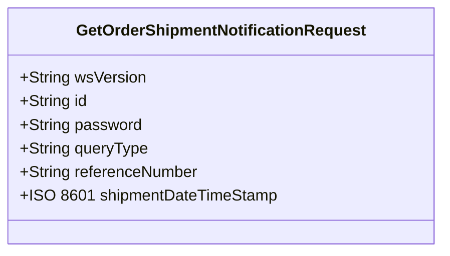
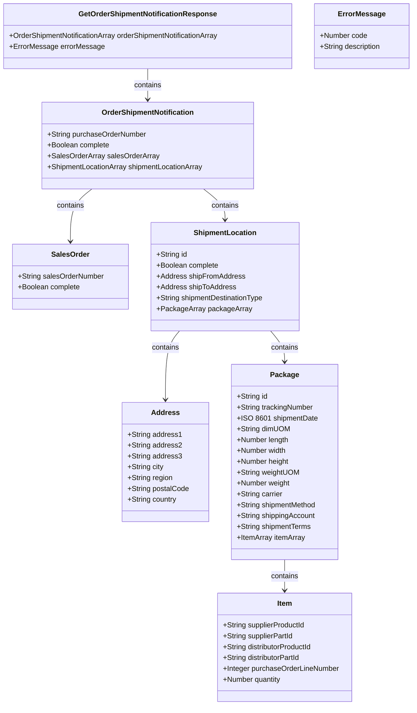

# PROMOTIONAL PRODUCTS DATA INTERFACE SPECIFICATION FOR WEB SERVICES

### **Order Shipment Notification (OSN)**
- **Version:** 1.0.0
- **Date:** 2016-01-29

## **Document Change Log**

| Version | Date       | Reason for Change                                  | Author                                                  |
|---------|------------|----------------------------------------------------|---------------------------------------------------------|
| 0.0.1   | 2015-10-30 | Initial Draft                                      | Stephen Luisser, VP of Research, Essent Corporation     |
| 0.0.2   | 2015-11-24 | Changed shipmentDestinationType to optional.       | Stephen Luisser, VP of Research, Essent Corporation     |
| 0.0.3   | 2015-12-17 | 1. Changed "ShipmentLocations" to "ShipmentLocation". 2. Changed ErrorMessage to an object and added object definition. 3. Marked SalesOrderNumberArray as optional for when writing an ErrorMessage object. 4. Changed version to a subversion until published. 5. Changed “PurchaseOrderNumber “ to “purchaseOrderNumber”. 6. Made all non-customizable enums strings. 7. Created an Address object and referenced for ShipFrom and ShipTo. |  Paul Fleischman, Technical Lead, PCNA |
| 0.0.4   | 2016-01-05 | 1. Consistency corrections2. Added Standardized Codes for ErrorMessage object3. Added supplierProductId, supplierPartId, distributorProductId, distributorPartId to Item array | Paul Fleischman, Technical Lead, PCNA                    |
| 0.0.5   | 2016-01-28 | 1. Removed 4th enumeration from Request.xsd file for query type 2. Added numerical values to documentation for query type parameters                 | Jon Norris, VP of Operations, Starline                   |
| 0.0.6   | 2016-01-28 | 1. Capitalized the Reply name “GetOrderShipmentNotification Response” 2. Created “OrderShipmentNotificationArray”: This is necessary to handle the ShipDateSearch queryType, as more than one PO will be returned at once. 3. Moved error message out into “GetOrderShipmentNotification Response” | Jon Norris, VP of Operations, Starline                   |
| 0.0.7   | 2016-01-29 | Renamed “SalesOrderNumberArray” to “SalesOrderArray”                                                                   | Paul Fleischman, Technical Lead PCNA             |
| 0.0.8   | 2016-03-01 | Added error codes range 300-399 that are specific to this service. | Jon Norris, VP of Operations, Starline   |
| 1.0.0   | 2016-03-02 | Service moved into Production                                   | Jon Norris, VP of Operations, Starline      |

## **Abstract and Recommended Audience**

This document describes the technologies for integration of suppliers and distributors in the Promotional Products Industry. It discusses the technology required to build the interface and provides sample code for using the interface. The reader should be fluent in web-based technologies and familiar with the language they plan to consume the web service in.

## **Background Information**

All specifications use the Simple Object Access Protocol (SOAP) over HTTPS for a standards-based secure form of communication. More information on SOAP can be found at [w3.org](http://www.w3.org/TR/soap12-part1/).

## **Order Shipment Notification**

- **Summary:** Summary: Provides a mechanism to get shipment details by specific parameters like (purchase order
number, sales order number, or shipment date). This allows the consumer of the service to obtain
shipment information grouped by purchase order number and sales order number for their needs.

### **Function:** 
`getOrderShipmentNotification()`

### **REQUEST: GetOrderShipmentNotificationRequest**

| Field                  | Description                                                         | Data Type     | Required? |
|------------------------|---------------------------------------------------------------------|---------------|-----------|
| wsVersion              | The Standard Version of the Web Service being referenced.           | 64 STRING: Enumerated | TRUE  |
| id                     | The customerID or any other agreed upon ID.                         | 64 STRING     | TRUE  |
| password               | The password associated with the customerID or agreed upon ID.      | 64 STRING     | FALSE |
| queryType              | The type of query you wish to perform.                              | String Enumerated | TRUE  |
| referenceNumber        | The purchase order or sales order number. Required when the queryType is 1 or 2. | 64 STRING     | FALSE |
| shipmentDateTimeStamp  | The earliest date for shipments to return in UTC3. Required when the queryType is 3. ISO 8601 | DATE  | FALSE |

**Notes:**
1. This indicates the type of query you are trying to perform. Valid Options:
   - **queryType 1 (POSearch):** Query based on customer provided purchase order number.
   - **queryType 2 (SOSearch):** Query based on vendor assigned sales order number.
   - **queryType 3 (ShipDateSearch):** Query based on all shipments with a shipment date greater than the value specified in shipmentDateTimeStamp.
2. When the queryType is (PO Search), this value represents the customer provided purchase order number. When the queryType is (SO Search), this value represents the vendor assigned sales order number. When the queryType is (Shipment Date Search), this value is not used and should not be passed.
3. This field will indicate the date time for any shipment GREATER than the shipment date time stamp provided. Note: Make sure to account for some jitter between the two systems and make sure to specify your time request in UTC and not in the local time zone.

## **REPLY: GetOrderShipmentNotificationResponse**

| Field                          | Description                                                | Data Type | Required? |
|--------------------------------|------------------------------------------------------------|-----------|-----------|
| [OrderShipmentNotificationArray](#ordershipmentnotificationarray-details) | An array of Order Shipment Notifications.                  | ARRAY     | FALSE     |
| [ErrorMessage](#errormessage--standardized-codes)                   | Response for any error requiring notification to requestor | OBJECT    | FALSE     |

#### **OrderShipmentNotificationArray Details:**

| Field                 | Description                                                  | Data Type | Required? |
|-----------------------|--------------------------------------------------------------|-----------|-----------|
| purchaseOrderNumber   | The associated purchase order.                               | 64 STRING | TRUE      |
| complete              | All shipments for this purchase order are complete.          | BOOLEAN  | TRUE       |
| [SalesOrderArray](#salesorder-details)       | An array of sales orders associated with the purchase order. | ARRAY    | FALSE      |

#### **SalesOrder Details:**

| Field                 | Description                                       | Data Type | Required? |
|-----------------------|---------------------------------------------------|-----------|-----------|
| salesOrderNumber      | The associated sales order.                       | 64 STRING | TRUE      |
| complete              | All shipments for this sales order are complete.  | BOOLEAN   | TRUE      |
| [ShipmentLocationArray](#shipmentlocation-details) | An array of shipment locations.                  | ARRAY     | TRUE      |

#### **ShipmentLocation Details:**

| Field                   | Description                                       | Data Type | Required? |
|-------------------------|---------------------------------------------------|-----------|-----------|
| id                      | The id of the location.                           | NUMBER    | FALSE     |
| complete                | All shipments for this location are complete.     | BOOLEAN   | TRUE      |
| [shipFromAddress](#address-object)         | Ship-From address                                 | OBJECT    | TRUE      |
| [shipToAddress](#address-object)           | Ship-To address                                   | OBJECT    | TRUE      |
| shipmentDestinationType | Used to identify the type of destination for the Ship-To address. | 64 STRING: Enumerated | FALSE |
| [PackageArray](#package)            | An array of shipment packages.7                   | ARRAY     | FALSE     |

## **Address Object**

| Field       | Description         | Data Type  | Required? |
|-------------|---------------------|------------|-----------|
| address1    | Address Line 1      | 64 STRING  | TRUE      |
| address2    | Address Line 2      | 64 STRING  | FALSE     |
| address3    | Address Line 3      | 64 STRING  | FALSE     |
| address4    | Address Line 4      | 64 STRING  | FALSE     |
| city        | Address City        | 64 STRING  | TRUE      |
| region      | Address Region      | 2 STRING   | TRUE      |
| postalCode  | Address Postal Code | 10 STRING  | TRUE      |
| country     | Address Country     | 128 STRING | FALSE     |

## **Package**

| Field                   | Description                                              | Data Type            | Required? |
|------------------------ |----------------------------------------------------------|----------------------|-----------|
| id                      | The id of the package                                    | NUMBER               | FALSE     |
| trackingNumber          | The tracking number for the package                      | 128 STRING           | TRUE      |
| shipmentDate            | The date for the shipment in UTC.8                       | ISO 8601 DATE        | TRUE      |
| dimUOM                  | The dimensional unit of measure                          | 64 STRING: Enumerated| FALSE     |
| length                  | The length of the package                                | NUMBER               | FALSE     |
| width                   | The width of the package                                 | NUMBER               | FALSE     |
| height                  | The height of the package                                | NUMBER               | FALSE     |
| weightUOM               | The weight unit of measure                               | 64 STRING: Enumerated| FALSE     |
| weight                  | The weight of the package                                | NUMBER               | FALSE     |
| carrier                 | The carrier delivering the package                       | 128 STRING           | FALSE     |
| shipmentMethod          | The method used for shipping (e.g., Ground)              | 128 STRING           | FALSE     |
| shippingAccount         | The shipping account used for this shipment              | 128 STRING           | FALSE     |
| shipmentTerms           | The terms of the shipment                                | 128 STRING           | FALSE     |
| [ItemArray](#itemarray) | A list of items and quantities contained in the package9 | ARRAY                | FALSE     |

## **ItemArray**

### **Item Object:**

A list of items and quantities contained in the package.

| Field                   | Description                                         | Data Type  | Required? |
|-------------------------|-----------------------------------------------------|------------|-----------|
| supplierProductId       | The supplier product Id                             | 64 STRING  | FALSE     |
| supplierPartId          | The supplier part Id associated with the supplier product Id | 64 STRING  | FALSE     |
| distributorProductId    | The distributor product Id                          | 64 STRING  | FALSE     |
| distributorPartId       | The distributor part Id associated with the supplier product Id | 64 STRING  | FALSE     |
| purchaseOrderLineNumber | The line number of the item on the purchase order   | INTEGER    | FALSE     |
| quantity                | The quantity of the item                            | NUMBER     | FALSE     |

## **ErrorMessage & Standardized Codes**

#### **ErrorMessage Details:**

| Field                 | Description                                       | Data Type | Required? |
|-----------------------|---------------------------------------------------|-----------|-----------|
| code                  | The numerical value of the code                   | NUMBER    | YES       |
| description           | Response for any error requiring notification to requestor | 256 STRING | YES       |

**Standardized Codes**: The range of `100-199` has been reserved for standardized error codes. The number `999` has been reserved for an error codes that is a “General Error - Contact System Service Provider”.

| Code | Description                                                                                   |
|------|-----------------------------------------------------------------------------------------------|
| 100  | ID (customerID) not found                                                                     |
| 104  | This account is unauthorized to use this service. Please contact the service provider         |
| 105  | Authentication Credentials failed                                                             |
| 110  | Authentication Credentials required                                                           |
| 115  | wsVersion not found                                                                           |
| 120  | The following field(s) are required [Comma Delimited field names]                             |
| 125  | Not Supported                                                                                 |
| 999  | General Error – Contact the System Service Provider                                           | 

## Service Specific Code: 
These error codes are only for the **Order Ship Notification Service**

| Code | Description                                                                                   |
|------|-----------------------------------------------------------------------------------------------|
| 300  | queryType not found                                                                           |
| 301  | referenceNumber not found                                                                     |
| 302  | shipmentDateTimeStamp is incorrect or is an invalid date range                                |

## ENUMERATED TYPE RESTRICTIONS

| Field                  | Description                                                       | Data Type | Values |
|------------------------|-------------------------------------------------------------------|-----------|--------|
| wsVersion              | The Standard Version of the Web Service being referenced          | 64 STRING | Enumerated: 1.0.0  |
| shipmentDestinationType| Used to identify the type of destination for the Ship-To address. | 64 STRING | Enumerated: Commercial,Residential, None |
| dimUOM                 | The dimensional unit of measure                                   | 64 STRING | Enumerated: Inches, Feet, mm, cm, Meters |
| weightUOM              | The weight unit of measure                                        | 64 STRING | Enumerated: Ounces, Pounds, Grams, KG |

## Code Samples
To be published under separate specification: “Order Shipment Notification Standards Use Examples”.

## DATA MINING / ABUSE GUIDELINE
The use of services detailed within this specification are to be conducted within the current guidelines of
the “Interface Data Use Guidelines Standards”.

### Diagrams

### getOrderShipmentNotification Function

