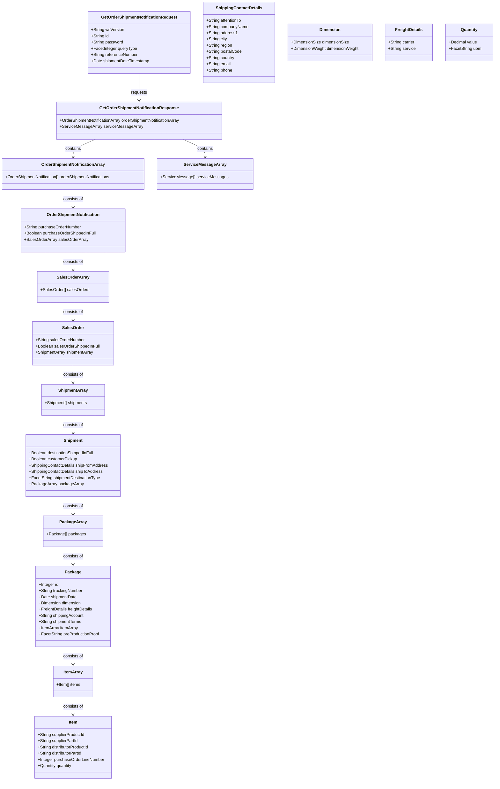

# PROMOTIONAL PRODUCTS DATA INTERFACE SPECIFICATION FOR WEB SERVICES

# Order Shipment Notification 2.0.0

Date: 12/23/2022

# Document Change Log

| Version | Date | Reason for Change | Authors |
| --- | --- | --- | --- |
| 2.0.0 | 2022-12-23 | Version 2.0.0 Final | Stephen Luisser - Essent Corporation |

# Contributors

The following have contributed to the creation of this specification:

Authors:

- Stephen Luisser, Vice President, Essent Corporation

Contributors: The PromoStandards Standards Committee

# Abstract and Recommended Audience

This document describes the technologies for integration of suppliers and distributors in the Promotional Products Industry. This document will discuss in detail the technology required in order to build the interface. Additionally, this document will provide sample code in order to use the interface.

This document will assume that the reader is fluent in web based technologies, and has knowledge of the language they plan to consume the web service in.

# Background Information

All specifications will be built using the Simple Object Access Protocol (SOAP) over HTTPS as the foundation for the web services protocol stack in order to provide a standards based secure form of communication.

More information on SOAP can be found at [http://www.w3.org/TR/soap12-part1/](http://www.w3.org/TR/soap12-part1/).

# Service Details

**Function** : getOrderShipmentNotification()

This function provides a mechanism to get shipment details by specific parameters like (purchase order number, sales order number, or shipment date). This allows the consumer of the service to obtain shipment information grouped by purchase order number and sales order number for their needs.

**Request:** GetOrderShipmentNotificationRequest

| **Field** | **Description** | **Data Type** | **Required** |
| --- | --- | --- | --- |
| wsVersion | The Standard Version of the Web Service being referenced | 64 STRING | TRUE |
| id | The customerId or any other agreed upon Id | 64 STRING | TRUE |
| password | The password associated with the customerId | 64 STRING | FALSE |
| queryType | The type of query you wish to perform | FACET INTEGER | TRUE |
| referenceNumber | The purchase order number for queryType =1 or the sales order number for queryType = 2 | 64 STRING | FALSE |
| shipmentDateTimestamp | The date for of shipments to return in UTC. Required when the queryType is 3. ISO 8601 | DATE | FALSE |

**GetOrderShipmentNotificationRequest queryType**

| **queryType** | **Short Name** | **Description** |
| --- | --- | --- |
| 1 | PO Number Search | Returns all shipments for the Purchase Order |
| 2 | SO Number Search | Returns all shipments for the Sales Order |
| 3 | Shipment Date Search | Returns all shipments with a shipment date specified by the shipmentDateTimeStamp |

**Reply:** GetOrderShipmentNotificationResponse

| **Field** | **Description** | **Data Type** | **Required** |
| --- | --- | --- | --- |
| [OrderShipmentNotificationArray](#ordershipmentnotification-object) | An array of Order Shipment Notification objects | ARRAY | FALSE |
| [ServiceMessageArray](#servicemessage-object) | An array of ServiceMessage objects | OBJECT | FALSE |

### OrderShipmentNotification Object

| **Field** | **Description** | **Data Type** | **Required** |
| --- | --- | --- | --- |
| purchaseOrderNumber | The associated purchase order | 64 STRING | TRUE |
| purchaseOrderShippedInFull | All shipments for this purchase order are complete | BOOLEAN | TRUE |
| [SalesOrderArray](#salesorder-object) | An array of Sales Order objects associated with the purchase order | ARRAY | TRUE |

### SalesOrder Object

| **Field** | **Description** | **Data Type** | **Required** |
| --- | --- | --- | --- |
| salesOrderNumber | The associated sales order | 64 STRING | TRUE |
| salesOrderShippedInFull | All shipments for this sales order are complete | BOOLEAN | TRUE |
| [ShipmentArray](#shipment-object) | An array of Shipment objects | ARRAY | TRUE |

### Shipment Object

| **Field** | **Description** | **Data Type** | **Required** |
| --- | --- | --- | --- |
| destinationShippedInFull | All shipments for this shipping destination location are complete | BOOLEAN | TRUE |
| customerPickup | The shipment will be a pickup and will not be shipped. Default to false if pickup cannot be determined | BOOLEAN | TRUE |
| [shipFromAddress](#shippingcontactdetails-object) | ShippingContactDetails Object for the Ship-From address | OBJECT | TRUE |
| [shipToAddress](#shippingcontactdetails-object) | ShippingContactDetails Object for the Ship-To address | OBJECT | TRUE |
| shipmentDestinationType | Used to identify the type of destination for the Ship-To address | FACET 64 STRING | FALSE |
| [PackageArray](#package-object) | An array of Package objects | ARRAY | TRUE |

### ShippingContactDetails Object

| **Field** | **Description** | **Data Type** | **Required** |
| --- | --- | --- | --- |
| attentionTo | Attention To (first and last name of contact) | 35 STRING | FALSE |
| companyName | Company Name | 35 STRING | FALSE |
| address1 | Address line 1 | 35 STRING | TRUE |
| address2 | Address line 2 | 35 STRING | FALSE |
| address3 | Address line 3 | 35 STRING | FALSE |
| city | The city | 30 STRING | TRUE |
| region | The 2 character US state abbreviation or 2-3 character non-US region | 3 STRING | TRUE |
| postalCode | The postal code | 10 STRING | TRUE |
| country | The country in ISO 3166-2 format | 2 STRING | FALSE |
| email | Email address associated with the contact | 128 STRING | FALSE |
| phone | The phone number associated with the contact | 32 STRING | FALSE |

### Package Object

| **Field** | **Description** | **Data Type** | **Required** |
| --- | --- | --- | --- |
| id | The id of the package | NUMBER | FALSE |
| trackingNumber | The tracking number for the package. Guidance is to always provide a tracking number if available | 128 STRING | FALSE |
| shipmentDate | The date for the shipment in UTC. ISO 8601 | ISO 8601 | TRUE |
| [Dimension](#dimension-object) | Physical dimensions and weight. Include this object if you have either a size or weight dimension | OBJECT | FALSE |
| [FreightDetails](#freightdetails-object) | The details on the freight: carrier and service | OBJECT | FALSE |
| shippingAccount | The shipping account used for this shipment | 128 STRING | FALSE |
| shipmentTerms | The terms of the shipment (i.e. Prepaid, Collect, Third Party, PPD., etc.) | 128 STRING | FALSE |
| [ItemArray](#item-object) | A list of items and quantities contained in the package | ARRAY | FALSE |
| preProductionProof | Signifies if the order is a pre-production proof. Valid options: "Yes", "No", "Unknown" | FACET 64 STRING | TRUE |

### Dimension Object

| **Field** | **Description** | **Data Type** | **Required** |
| --- | --- | --- | --- |
| [DimensionSize](#dimensionsize-object) | Physical dimensions. Include only if you have at least one physical dimension | OBJECT | FALSE |
| [DimensionWeight](#dimensionweight-object) | Weight | OBJECT | FALSE |

### DimensionSize Object

| **Field** | **Description** | **Data Type** | **Required** |
| --- | --- | --- | --- |
| dimensionUom | The dimensional unit of measure | FACET 2 STRING | TRUE |
| length | The length of the part using the unit of measure specified in dimensionUom | DECIMAL | FALSE |
| width | The width of the part using the unit of measure specified in dimensionUom | DECIMAL | FALSE |
| height | The height of the part using the unit of measure specified in dimensionUom | DECIMAL | FALSE |

### DimensionWeight Object

| **Field** | **Description** | **Data Type** | **Required** |
| --------- | --- | --- | --- |
| weightUom | The weight unit of measure for the part | FACET 2 STRING | TRUE |
| weight    | The weight of the part using the unit of measure specified in dimensionUom | DECIMAL | TRUE |

### FreightDetails Object

| **Field** | **Description** | **Data Type** | **Required** |
| --- | --- | --- | --- |
| carrier | The carrier name of the shipping vendor being requested. (i.e. "UPS", "FEDEX", etc.) | 64 STRING | TRUE |
| service | The service code of the shipping vendor for the service being requested. (i.e. GROUND, 2DAY, NEXTDAY, etc.) | 64 STRING | TRUE |

### Item Object

| **Field** | **Description** | **Data Type** | **Required** |
| --- | --- | --- | --- |
| supplierProductId | The supplier product Id | 64 STRING | TRUE |
| supplierPartId | The supplier part Id associated to the supplier product Id | 64 STRING | FALSE |
| distributorProductId | The distributor product Id | 64 STRING | FALSE |
| distributorPartId | The distributor part Id associated to the supplier product Id | 64 STRING | FALSE |
| purchaseOrderLineNumber | The line number of the item on the purchase order | INTEGER | FALSE |
| [Quantity](#quantity-object) | The quantity of the item shipped | OBJECT | TRUE |

### Quantity Object

| **Field** | **Description** | **Data Type** | **Required** |
| --------- | --- | --- | --- |
| value     | The quantity value | DECIMAL | TRUE |
| uom       | The unit of measure for the value | FACET 2 STRING | TRUE |

**Guidance**

If you are unable to determine the quantity of items shipped by tracking number for a shipment due to process or system limitations, PromoStandards guidance is to attach all products and quantities to a single tracking number and leave the other tracking numbers without products or quantities.

**Enumerated Type Restrictions (FACET)**

| **Field** | **Description** | **Data Type** | **Enumeration Values** |
| --- | --- | --- | --- |
| dimUOM | The dimensional unit of measure | FACET 64 STRING | Inches Feet mm cm Meters |
| preProductionProofType | Identifies if the item is a pre-production proof | FACET 64 STRING | Yes No Unknown |
| quantityUOM | The unit of measure for quantity based field | FACET 2 STRING | BX (Box)CA (Case)DZ (Dozen)EA (Each)KT (Kit)PK (Package)PR (Pair)RL (Roll)ST (Set)SL (Sleeve)TH (Thousand) |
| serviceMessageSeverity | The severity of the message. | FACET 64 STRING | Error Information Warning |
| shipmentDestinationType | The type of shipment destination | FACET 64 STRING | Commercial Residential Other |
| weightUOM | The weight unit of measure | FACET 64 STRING | Ounces Pounds Grams KG |

## **Appendix A: Service Messages**

**ServiceMessage Object**

| **Field** | **Description** | **Data Type** | **Required** |
| --- | --- | --- | --- |
| code | The numerical value of the code | INTEGER | TRUE |
| description | Response for any message requiring notification to requestor | 256 STRING | TRUE |
| severity | The severity of the message. Values are enumerated: \{Error, Information, Warning\} | FACET 64 STRING | TRUE |

**Standardized Codes**

The range of 100-199 has been reserved for standardized error codes.  The number 999 has been reserved for an error codes that is a "General Error - Contact System Service Provider"

| **Code** | **Description** |
| --- | --- |
| 100 | ID (customerID) not found |
| 104 | This account is unauthorized to use this service.  Please contact the service provider |
| 105 | Authentication Credentials failed |
| 110 | Authentication Credentials required |
| 115 | wsVersion not found |
| 120 | The following field(s) are required [Comma Delimited field names] |
| 125 | Not Supported |
| 999 | General Error – Contact the System Service Provider |

**Service Specific Codes**

These error codes are only for this service.

| **Code** | **Description** |
| --- | --- |
| 300 | queryType not found |
| 301 | referenceNumber not found |
| 302 | shipmentDateTimeStamp is incorrect or is an invalid date range |

# DATA MINING / ABUSE GUIDELINE

The use of services detailed within this specification are to be conducted within the current guidelines of the "Interface Data Use Guidelines Standards".

**Validation of Services**

Before you publish your endpoint, please ensure that it adheres to the promostandards.org spec by using the web service validation tool located at: [https://services.promostandards.org/webserviceValidator/home](https://services.promostandards.org/webserviceValidator/home).

Select the service, version, method and input your endpoint.  If the endpoint is correct, you should receive a message of: "The XML response is valid."

## Diagrams

### getOrderShipmentNotification Function

