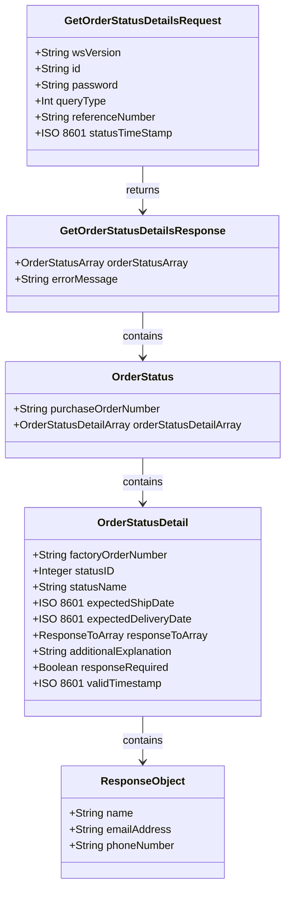
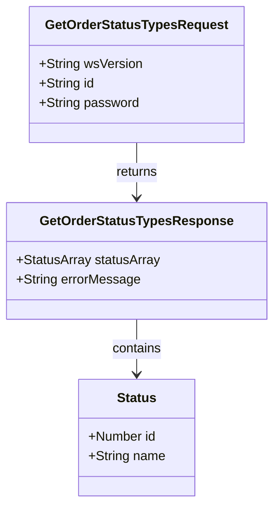

# PROMOTIONAL PRODUCTS DATA INTERFACE SPECIFICATION FOR WEB SERVICES

## Order Status 1.0.0

**Version**: 1.0.0  
**Release Date**: 2015-07-01

## **Document Change Log**

| Version | Date       | Reason for Change                                                                                                           | Author                                                      |
|---------|------------|----------------------------------------------------------------------------------------------------------------------------|-------------------------------------------------------------|
| 0.0.1   | 2014-05-12 | Initial Draft                                                                                                              | Jon Norris, System Operations Manager, Starline USA         |
| 0.0.2   | 2014-05-13 | - Changed Order Status Detail into multidimensional array to accommodate multiple sales orders to one purchase order.   - Added Credit Hold and Backorder Statuses.   - Added In Hands Date Field   - Added Ship Method | Eric Shonebarger, CIO, Hit Promotional Products Inc         |
| 0.0.3   | 2014-05-30 | - Added support for requesting single purchase order or array of purchase orders based on date   - Added statusTimeStampto request   - Changed function name: getOrderStatusDetails()   - Fixing array naming to OrderStatusDetailArray   - Created function getOrderStatusTypes() | Jon Norris, System Operations Manager, Starline USA         |
| 0.0.4   | 2014-07-07 | - Added unique request and response names for both methods   - Fixed Required Flag on expectedInHandsDate                  | Jon Norris, System Operations Manager, Starline USA         |
| 0.0.5   | 2015-04-13 | - Changed purchaseOrder references to referenceNumber (more generic)   - Changed to more rigid search parameters and warned everyone to account for time jitter   - Changed Search parameter to UTC   - Changed Status Codes to reflect desire for logical progression and to conform to traditional 855/997 documents | Eric Shonebarger, CIO, Hit Promotional Products, Inc        |
| 0.0.8   |            | - Made some adjustments to status codes in order to facilitate adoption as well as their descriptions   - Changed “inHandsDate” to “expectedDeliveryDate” and adjusted description to be more descriptive   - Adjusted factoryOrderNumber description   - Made the ResponseToArray description a little more descriptive   - Adjusted customMessage to 1024   - Added the boolean responseRequired to determine if a status requires a response from the distributor   - Made the “Custom Message” more descriptive | Eric Shonebarger, CIO, Hit Promotional Products, Inc        |
| 0.0.9   |            | - Updated explanation for purchase order naming.   - Renamed custom message to “additionalExplanation”   - Changed statusID data type to Integer (Enumeration) from Number | Jon Norris, VP Operations, Starline                          |

## Abstract and Recommended Audience
This document describes the technologies for integration of suppliers and distributors in the Promotional Products Industry. This document will discuss in detail the technology required in order to build the interface. Additionally, this document will provide sample code in order to use the interface.

This document will assume that the reader is fluent in web based technologies, and has knowledge of the language they plan to consume the web service in.

## Background Information
All specifications will be built using the Simple Object Access Protocol (SOAP) over HTTPS as the foundation for the web services protocol stack in order to provide a standards based secure form of communication.

More information on SOAP can be found at [w3](http://www.w3.org/TR/soap12-part1/)

## **Service Details:**
- [getOrderStatusDetails](#getorderstatusdetails)
- [getOrderStatusTypes](#getorderstatustypes)

## getOrderStatusDetails

### **Request:**

#### **GetOrderStatusDetailsRequest**

| Field            | Description                                                                                       | Data Type | Required? |
|------------------|---------------------------------------------------------------------------------------------------|-----------|-----------|
| wsVersion        | The Standard Version of the Web Service being referenced                                          | 64 STRING | TRUE      |
| id               | The customerID or any other agreed upon ID.                                                       | 64 STRING | TRUE      |
| password         | The password associated with the customerID.                                                      | 64 STRING | FALSE     |
| queryType        | The type of query you wish to perform[^4]                                                         | INT       | TRUE      |
| referenceNumber  | The purchase order/sales order associated with the order.                                         | 64 STRING | FALSE     |
| statusTimeStamp  | Beginning date time since last status change in UTC[^5]                                           | ISO 8601  | FALSE     |

[^4]: This indicates the type of query you are trying to perform. Valid Options:

| queryType | Short Name         | Description                                                                                   |
|-----------|--------------------|-----------------------------------------------------------------------------------------------|
| 1         | PO Search          | Query based on customer provided purchase order number.                                       |
| 2         | SO Search          | Query based on vendor assigned sales order number                                            |
| 3         | Last Update Search | Query based on all orders with an update time greater than the value specified in statusTimeStamp. |
| 4         | All Open Search    | Query based on all orders that currently have a status other than “Complete” and “Cancelled”  |

[^5]: This field will indicate the change date time for any status change GREATER than the date time stamp provided. Note: Make sure to account for some jitter between the two systems and make sure to specify your time request in UTC and not in the local time zone.

### **Reply:**

#### **GetOrderStatusDetailsResponse**

| Field               | Description                                                                                       | Data Type | Required? |
|---------------------|---------------------------------------------------------------------------------------------------|-----------|-----------|
| [OrderStatusArray[^1]](#orderstatus-object)| An array of order status                                                                          | ARRAY     | TRUE      |
| errorMessage        | Response for any error requiring notification to requestor                                        | 256 STRING| FALSE     |

[^1]: **OrderStatusArray**

## OrderStatus Object

| Field                    | Description                                                                                       | Data Type | Required? |
|--------------------------|---------------------------------------------------------------------------------------------------|-----------|-----------|
| purchaseOrderNumber      | The associated Purchase Order Number from the customer                                            | 64 STRING | TRUE      |
| [OrderStatusDetailArray[^2]](#orderstatusdetail-object)| Array of OrderStatusDetails                                                                      | ARRAY     | TRUE      |

[^2]: **OrderStatusDetailArray**

## OrderStatusDetail Object

| Field                | Description                                                                                       | Data Type | Required? |
|----------------------|---------------------------------------------------------------------------------------------------|-----------|-----------|
| factoryOrderNumber   | The associated factory sales order number (This is used in the example of internal PO splitting at the factory level) | 64 STRING | TRUE      |
| statusID[^5]         | Paired standard order status from allowed values                                                  | Integer   | TRUE      |
| statusName[^5]       | Textual description of statusID                                                                   | 256 STRING| TRUE      |
| expectedShipDate     | The expected ship date for the purchase order                                                     | ISO 8601  | FALSE     |
| expectedDeliveryDate | The expected date the order should arrive at customer also known as the “in hands date”            | ISO 8601  | FALSE     |
| [ResponseToArray[^4]](#response-object)  | An array of human contact information such as email, phone, and rep name so the distributor knows who to get in contact to fix an issue. | ARRAY     | FALSE     |
| additionalExplanation[^3] | This allows further detail about the status                                                      | 1024 STRING | FALSE     |
| responseRequired     | True or False to determine if it is necessary to provide information back to the supplier to complete the order | Boolean   | TRUE      |
| validTimestamp       | Time of order status                                                                              | ISO 8601  | TRUE      |

[^3]: **customMessage Examples:**

- If the Order Status is 43 (Artwork Hold), The custom message could be “Size of Text is too small.”
- If the Order Status is 11 (Order Entry Hold) The custom message could be “We can’t meet your delivery date with the ship method provide.”

Using additionalExplanation in conjunction with the ResponseToArray will point the distributor who to contact to fix the issue.

[^4]: **ResponseToArray**

## ResponseTo Object

| Field        | Description                                                                                       | Data Type | Required? |
|--------------|---------------------------------------------------------------------------------------------------|-----------|-----------|
| name         | The name of the person to respond to                                                              | 256 STRING| FALSE     |
| emailAddress | A monitored email address that a recipient can send their response to                              | 256 STRING| FALSE     |
| phoneNumber  | The phone number of the person to respond | 256 STRING| FALSE     |

## getOrderStatusTypes

#### **GetOrderStatusTypesRequest**

| Field     | Description                                                                                       | Data Type | Required? |
|-----------|---------------------------------------------------------------------------------------------------|-----------|-----------|
| wsVersion | The Standard Version of the Web Service being referenced                                          | 64 STRING | TRUE      |
| id        | The customerID or any other agreed upon ID.                                                       | 64 STRING | TRUE      |
| password  | The password associated with the customerID.                                                      | 64 STRING | FALSE     |

### **Reply:**

#### **GetOrderStatusTypes Response**

| Field       | Description                                                                                       | Data Type | Required? |
|-------------|---------------------------------------------------------------------------------------------------|-----------|-----------|
| [StatusArray[^4]](#status) | An array of order status                                                                          | ARRAY     | TRUE      |
| errorMessage   | Response for any error requiring notification to requestor                                        | 256 STRING| FALSE     |

[^4]: **StatusArray**
### Status

| Field | Description                                                                                       | Data Type | Required? |
|-------|---------------------------------------------------------------------------------------------------|-----------|-----------|
| id    | The numerical value of the order status                                                           | NUMBER    | TRUE      |
| name  | The string status name from possible values[^5]                                                   | 256 STRING| TRUE      |

[^5]: **Possible Values for Status**

| StatusID | Status Name      | Description                                                                                       |
|----------|------------------|---------------------------------------------------------------------------------------------------|
| 10       | Order Received   | Order has been received.                                                                          |
| 11       | Order Entry Hold | Vendor has a problem with the data in the purchase order, and it is preventing the order from being entered. |
| 20       | Order Confirmed  | Order has been received, entered, and accepted                                                    |
| 30       | Pre-Production   | Vendor has begun to process the order, but it is not in production                                |
| 40       | General Hold     | Something is preventing the order from being entered                                              |
| 41       | Credit Hold      | Vendor is awaiting payment from customer                                                          |
| 42       | Proof Hold       | Vendor is awaiting response to proof                                                              |
| 43       | Art Hold         | Vendor is awaiting suitable artwork from customer                                                 |
| 44       | Back Order Hold  | Order has been backordered; Nothing has shipped yet.                                              |
| 60       | In Production    | Production of the order has started                                                               |
| 70       | In Storage       | Order is complete, but vendor is waiting to ship goods                                            |
| 75       | Partial Shipment | Order has shipped in Part; remaining items in production                                          |
| 80       | Complete         | Order has shipped in full—No further updates will be given                                        |
| 99       | Canceled         | Order has been canceled—No further updates will be given                                          |

## Code Samples
To be published under separate specification: “Inventory Interface Standards Use Examples”

## DATA MINING / ABUSE GUIDELINE
The use of services detailed within this specification are to be conducted within the current guidelines of the “Interface Data Use Guidelines Standards”

 ### Validation of Services

Before you publish your endpoint, please ensure that it adheres to the promostandards.org spec by using the web service validation tool. 

http://services.promostandards.org/webserviceValidator/home

Select the service, version, method and input your endpoint.  If the endpoint is correct you should receive a message of:

"The XML response is valid." 

## Diagrams

### getOrderStatusDetails Function

### getOrderStatusTypes Function

