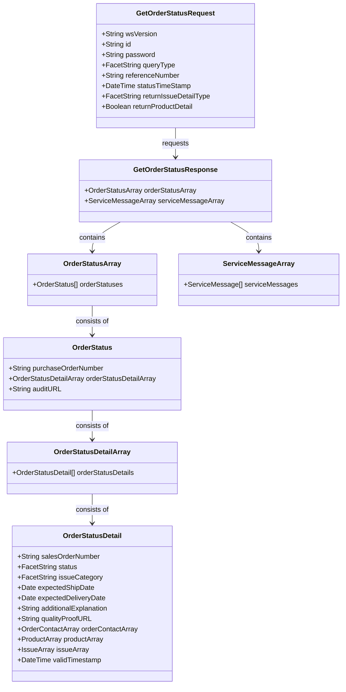

# PROMOTIONAL PRODUCTS DATA INTERFACE SPECIFICATION FOR WEB SERVICES

#### Promotional Products Data Interface Specification for Web services

## Order Status 2.0.0

Date: 5/18/2023

## Document Change Log

| Version | Date | Reason for Change | Authors |
| --- | --- | --- | --- |
| 2.0.0 | 2023-05-18 | Version 2.0.0 Final | Stephen Luisser - Hit Promotional ProductsRaj Mukherjee – Hit Promotional Products |

## Contributors

The following have contributed to the creation of this specification:

Contributors:

- The PromoStandards Standards Committee

## Abstract and Recommended Audience

This document describes the technologies for integration of suppliers and distributors in the Promotional Products Industry. This document will discuss in detail the technology required in order to build the interface.

This document assumes that the reader is fluent in web based technologies and has knowledge of the programming language they plan to create or consume the web service with.

## Background Information

All specifications will be built using the Simple Object Access Protocol (SOAP) over HTTPS as the foundation for the web services protocol stack in order to provide a standards based secure form of communication.

More information on SOAP can be found at [http://www.w3.org/TR/soap12-part1/](http://www.w3.org/TR/soap12-part1/).

## Service Details

Function: getOrderStatus()

This function provides a mechanism to get order status by specific parameters such as purchase order number, sales order number, or transaction id. This allows the consumer of the service to obtain order status information grouped by purchase order number and sales order number for their needs. This function is required to implement.

### Request: GetOrderStatusRequest

| Field | Description | Data Type | Required |
| --- | --- | --- | --- |
| wsVersion | The Standard Version of the Web Service being referenced | 64 STRING | TRUE |
| id | The id of the entity making the request or any other agreed upon Id | 64 STRING | TRUE |
| password | The password associated with the customerId | 64 STRING | FALSE |
| queryType | The type of query you wish to perform, see the queryType facet for acceptable values | FACET STRING | TRUE |
| referenceNumber | The purchase order number for queryType poSearch, the sales order number for queryType soSearch, or the transaction id for queryType transactionId. Required when any of these queryTypes are specified. | 64 STRING | FALSE |
| statusTimeStamp | Beginning datetime since last status change in UTC. This allows an entity to request status for any orders which have been updated since this datetime. Make sure to account for some jitter between the two systems and make sure to specify your time request in UTC and not in the local time zone. Required with queryType lastUpdate. | DATETIME | FALSE |
| returnIssueDetailType | Returns detailed information regarding order issues including recommended actions to resolve open issues if available when set to TRUE. See the returnIssueDetailsType facet for acceptable values. When this parameter is not included, the noIssues option is used. | FACET STRING | FALSE |
| returnProductDetail | Returns detailed information regarding the order/line item information when set to TRUE. The default value FALSE is used when this parameter is not included. | BOOLEAN | FALSE |

### GetOrderStatusRequest queryType

| Value         | Short Name           | Description                                                |
| ------------- | -------------------- | ---------------------------------------------------------- |
| poSearch      | PO Search            | Query based on the Customer provided Purchase Order Number |
| soSearch      | SO Search            | Query based on the Customer provided Sales Order Number    |
| lastUpdate    | Last Update Search   | Query based on all orders with an updated time greater than the value specified in the statusTimeStamp field |
| allOpen       | All Open Search      | Query based on all Sales Orders that currently have a Status other than Complete or Canceled |
| allOpenIssues | All Open Issues      | Query based on all open orders that currently have an issue associated with them with an Issue Status of Open or Pending |
| transactionId | transactionId Search | Query based on the transactionId returned when submitting a Purchase Order to the PromoStandards Purchase Order service. This queryType is not applicable for Purchase Orders submitted another way. This is useful to check up on a Purchase Order that is not yet entered in the Suppliers Order Management system. This option may not be supported by all Suppliers and it is not to replace the PO Search option. If this queryType is not supported return error 210, Query Type not supported. |

### GetOrderStatusRequest returnIssueDetailType

| Value      | Short Name  | Description |
| ---------- | ----------- | --------------------------------------------- |
| noIssues   | No Issues   | The response does not include issues details. |
| openIssues | Open Issues | If supported, the response includes issues details for issues with an Issue Status of Open or Pending. |
| allIssues  | All Issues  | If supported, the response includes issues details for all issues. |

### Reply: GetOrderStatusResponse

| Field | Description | Data Type | Required |
| --- | --- | --- | --- |
| [OrderStatusArray](#orderstatus-object) | An array of OrderStatus objects | ARRAY | FALSE |
| [ServiceMessageArray](#servicemessage-object) | An array of ServiceMessage objects | ARRAY | FALSE |

### OrderStatus Object

| Field               | Description                   | Data Type | Required |
| ------------------- | ----------------------------- | --------- | -------- |
| purchaseOrderNumber | The associated purchase order | 64 STRING | TRUE     |
| [OrderStatusDetailArray](#orderstatusdetail-object) | An array of OrderStatusDetail objects for all sale orders associated with the purchaseOrderNumber even in the case where the queryType is lastUpdate, allOpen, allOpenIssues. | ARRAY | TRUE |
| auditURL | The URL to a page that can be used to find additional details about the Purchase Order. This page may include the XML posted to the PromoStandards Purchase Order service, a visual representation of the Purchase Order, a visual representation of the Invoice, or other relevant information. | 1024 STRING | FALSE |

### OrderStatusDetail Object

| Field | Description | Data Type | Required |
| --- | --- | --- | --- |
| salesOrderNumber | The associated sales order. For Purchase Orders that do not have a Sales Order in the Supplier Order Management system yet, use the value N/A. | 64 STRING | TRUE |
| status | Status of the sales order, see the status facet for acceptable values | FACET 64 STRING | TRUE |
| issueCategory | The category of the issue that is placing or will place the order on hold, see the issueCategory facet for acceptable values | FACET 64 STRING | FALSE |
| expectedShipDate | The expected date the order should ship in the shipper's timezone. This field does not include a time component. | DATE | FALSE |
| expectedDeliveryDate | The expected date the order should arrive at the destination, also known as the _in hands date_. This field does not include a time component. | DATE | FALSE |
| additionalExplanation | A freeform text field which can include additional details about the status of the sales order | 1024 STRING | FALSE |
| qualityProofURL | A URL of the product with logo | 1024 STRING | FALSE |
| [OrderContactArray](#contact-object) | An array of Contact objects. Enables the consumer to know whom to contact about the order. | ARRAY | FALSE |
| [ProductArray](#product-object) | An array of Product objects. This field should be populated if returnProductDetail is true in the GetOrderStatusRequest object | ARRAY | FALSE |
| [IssueArray](#issue-object) | An array of Issue objects. This field should not be populated if returnIssueDetailType is noIssues in the GetOrderStatusRequest object | ARRAY | FALSE |
| validTimestamp | Time in UTC of the last status change for the sales order. This is not the time of the request or response. | DATETIME | TRUE |

### Contact Object

| Field | Description | Data Type | Required |
| --- | --- | --- | --- |
| accountName | The name of the account for the contact if applicable | 64 STRING | FALSE |
| accountNumber | The number of the account for the contact if applicable | 64 STRING | FALSE |
| contactType | The type of contact, see the contactType facet for acceptable values | FACET 64 STRING | TRUE |
| ContactDetails | A ContactDetails object which contains the details about the contact | OBJECT | TRUE |

### ContactDetails Object

| Field | Description | Data Type | Required |
| --- | --- | --- | --- |
| attentionTo | Attention To (first and last name of contact, department, or role) | 35 STRING | FALSE |
| companyName | The Company name for the contact. When dealing with a conglomerate or company with multiple divisions, the account name in the Contact Object may differ from the value specified here. | 35 STRING | FALSE |
| address1 | Address line 1 | 35 STRING | FALSE |
| address2 | Address line 2 | 35 STRING | FALSE |
| address3 | Address line 3 | 35 STRING | FALSE |
| city | The city | 30 STRING | FALSE |
| region | The 2 character US state abbreviation or 2-3 character non-US region | 3 STRING | FALSE |
| postalCode | The postal code | 10 STRING | FALSE |
| country | The country in ISO 3166-2 format | 2 STRING | FALSE |
| email | Email address associated with the contact | 128 STRING | FALSE |
| phone | The phone number associated with the contact | 32 STRING | FALSE |
| comments | Comments regarding the contact for further clarification, use only when absolutely necessary | STRING | FALSE |

### Product Object

| Field | Description | Data Type | Required |
| --- | --- | --- | --- |
| productId | The supplier product Id associated to the Order status and supplier sales order line item | 64 STRING | TRUE |
| partId | The supplier part Id associated to the Order Status and supplier sales order line item | 64 STRING | FALSE |
| salesOrderLineNumber | The supplier sales order line number | 64 STRING | TRUE |
| purchaseOrderLineNumber | The line number on the purchase order supplied by the buyer | 64 STRING | FALSE |
| QuantityOrdered | A Quantity object, the ordered quantity of the product for the sales order line number | OBJECT | TRUE |
| QuantityShipped | A Quantity object, the shipped quantity of the product for the sales order line number | OBJECT | FALSE |
| issueCategory | The category of the issue that is placing or will place the product for the SO on hold, see the issueCategory facet for acceptable values | FACET 64 STRING | FALSE |
| status | Status of the product for the SO, see the status facet for acceptable values | FACET 64 STRING | TRUE |

### Quantity Object

| Field | Description | Data Type | Required |
| ----- | --- | --- | --- |
| value | The quantity value | DECIMAL | TRUE |
| uom   | The unit of measure for the value, see the quantityUOM facet for acceptable values | FACET 2 STRING | TRUE |

### Issue Object

| Field                  | Description | Data Type | Required |
| ---------------------- | ----------- | --------- | -------- |
| issueId                | A unique identifier to retrieve the details behind the issue. The issueId is used in conjunction with the getIssue method. | 64 STRING | FALSE |
| issueStatus            | The status of the issue, see the issueStatus facet for acceptable values | FACET 64 STRING | TRUE |
| issueCategory          | The category of the issue that is placing or will place the order on hold, see the issueCategory facet for acceptable values | FACET 64 STRING | TRUE |
| issueName              | The name of the issue which should provide more specific information than issueCategory and less specific than issueDescription. If no additional information is available use the value from the issueCategory field. | 64 STRING | FALSE |
| urgentResponseRequired | Indicates that the order is currently on hold pending information and order is blocked from progressing to completion | BOOLEAN | TRUE |
| issueDescription       | A detailed description of the issue | 1024 STRING | FALSE |
| responseRequiredBy     | The date/time in UTC that the issue needs to be resolved by in order to not delay the order. | ISO 8601 | FALSE |
| issueResolutionURL     | A supplier-hosted URL which provides a custom user interface that allows the consumer to resolve the issue | 1024 STRING | FALSE |
| [ResolutionArray](#resolution-object)        | An array of Resolution objects | ARRAY | FALSE |
| issueBlockingStatus    | The earliest status to which the order cannot progress without resolution, see the status facet for acceptable valuesFor example, without an address the order can be produced (In Production) but cannot ship (Shipped) so the issueBlockingStatus would be "Shipped". | FACET 64 STRING | FALSE |
| [ContactArray](#contact-object)           | An array of Contact objects. Enables the consumer to know whom to contact about the order. | ARRAY | FALSE |
| productId              | The supplier product Id if the issue is for a specific product. For order level issues this field should not be set. | 64 STRING | FALSE |

1This object currently provides data regarding issues. A future standard, Order Management is currently under development. This object will communicate issues where resolutions can be electronically sent to a supplier and programmatically resolved. The intent of this is to automate customer service-related activities involving orders. As such, the Issues object and its contained objects may undergo revisions in subsequent versions as Order Management is published.

### Resolution Object

| Field                 | Description                                   | Data Type   | Required |
| --------------------- | --------------------------------------------- | ----------- | -------- |
| resolutionId          | A unique identifier related to the resolution | 64 STRING   | TRUE     |
| resolutionName        | Short name to describe the resolution         | 64 STRING   | TRUE     |
| resolutionDescription | Detailed description of the resolution        | 1024 STRING | TRUE     |
| [ParameterArray](#parameter-object)        | Parameters to resolve the issue               | ARRAY       | FALSE    |

### Parameter Object

| Field | Description | Data Type | Required |
| --- | --- | --- | --- |
| parameterId | The identifier for the parameter | 64 STRING | TRUE |
| name | Short name of the parameter | 64 STRING | TRUE |
| type | The type of variable that the parameter represents Recommended to use ANSI SQL Data Types | 64 STRING | FALSE |
| displayOrder | The order in which to display the parameter to the user | INTEGER | FALSE |
| required | Is the parameter required to process the item | BOOLEAN | TRUE |
| length | The length of the parameter | INTEGER | FALSE |
| pspoFieldName | The field name of the parameter name in PromoStandards Purchase Order format | 64 STRING | FALSE |
| pspoVersion | The version of the PromoStandards Purchase Order pspoFieldName is referencing. This must be set if the pspoFieldName is set. | 64 STRING | FALSE |
| [validResponseArray](#validresponse-object) | An array of valid responses for this parameter | OBJECT | FALSE |

### ValidResponse Object

| Field | Description                                | Data Type | Required |
| ----- | ------------------------------------------ | --------- | -------- |
| value | A valid response for the related parameter | STRING    | TRUE     |

### ServiceMessage Object

| Field | Description | Data Type | Required |
| ---------- | --- | --- | --- |
| code        | The numerical value of the code | INTEGER | TRUE |
| description | Response for any message requiring notification to requestor | 256 STRING | TRUE |
| severity    | The severity of the message, see the serviceMessageSeverity facet for acceptable values | FACET 64 STRING | TRUE |

### Function: getIssue()

This function provides a mechanism to get details for an issue. This function is optional to implement.

### Request: GetIssueRequest

| Field | Description | Data Type | Required |
| --- | --- | --- | --- |
| wsVersion | The Standard Version of the Web Service being referenced | 64 STRING | TRUE |
| id | The customerId or any other agreed upon Id | 64 STRING | TRUE |
| password | The password associated with the customerId | 64 STRING | FALSE |
| issueId | The issueId for which the latest information should be returned | 64 STRING | TRUE |

### Reply: GetIssueResponse

| Field               | Description                        | Data Type | Required |
| ------------------- | ---------------------------------- | --------- | -------- |
| [IssueArray](#issue-object)          | An array of Issue objects.         | ARRAY     | FALSE    |
| [ServiceMessageArray](#servicemessage-object) | An array of ServiceMessage objects | ARRAY     | FALSE    |

### Function: getServiceMethods()

This function provides a mechanism to get a methods supported by the implementation of the service. This function is required to implement.

### Request: GetServiceMethodsRequest

| Field | Description | Data Type | Required |
| --- | --- | --- | --- |
| wsVersion | The Standard Version of the Web Service being referenced | 64 STRING | TRUE |
| id | The customerId or any other agreed upon Id | 64 STRING | TRUE |
| password | The password associated with the customerId | 64 STRING | FALSE |

### Reply: GetServiceMethodsResponse

| Field               | Description                        | Data Type | Required |
| ------------------- | ---------------------------------- | --------- | -------- |
| [ServiceMethodArray](#servicemethod-object)  | An array of ServiceMethod objects  | ARRAY     | FALSE    |
| [ServiceMessageArray](#servicemessage-object) | An array of ServiceMessage objects | ARRAY     | FALSE    |

### ServiceMethod Object

| Field         | Description                  | Data Type | Required |
| ------------- | ---------------------------- | --------- | -------- |
| serviceMethod | The name of a function that the implementation of the service supports. Acceptable values: \{getOrderStatus, getIssue, getServiceMethods\} | 128 STRING | TRUE |

### Guidance

The ContactDetails object should include at a minimum an address, email, or phone.

All functions in this service have an optional array to return data and a ServiceMessageArray. As such, at least one array should be populated in the response.

Fields with the DATETIME data type are to be in UTC using the ISO 8601 format and not include a time zone. An example of a properly formatted ISO 8601 UTC date is 2022-06-14T15:26:32Z

There may be limitations with the amount of data that can be processed or returned with a call to GetOrderStatusRequest. An example is limiting the date search to 60 days. For cases such as this, you can return Service Message 125 - Not Supported with the appropriate severity.

It is recommended that the getOrderStatus function when called by lastUpdate supports going back at least a minimum of 7 days.

For Status at the order and product level. Issues such as a back order should be reported as the status even if the majority of items are not backordered. The worst status should be returned when there are products on the order with different statuses. If the preference is to discretely show backordered products for a purchase order, backordered products can be moved to another sales order.

For scenarios for a Purchase Order using Sales Order Number N/A.

- If the Purchase Order is still being processed or in a manual review, the Status returned should be _Order Received_ and any relevant details should be included in the additionalExplanation field.
- If the Purchase Order has been rejected, the Status returned should be _Canceled_ and any relevant details should be included in the additionalExplanation field.
- If the Purchase Order was not found, even when searching by transactionId, a service message with Code 220, No Orders were found for the requested criteria

Enumerated Type Restrictions (FACET)

### status Facet

| Name              | Description                                                                           | Enumeration Value |
| ----------------- | ------------------------------------------------------------------------------------- | ----------------- |
| Received          | Order or line item has been received                                                  | received          |
| Confirmed         | Order or line item has been received, entered, and accepted                           | confirmed         |
| Preproduction     | Vendor has begun to process the order, but it is not in production                    | preproduction     |
| In Production     | Production of the order has started                                                   | inProduction      |
| In Storage        | Order or line item is complete, but the vendor is waiting to ship goods               | inStorage         |
| Partially Shipped | Order or line item has shipped in Part; remaining items in production                 | partiallyShipped  |
| Shipped           | Order or line item has shipped in full                                                | shipped           |
| Complete          | Order or line item has shipped in full and invoiced, No further updates will be given | complete          |
| Canceled          | Order or line item has been canceled, no further updates will be given                | canceled          |

### issueCategory Facet

| Name | Description | Enumeration Value |
| --- | --- | --- |
| Order Entry Hold | Vendor has a problem with the data in the purchase order, and it is preventing the order from being entered | orderEntryHold |
| General Hold | Something is preventing the order from being entered | generalHold |
| Credit Hold | Vendor is awaiting payment from the customer | creditHold |
| Proof Hold | Vendor is awaiting response to proof | proofHold |
| Art Hold | Vendor is awaiting suitable artwork from the customer | artHold |
| Back Order Hold | Order or line item has been backordered; Nothing has shipped yet | backOrderHold |
| Shipping Hold | Order or line item has been produced and is on hold preventing shipping | shippingHold |
| Customer Supplied Item Hold | Order or line item is on hold waiting for customer owned goods | customerSuppliedItemHold |

### Simple Facets

| Field       | Description                                  | Data Type       | Enumeration Values                |
| ----------- | -------------------------------------------- | --------------- | --------------------------------- |
| contactType | The type of contact                          | FACET 64 STRING | Art Bill Expeditor Order Sales Sold |
| issueStatus | The status of an Issue                       | FACET 64 STRING | Pending Open Closed       |
| quantityUOM | The unit of measure for quantity based field | FACET 2 STRING  | BX (Box) CA (Case) DZ (Dozen) EA (Each) KT (Kit) PK (Package) PR (Pair) RL (Roll) SL (Sleeve) ST (Set) TH (Thousand) |
| serviceMessageSeverity | The severity of the message       | FACET 64 STRING | Error Information Warning |

## DATA MINING / ABUSE GUIDELINE

The use of services detailed within this specification are to be conducted within the current guidelines of the "Interface Data Use Guidelines Standards".

Validation of Services

Before you publish your endpoint, please ensure that it adheres to the promostandards.org spec by using the web service validation tool located at: [https://www.promostandards.org/PromoStandards-Service-Validator](https://www.promostandards.org/PromoStandards-Service-Validator)

Select the service, version, method and input your endpoint. If the endpoint is correct, you should receive a message of: "The XML response is valid."

## Appendix A: Service Messages

### Standardized Codes

The range of `100-199` has been reserved for standardized error codes. The number 999 has been reserved for an error codes that is a "General Error - Contact System Service Provider"

| Code | Description |
| --- | --- |
| 100 | ID (customerID) not found |
| 104 | This account is unauthorized to use this service. Please contact the service provider |
| 105 | Authentication Credentials failed |
| 110 | Authentication Credentials required |
| 115 | wsVersion not found |
| 120 | The following field(s) are required [Comma Delimited field names] |
| 125 | Not Supported |
| 130 | Function not supported |
| 999 | General Error – Contact the System Service Provider |

### Service Specific Codes

These error codes are only for this service.

| Code | Description |
| --- | --- |
| 200 | queryType not found |
| 210 | queryType not supported |
| 212 | Function does not support returning issues  [This message is used when the implementation does not support returning issues.] |
| 213 | returnIssueDetailType not supported  [This message is used when the implementation supports returning issues but not the type requested. For example, allIssues is specified but the function can only return openIssues. |
| 214 | Function does not support returning Product Details |
| 220 | No Orders were found for the requested criteria |
| 230 | No Issue was found for the given issue identifier |
| 240 | The specified Issue has already been resolved |
| 250 | statusTimeStamp is incorrect or is an invalid date range |

## Diagrams

### getOrderStatusDetails Function

