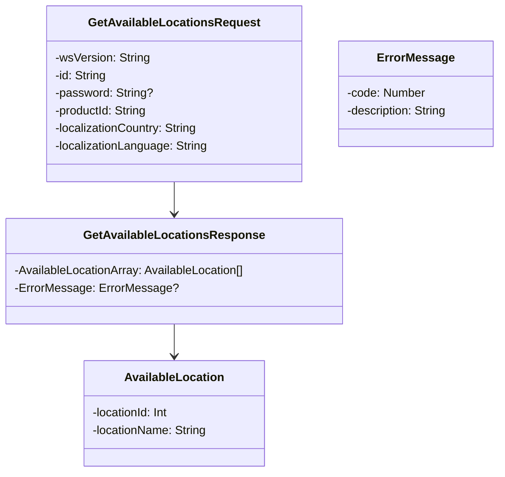
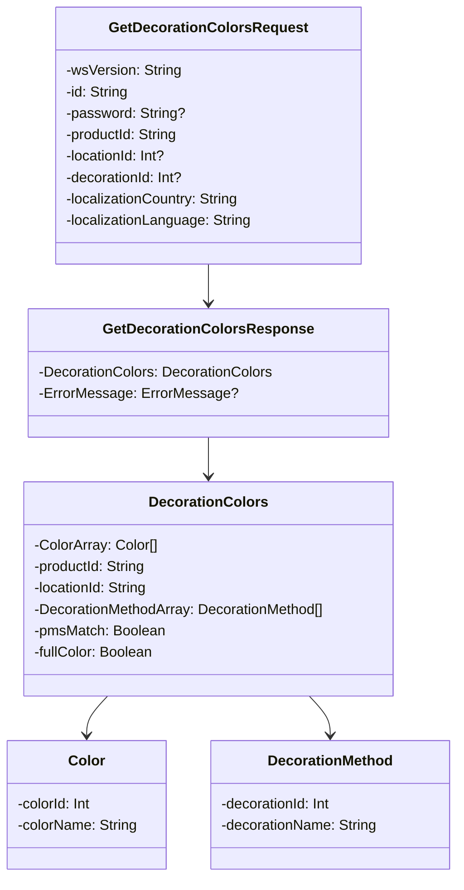
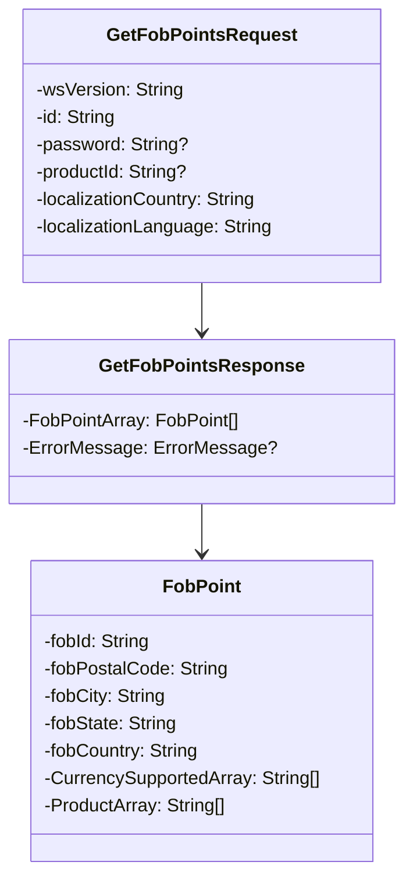
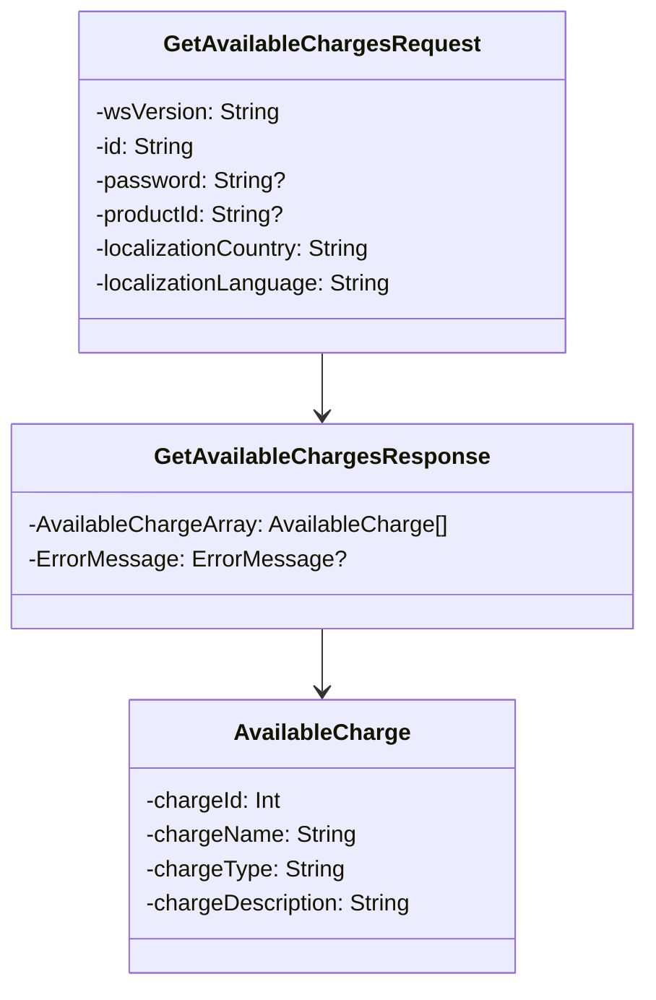

# PROMOTIONAL PRODUCTS DATA INTERFACE SPECIFICATION FOR WEB SERVICES

## Product Configuration, Decoration, and Pricing

### Version Details:
- **Version**: 1.0.0
- **Date**: 2017-07-19

### Document Change Log:
- **Initial Release**: 07/19/17
- **Design**: Eric Shonebarger (CIO Hit Promotional Products, Inc) and Eric Alessi (Essent Corporation).

### Contributors:
- **Design**: 
  - Eric Shonebarger
  - Eric Alessi
- **Contributions**: 
  - Paul Fleischman (Technical Lead PCNA)
  - Jon Norris (VP of Operations, Starline)

### Abstract:
This document describes the technologies for integration of suppliers and distributors in the Promotional Products Industry. This document will discuss in detail the technology required in order to build the interface. Additionally, this document will provide sample code in order to use the interface.

This document will assume that the reader is fluent in web based technologies, and has knowledge of the language they plan to consume the web service in.

### Background Information
All specifications will be built using the Simple Object Access Protocol (SOAP) over HTTPS as the foundation for the web services protocol stack in order to provide a standards based secure form of communication.

More information on SOAP can be found at http://www.w3.org/TR/soap12-part1/

### Service Details:
- **Function [getAvailableLocations](#function-getavailablelocations)**: Provides names of locations for a given product.
- **Function [getDecorationColors](#function-getdecorationcolors)**: Describes possible decoration colors for a product.

### Additional Functions:
- **Function [getFobPoints](#function-getfobpoints)**: Returns information about FOB points for a product.
- **Function [getAvailableCharges](#function-getavailablecharges)**: Provides a list of charges and information on how to calculate them.

### Configuration and Pricing:
- **Function [getConfigurationAndPricing](#function-getconfigurationandpricing)**: Provides the pricing and configuration of a product.

---

## Function: getAvailableLocations()

This function provides the names of locations for a given product.

### Request: GetAvailableLocationsRequest

| Field                | Description                                                                 | WSDL Data Type | SQL Data Type | Required? |
|----------------------|-----------------------------------------------------------------------------|----------------|---------------|-----------|
| wsVersion            | The Standard Version of the Web Service being referenced. Values are enumerated \{1.0.0\} | STRING        | VARCHAR(64)   | TRUE      |
| id                   | The customerId or any other agreed upon Id.                                             | STRING        | VARCHAR(64)   | TRUE      |
| password             | The password associated with the customerId.                                            | STRING        | VARCHAR(64)   | FALSE     |
| productId            | The product id for which to get the locations                                           | STRING        | VARCHAR(64)   | TRUE      |
| localizationCountry  | ISO 3166-1 Alpha 2 code for Country Example: CA=Canada; US=United States                | STRING        | VARCHAR(2)    | TRUE      |
| localizationLanguage | ISO 639-1 Alpha 2 code for Language. Example: en = English; fr = French                 | STRING        | VARCHAR(2)    | TRUE      |

### Reply: GetAvailableLocationsResponse

| Field                     | Description                                                           | WSDL Data Type | SQL Data Type | Required? |
|---------------------------|-----------------------------------------------------------------------|----------------|---------------|-----------|
| [AvailableLocationArray](#availablelocation)    | An array of locations                                                 | ARRAY          | ARRAY        | TRUE      |
| [ErrorMessage](#errormessage)           | List of possible values for errors. Values are enumerated—See Appendix A: Error Messages for full details.    | STRING            | VARCHAR(256) | FALSE  |

## AvailableLocation

This array provides details about the available locations for a given product.

| Field        | Description                     | WSDL Data Type | SQL Data Type | Required? |
|--------------|---------------------------------|----------------|---------------|-----------|
| locationId   | A unique Id of the location     | INT            | INT           | TRUE      |
| locationName | The name of the location        | STRING         | VARCHAR(64)   | TRUE      |

---

## Function: getDecorationColors()

This function describes possible decoration colors given a `productId`.

### Request: GetDecorationColorsRequest

| Field                | Description                                                                 | WSDL Data Type | SQL Data Type | Required? |
|----------------------|-----------------------------------------------------------------------------|----------------|---------------|-----------|
| wsVersion            | The Standard Version of the Web Service being referenced. Values are enumerated: \{1.0.0\} | STRING        | VARCHAR(64)   | TRUE      |
| id                   | The customerId or any other agreed upon Id.                                | STRING        | VARCHAR(64)   | TRUE      |
| password             | The password associated with the customerId.                                | STRING        | VARCHAR(64)   | FALSE     |
| locationId           | The Id of the location                                                      | INT            | INT           | TRUE      |
| productId            | ProductId to filter down to a specific product. If left blank, the function will return all decoration colors for all products. | STRING | VARCHAR(64) | TRUE |
| decorationId         | The Id of the decoration to filter requests by                              | INT            | INT           | FALSE     |
| localizationCountry  | ISO 3166-1 Alpha 2 code for Country Example: CA=Canada; US=United States    | STRING        | VARCHAR(2)    | TRUE      |
| localizationLanguage | ISO 639-1 Alpha 2 code for Language. Example: en = English; fr = French     | STRING        | VARCHAR(2)    | TRUE      |

### Reply: GetDecorationColorsResponse

| Field                | Description                                                                 | WSDL Data Type | SQL Data Type | Required? |
|----------------------|-----------------------------------------------------------------------------|----------------|---------------|-----------|
| [DecorationColors](#color)     | The object with decoration colors                                           | ARRAY          | ARRAY        | FALSE      |
| [ErrorMessage](#errormessage)         | List of possible values for errors. Values are enumerated—See Appendix A: Error Messages for full details. | | | FALSE |

###

| Field                | Description                                                                 | WSDL Data Type | SQL Data Type | Required? |
|----------------------|-----------------------------------------------------------------------------|----------------|---------------|-----------|
| [DecorationColors](#color)     | The object with decoration colors                                           | ARRAY          | ARRAY        | TRUE      |
| productId            | The Id of the product.                                                      | STRING         | VARCHAR(64)   | TRUE      |
| locationId           | The Id of the location that was provided                                    | STRING         | VARCHAR(64)   | TRUE      |
| [DecorationMethodArray](#decorationmethod)| An array of decoration methods for the location                             | ARRAY          | ARRAY        | TRUE      |
| pmsMatch             | TRUE, if PMS match is possible                                              | BOOLEAN        | BOOLEAN      | TRUE      |
| fullColor            | Set to true if the decoration method is full color process; False implies that number of colors is irrelevant. | BOOLEAN | BOOLEAN | TRUE |

### Color

| Field       | Description                                     | WSDL Data Type | SQL Data Type | Required? |
|-------------|-------------------------------------------------|----------------|---------------|-----------|
| colorId     | A unique Id of the color of the imprint         | INT            | INT           | TRUE      |
| colorName   | The name of the imprint color                   | STRING         | VARCHAR(64)   | TRUE      |

### DecorationMethod

| Field          | Description                                     | WSDL Data Type | SQL Data Type | Required? |
|----------------|-------------------------------------------------|----------------|---------------|-----------|
| decorationId   | A unique Id of the decoration                   | INT            | INT           | TRUE      |
| decorationName | The name of the decoration                      | STRING         | VARCHAR(64)   | TRUE      |

---

## Function: getFobPoints()

This function will return basic information about FOB points for a given product.

### Request: GetFobPointsRequest

| Field                | Description                                                                 | WSDL Data Type | SQL Data Type | Required? |
|----------------------|-----------------------------------------------------------------------------|----------------|---------------|-----------|
| wsVersion            | The Standard Version of the Web Service being referenced. Values are enumerated: \{1.0.0\} | STRING        | VARCHAR(64)   | TRUE      |
| id                   | The customerId or any other agreed upon Id.                                | STRING        | VARCHAR(64)   | TRUE      |
| password             | The password associated with the customerId.                                | STRING        | VARCHAR(64)   | FALSE     |
| productId            | The productId you are requesting FOB points for                             | STRING        | VARCHAR(64)   | TRUE     |
| localizationCountry  | ISO 3166-1 Alpha 2 code for Country Example: CA=Canada; US=United States    | STRING        | VARCHAR(2)    | TRUE      |
| localizationLanguage | ISO 639-1 Alpha 2 code for Language. Example: en = English; fr = French     | STRING        | VARCHAR(2)    | TRUE      |

### Reply: GetFobPointsResponse

| Field                | Description                                                                 | WSDL Data Type | SQL Data Type | Required? |
|----------------------|-----------------------------------------------------------------------------|----------------|---------------|-----------|
| [FobPointArray](#fobpoint)        | Array of fob Points                                                         | ARRAY          | ARRAY        | FALSE     |
| [ErrorMessage](#errormessage)         | List of possible values for errors. Values are enumerated—See Appendix A: Error Messages for full details. | STRING       | VARCHAR(256) | FALSE     |

### FobPoint

| Field          | Description                                                        | WSDL Data Type | SQL Data Type | Required? |
|----------------|--------------------------------------------------------------------|----------------|---------------|-----------|
| fobId          | The Id of the FOB Point                                            | STRING         | VARCHAR(64)   | TRUE      |
| fobPostalCode  | The Postal or Zip Code of the fob Point                            | STRING         | VARCHAR(64)   | TRUE      |
| fobCity        | The city of the FOB Point                                          | STRING         | VARCHAR(64)   | TRUE      |
| fobState       | The state of the FOB Point in ISO 3166-2 format.                   | STRING         | VARCHAR(64)   | TRUE      |
| fobCountry     | The country of the FOB Point in Alpha 2 ISO3166 “CODE” format.     | STRING         | VARCHAR(64)   | TRUE      |
| [CurrencySupportedArray](#currencysupported) | The currencies supported for the FOB Point                 | ARRAY          | ARRAY         | TRUE      |
| [ProductArray](#product)           |An array of productIds associated with the FOB Point        | ARRAY          | ARRAY         | TRUE      |

### Product

| Field          | Description                                                        | WSDL Data Type | SQL Data Type | Required? |
|----------------|--------------------------------------------------------------------|----------------|---------------|-----------|
| productId      | The product id                                                     | STRING         | VARCHAR(64)   |  TRUE     |

### CurrencySupported

| Field          | Description                                                        | WSDL Data Type | SQL Data Type | Required? |
|----------------|--------------------------------------------------------------------|----------------|---------------|-----------|
| currency       | The currency supported for the FOB point in ISO4217 format.        | STRING         | VARCHAR(64)   | TRUE      |

---

## Function: getAvailableCharges()

This function provides a list of charges and information on how to calculate charges. It is designed to help populate a database of charge types and design logic to calculate charges.

### Request: GetAvailableChargesRequest

| Field                | Description                                                                 | WSDL Data Type | SQL Data Type | Required? |
|----------------------|-----------------------------------------------------------------------------|----------------|---------------|-----------|
| wsVersion            | The Standard Version of the Web Service being referenced. Values are enumerated: \{1.0.0\} | STRING        | VARCHAR(64)   | TRUE      |
| id                   | The customerId or any other agreed upon Id.                                | STRING        | VARCHAR(64)   | TRUE      |
| password             | The password associated with the customerId.                                | STRING        | VARCHAR(64)   | FALSE     |
| productId            | The productId you are requesting charges for                                | STRING        | VARCHAR(64)   | FALSE     |
| localizationCountry  | ISO 3166-1 Alpha 2 code for Country Example: CA=Canada; US=United States    | STRING        | VARCHAR(2)    | TRUE      |
| localizationLanguage | ISO 639-1 Alpha 2 code for Language. Example: en = English; fr = French     | STRING        | VARCHAR(2)    | TRUE      |

### Reply: GetAvailableChargesResponse

| Field                | Description                                                                 | WSDL Data Type | SQL Data Type | Required? |
|----------------------|-----------------------------------------------------------------------------|----------------|---------------|-----------|
| [AvailableChargeArray](#availablecharge) | An array of charges                                                         | ARRAY          | ARRAY        | TRUE      |
| [ErrorMessage](#errormessage)         | List of possible values for errors. Values are enumerated—See Appendix A: Error Messages for full details. | STRING     | VARCHAR(256) | FALSE     |

### AvailableCharge

| Field               | Description                                                                   | WSDL Data Type | SQL Data Type | Required? |
|---------------------|-------------------------------------------------------------------------------|----------------|---------------|-----------|
| chargeId            | A unique Id of the charge                                                     | INT            | INT           | TRUE      |
| chargeName          | The name of the charge                                                        | STRING         | VARCHAR(64)   | TRUE      |
| chargeType          | The type of charge. Values are enumerated \{SETUP, RUN, ORDER\}.              | STRING         | VARCHAR(64)   | TRUE      |
| chargeDescription   | The charge description                                                        | STRING         | VARCHAR(256)  | TRUE      |

---

## Function: getConfigurationAndPricing()

This function is the main function of the service and provides the pricing and configuration of a product.

### Request: GetConfigurationAndPricingRequest

| Field                | Description                                                                                | WSDL Data Type | SQL Data Type | Required? |
|----------------------|--------------------------------------------------------------------------------------------|----------------|---------------|-----------|
| wsVersion            | The Standard Version of the Web Service being referenced. Values are enumerated: \{1.0.0\} | STRING         | VARCHAR(64)   | TRUE      |
| id                   | The customerId or any other agreed upon Id.                                                | STRING         | VARCHAR(64)   | TRUE      |
| password             | The password associated with the customerId.                                               | STRING         | VARCHAR(64)   | FALSE     |
| productId            | The productId for the pricing                                                              | STRING         | VARCHAR(64)   | TRUE      |
| partId               | The partId                                                                                 | STRING         | VARCHAR(64)   | FALSE     |
| currency             | The unit of currency that the pricing should be returned in ISO4217 “CODE” format.         | STRING         | VARCHAR(64)   | TRUE      |
| fobId                | The fobId of the FOB point                                                                 | STRING         | VARCHAR(64)   | TRUE      |
| priceType            | The type of pricing that should be returned. Values are enumerated: \{Customer, List, Net \} | STRING | VARCHAR(64) | TRUE |
| localizationCountry  | ISO 3166-1 Alpha 2 code for Country Example: CA=Canada; US=United States | STRING | VARCHAR(2) | TRUE |
| localizationLanguage | ISO 639-1 Alpha 2 code for Language. Example: en = English; fr = French | STRING | VARCHAR(2) | TRUE |
| configurationType    | The type of configuration of the product to be returned.  Values are enumerated: \{Blank, Decorated\} | STRING | VARCHAR(32) | TRUE |

### Reply: GetConfigurationAndPricingResponse

| Field                | Description                                                                 | WSDL Data Type | SQL Data Type | Required? |
|----------------------|-----------------------------------------------------------------------------|----------------|---------------|-----------|
| [Configuration](#configuration)        | An object to hold Configuration data.                                       | OBJECT        | OBJECT        | TRUE      |
| [ErrorMessage](#errormessage)         | Response for any error requiring notification to requestor                  | OBJECT        | OBJECT        | FALSE     |

### Configuration

| Field                | Description                                                                 | WSDL Data Type | SQL Data Type | Required? |
|----------------------|-----------------------------------------------------------------------------|----------------|---------------|-----------|
| [PartArray](#partarray)            | An array of Parts and their pricing and configuration data                  | ARRAY          | ARRAY        | TRUE      |
| [LocationArray](#locationarray)        | An array of Locations and their pricing and configuration data              | ARRAY          | ARRAY        | FALSE     |
| productId            | The product family. This is how the part is marketed.                       | STRING         | VARCHAR(64)   | TRUE      |
| currency             | The currency the request of the request in ISO 4217 format                  | STRING         | VARCHAR(64)   | TRUE      |
| [FobArray](#fobarray)             | An array of FOB points that support this configuration                      | ARRAY          | ARRAY        | TRUE      |
| fobPostalCode        | The postal code of the FOB point                                            | STRING         | VARCHAR(64)   | FALSE     |

## PartArray

This object contains information about a part. Parts can either be the main part, required parts, or optional parts that customers can use to configure a product. The `partId` and `partGroup` combination should be unique.

### Part

| Field                | Description                                                                 | WSDL Data Type | SQL Data Type | Required? |
|----------------------|-----------------------------------------------------------------------------|----------------|---------------|-----------|
| partId               | The `partId`                                                               | STRING         | VARCHAR(64)   | TRUE      |
| partDescription      | A description of the `partId`                                               | STRING         | VARCHAR(128)  | FALSE     |
| [PartPriceArray](#partprice)       | An array of prices and quantities                                           | ARRAY          | ARRAY        | FALSE     |
| partGroup            | A numeric identifier grouping mutually exclusive parts together.            | NUMBER         | INT           | TRUE      |
| nextPartGroup        | The next mutually exclusive `partGroup` to complete configuration of the product | NUMBER | INT | FALSE     |
| partGroupRequired    | A boolean value specifying if this `partGroup` is required for the product configuration | BOOLEAN | BOOLEAN | TRUE |
| partGroupDescription | A description of the `partGroup`. Examples: "Main Product", "Optional Lid", "Straw", etc. | STRING | VARCHAR(64) | TRUE |
| ratio                | Describes how the amount of partIds that need to be added to the order based on the number of products ordered. Example: If 8 partIds would be required per 1 product ordered, then 8 should be used as the ratio. If one partId is required for every 8 products, then use .125 | DOUBLE | DECIMAL (12,4) | TRUE |
| defaultPart          | This part is included in the “Basic Pricing Configuration” service price. This field is optional, but highly encouraged. | BOOLEAN | BOOLEAN | FALSE |
| [LocationIdArray](#locationidarray)      | An array of LocationIDs that are available for decoration because the selected part has been configured. | ARRAY | ARRAY | FALSE |

### PartPrice

This object contains pricing for a product based on the `partId`. Prices are additive in nature. A configuration that requires three parts with three different prices should be summed together on the purchase order.

| Field        | Description                                                                 | WSDL Data Type | SQL Data Type | Required? |
|--------------|-----------------------------------------------------------------------------|----------------|---------------|-----------|
| minQuantity  | The minimum quantity for the price break.                                   | INT            | INT           | TRUE      |
| price        | The base price of the good without decoration                               | DOUBLE         | DECIMAL (12,4)| TRUE      |
| discountCode       | The industry discount code associated with the price.                       | STRING         | VARCHAR(1)    | FALSE     |
| priceUom           | Enumerated list of unit of measure used to describe the price. Values are: \{BX, CA, DZ, EA, KT, PR, PK, RL, ST, SL, TH\}. BX - Box, CA - Case, DZ - Dozen, EA - Each, KT - Kit, PR - Pair, PK - Package, RL - Roll, ST - Set, SL - Sleeve, TH - Thousand | STRING | VARCHAR(2) | TRUE  |
| priceEffectiveDate | The date the price is effective in ISO8601 format.                          | DATE           | DATE          | TRUE      |
| priceExpiryDate    | The date the price is no longer effective in ISO8601 format.                | DATE           | DATE          | TRUE      |

### LocationIdArray

This is a list of locationIds that are valid based on the partID that was configured.

| Field       | Description                                      | WSDL Data Type | SQL Data Type | Required? |
|-------------|--------------------------------------------------|----------------|---------------|-----------|
| locationID  | The Id of the available location.                | INT            | INT           | TRUE      |

## LocationArray

This object contains information about available locations for a given product.

### Location

| Field               | Description                                                                  | WSDL Data Type | SQL Data Type | Required? |
|---------------------|------------------------------------------------------------------------------|----------------|---------------|-----------|
| locationId          | A unique Id of the location                                                  | INT            | INT           | TRUE      |
| locationName        | The name of the location                                                     | STRING         | VARCHAR(64)   | TRUE      |
| [DecorationArray](#decorationarray)     | An array of decorations that are available for the location.                 | ARRAY          | ARRAY         | TRUE      |
| decorationsIncluded | The number of decorations included in the price                              | INT            | INT           | TRUE      |
| maxDecoration       | The maximum number of decorations that can be added to the location          | INT            | INT           | TRUE      |
| minDecoration       | The minimum number of decorations that can be added to the location          | INT            | INT           | TRUE      |
| locationRank        | Popularity of location based on supplier experience                          | INT            | INT           | FALSE     |

---

### DecorationArray

This array provides details about the decorations that are valid for a given location.

### Decoration

This object contains decoration information that is valid for a specific location.

| Field                        | Description                                                                 | WSDL Data Type | SQL Data Type | Required? |
|------------------------------|-----------------------------------------------------------------------------|----------------|---------------|-----------|
| decorationId                 | The ID of the decoration                                                    | INT            | INT           | TRUE      |
| decorationName               | The name of the decoration                                                  | STRING         | VARCHAR(64)   | FALSE     |
| decorationGeometry           | The geometry of the decoration. Values are enumerated: \{Circle, Rectangle, Other\} | STRING | VARCHAR(64) | TRUE      |
| decorationHeight             | The maximum imprint height of the decoration; leave blank if the imprint is not rectangular | DOUBLE | DECIMAL (12,4) | FALSE |
| decorationWidth              | The maximum imprint width of the decoration; leave blank if the imprint is not rectangular | DOUBLE | DECIMAL (12,4) | FALSE |
| decorationDiameter           | The maximum imprint diameter of the decoration; leave blank if the imprint is not circular | DOUBLE | DECIMAL (12,4) | FALSE |
| decorationUom                | The unit of measure for the decoration area in ISO 20022 format | STRING | VARCHAR(64) | TRUE |
| allowSubForDefaultLocation   | Buyer is allowed to substitute a decoration location without changing the price | BOOLEAN | BOOLEAN | FALSE |
| allowSubForDefaultMethod     | Buyer is allowed to substitute this decoration method without changing the price | BOOLEAN | BOOLEAN | FALSE |
| itemPartQuantityLTM          | Specifies the Part Quantity that is the absolute minimum that can be ordered with a Less Than Minimum (LTM) charge | INT | INT | FALSE |
| [ChargeArray](#charge)                  | An array of setup charge data                                               | ARRAY         | ARRAY | FALSE |
| decorationUnitsIncluded      | The number of included decoration units. For example, if 1 color decoration is included set value to “1”. If 7,500 stitches are included set value to “7500” | INT | INT | FALSE |
| decorationUnitsIncludedUom   | Values are enumerated: \{Colors, Inches, Other, Stitches, SquareInches \} | STRING | STRING | FALSE |
| decorationUnitsMax           | This is the max number of decoration units for this decoration/location combination | INT | INT | FALSE |
| defaultDecoration            | Specifies whether this is the default decoration for this location | BOOLEAN | BOOLEAN | TRUE |
| leadTime                     | The lead time for the given decoration | INT | INT | FALSE |
| rushLeadTime                 | The lead time for rush service for a given decoration (rush charges may apply) | INT | INT | FALSE |

## Charge

This object contains a charge that is associated with the setup of the product, location, and decoration configuration.

| Field               | Description                                                                   | WSDL Data Type | SQL Data Type | Required? |
|---------------------|-------------------------------------------------------------------------------|----------------|---------------|-----------|
| chargeId            | The Id of the charge                                                          | INT            | INT           | TRUE      |
| chargeName          | The name of the charge                                                        | STRING         | VARCHAR(64)   | TRUE      |
| chargeType          | The type of charge. Values are enumerated `{Order, Run, Setup`}.              | STRING         | VARCHAR(64)   | TRUE      |
| chargeDescription   | The charge description                                                        | STRING         | VARCHAR(256)  | TRUE      |
| [ChargePriceArray](#chargeprice)    | An array of charge prices                                                     | ARRAY          | ARRAY         | TRUE      |
| chargesAppliesLTM   | This charge is applied with ordering Less than Minimum (LTM).                 | BOOLEAN        | BOOLEAN       | TRUE      |
| chargesPerLocation  | The number of times a charge will occur per location                          | INT            | INT           | FALSE     |
| chargesPerColor     | The number of times a charge will occur per color                             | INT            | INT           | FALSE     |

## ChargePrice

This object contains a single line of a price grid represented by an X and Y axis.

| Field               | Description                                                                 | WSDL Data Type | SQL Data Type | Required? |
|---------------------|-----------------------------------------------------------------------------|----------------|---------------|-----------|
| xMinQty             | The minimum x-value quantity for this price                                 | INT            | INT           | TRUE      |
| xUom                | The unit of measure for the x-axis. Values are enumerated: \{BX, CA, DZ, EA, KT, PR, PK, RL, ST, SL, TH\} | STRING | VARCHAR(2) | TRUE      |
| yMinQty             | The minimum y-value quantity for this price                                 | INT            | INT           | TRUE      |
| yUom                | The unit of measure for the y-axis. Values are enumerated: \{Colors, Inches, Other, Stitches, SquareInches\} | STRING | STRING | TRUE |
| price               | The price of the charge                                                     | DOUBLE         | DECIMAL (12,4)| TRUE      |
| discountCode        | The discount code associated with the price                                 | STRING         | VARCHAR(1)    | FALSE     |
| repeatPrice         | The price of the charge if it is a repeat order                             | NUMBER         | DECIMAL (12,4)| FALSE     |
| repeatDiscountCode  | The discount code of the repeat price                                       | STRING         | VARCHAR(1)    | FALSE     |
| priceEffectiveDate  | The date the price is effective in ISO8601 format                           | DATE           | DATE          | FALSE     |
| priceExpiryDate     | The date the price is no longer effective in ISO8601 format                 | DATE           | DATE          | FALSE     |

## FobArray

This object contains information about the FOB (Free On Board) points that support the configuration. By default, this will always include the valid FOB point that was sent as part of the request.

### FOB Point

| Field          | Description                                      | WSDL Data Type | SQL Data Type | Required? |
|----------------|--------------------------------------------------|----------------|---------------|-----------|
| fobId          | The FOB point of the pricing                     | STRING ARRAY   | VARCHAR(64)   | TRUE      |
| fobPostalCode  | The postal code of the FOB point                 | STRING         | VARCHAR(64)   | FALSE     |

---

## Appendix A: Error Messages

These error messages are associated with the setup of the product, location, and decoration configuration.

### ErrorMessage

| Field         | Description                                         | WSDL Data Type | SQL Data Type | Required? |
|---------------|-----------------------------------------------------|----------------|---------------|-----------|
| code          | The numerical value of the code                     | INT            | INT           | TRUE      |
| description    | Response for any error requiring notification to requestor | STRING | VARCHAR(256) | FALSE    | 

### Standardized Codes

The range of `100-199` has been reserved for standardized error codes. The number `999` has been reserved for an error code that is a "General Error - Contact System Service Provider".

| Code | Description |
|------|-------------|
| 100  | ID (customerID) not found |
| 104  | This account is unauthorized to use this service. Please contact the service provider |
| 105  | Authentication Credentials failed |
| 110  | Authentication Credentials required |
| 115  | wsVersion not found |
| 120  | The following field(s) are required [Comma Delimited field names] |
| 125  | Not Supported:
| 999  | General Error – Contact the System Service Provider Details: [Details] |

### Service Specific Code

These error codes are only for this service.

| Code | Description |
|------|-------------|
| 400  | productID not found |
| 401  | currencyID not found |
| 402  | priceType not found |
| 403  | fobId not found |
| 404  | localizationCountry not found |
| 405  | localizationLanguage not found |
| 406  | configurationType not found |

## Diagrams

### getAvailableLocations Function

### getDecorationColors Function

### getFobPoints Function

### getAvailableCharges Function

### GetConfigurationAndPricing Function

```mermaid
classDiagram
    class GetConfigurationAndPricingRequest {
        -wsVersion: String
        -id: String
        -password: String?
        -productId: String
        -partId: String?
        -currency: String
        -fobId: String
        -priceType: String
        -localizationCountry: String
        -localizationLanguage: String
        -configurationType: String
    }

    class GetConfigurationAndPricingResponse {
        -Configuration: Configuration
        -ErrorMessage: ErrorMessage?
    }

    class Configuration {
        -PartArray: Part[]
        -LocationArray: Location[]
        -productId: String
        -currency: String
        -FobArray: Fob[]
        -fobPostalCode: String
        -priceType: String
    }

    class Part {
        -partId: String
        -partDescription: String
        -PartPriceArray: PartPrice[]
        -partGroup: Int
        -nextPartGroup: Int
        -partGroupRequired: Boolean
        -partGroupDescription: String
        -ratio: Double
        -defaultPart: Boolean
        -LocationIdArray: Int[]
    }

    class PartPrice {
        -minQuantity: Int
        -price: Double
        -discountCode: String
        -priceUom: String
        -priceEffectiveDate: Date
        -priceExpiryDate: Date
    }

    class Location {
        -locationId: Int
        -locationName: String
        -DecorationArray: Decoration[]
        -decorationsIncluded: Int
        -defaultLocation: Boolean
        -maxDecoration: Int
        -minDecoration: Int
        -locationRank: Int
    }

    class Decoration {
        -decorationId: Int
        -decorationName: String
        -decorationGeometry: String
        -decorationHeight: Double
        -decorationWidth: Double
        -decorationDiameter: Double
        -decorationUom: String
        -allowSubForDefaultLocation: Boolean
        -allowSubForDefaultMethod: Boolean
        -itemPartQuantityLTM: Int
        -ChargeArray: Charge[]
        -decorationUnitsIncluded: Int
        -decorationUnitsIncludedUom: String
        -decorationUnitsMax: Int
        -defaultDecoration: Boolean
        -leadTime: Int
        -rushLeadTime: Int
    }

    class Charge {
        -chargeId: Int
        -chargeName: String
        -chargeType: String
        -chargeDescription: String
        -ChargePriceArray: ChargePrice[]
        -chargeAppliesLTM: Boolean
        -chargesPerLocation: Int
        -chargesPerColor: Int
    }

    class ChargePrice {
        -xMinQty: Int
        -xUom: String
        -yMinQty: Int
        -yUom: String
        -price: Double
        -discountCode: String
        -repeatPrice: Number
        -repeatDiscountCode: String
        -priceEffectiveDate: Date
        -priceExpiryDate: Date
    }

    GetConfigurationAndPricingRequest --> GetConfigurationAndPricingResponse
    GetConfigurationAndPricingResponse --> Configuration
    Configuration --> Part
    Part --> PartPrice
    Configuration --> Location
    Location --> Decoration
    Decoration --> Charge
    Charge --> ChargePrice

```

---

