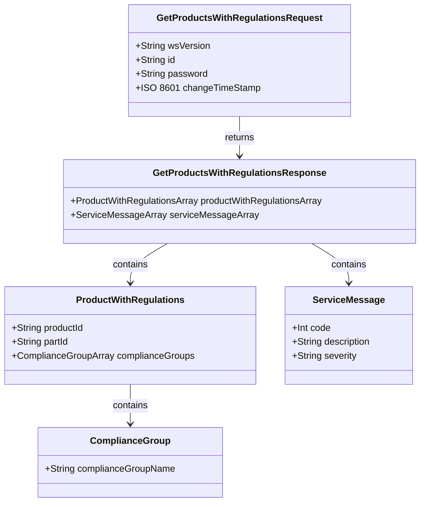
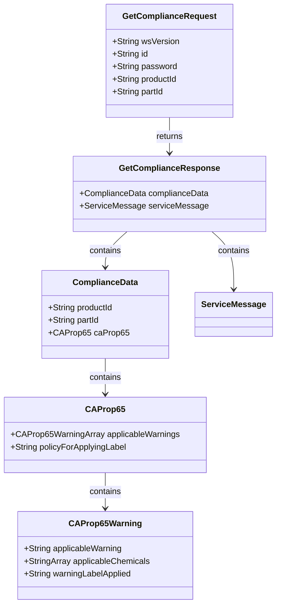

### **PROMOTIONAL PRODUCTS COMPLIANCE INTERFACE SPECIFICATION FOR WEB SERVICES**

## **Product Compliance 1.0.0**

# Product Compliance 1.0.0

Version: 1.0.0

Date: 2020-01-08

**Document Change Log**

| Version | Date       | Reason for Change  | Author                                                             |
| ------- | ---------- | ------------------ | ------------------------------------------------------------------ |
| 1.0.0   | 01/08/2020 | Production Release | Dustin Kessler, Enterprise Architect, Staples Promotional Products |

# Contributors

The following have contributed to the creation of this specification:

Contributors: Dustin Kessler, Enterprise Architect, Staples Promotional Products
 Max Stepanskiy, Executive Director of Enterprise Architecture, Advertising Specialty Institute

Eric Shonebarger, CIO, Hit Promotional Products, Inc

Michael J Plourde, Director Data and Analytics, Geiger

# Abstract and Recommended Audience

This document describes the technologies for integration of suppliers and distributors in the Promotional Products Industry. This document will discuss in detail the technology required to build the interface. Additionally, this document will provide sample code to use the interface.

This document will assume that the reader is fluent in web based technologies, and has knowledge of the language they plan to consume the web service in.

# Background Information

All specifications will be built using the Simple Object Access Protocol (SOAP) over HTTPS as the foundation for the web services protocol stack in order to provide a standard based on a secure form of communication.

More information on SOAP can be found at http://www.w3.org/TR/soap12-part1/

### **Service Details**

### **Function** : getProductsWithRegulations ()

Gets the list of products and optional parts which currently or in the future will have applicable regulations

### **Request:** GetProductsWithRegulationsRequest

| **Field** | **Description** | **WSDL Data Type** | **SQL Data Type** | **Required?** |
| --- | --- | --- | --- | --- |
| wsVersion | The Standard Version of the Web Service being referenced. _Values are enumerated \{1.0.0\}_ | STRING | VARCHAR(64) | TRUE |
| id | The customerId or any other agreed upon Id. | STRING | VARCHAR(64) | TRUE |
| password | The password associated with the customerId. | STRING | VARCHAR(64) | FALSE |
| changeTimeStamp | Beginning date time since last change in UTC; this element being left off the request indicates an intention to get all whereas including this element in the request indicates an intention to only get those that have changed since the supplied date and time. | ISO 8601 DATE | DATETIME | FALSE |

### **Reply:** GetProductsWithRegulationsResponse

| **Field** | **Description** | **WSDL Data Type** | **SQL Data Type** | **Required?** |
| --- | --- | --- | --- | --- |
| [productWithRegulationsArray](#productwithregulations-object) | The list of products and optional their parts which currently or in the future will have applicable regulations | OBJECT ARRAY | OBJECT ARRAY | TRUE |
| [ServiceMessageArray](#servicemessage) | Error message object Array | OBJECT ARRAY | OBJECT ARRAY | FALSE |

### ProductWithRegulations Object

| **Field** | **Description** | **WSDL Data Type** | **SQL Data Type** | **Required?** |
| --- | --- | --- | --- | --- |
| productId | The identifier of the product that has or will have applicable regulations | STRING | VARCHAR(64) | TRUE |
| partId | The identifier of the part that has or will have applicable regulations; this element being left off the response indicates all parts have or will have applicable regulations whereas including this element in the response indicates this part has or will have applicable regulations | STRING | VARCHAR(64) | FALSE |
| complianceGroups | The list of promo standards compliance groups which currently or in the future apply to this product and, if included in the response, part Values are enumerated \{CaliforniaProp65\} | ENUMERATED STRING ARRAY | VARCHAR(64) ARRAY | TRUE |

### **Function** : getCompliance ()

Gets the compliance data of the specific product and part, if supplied, for the `CaliforniaProp65` compliance group.

### **Request:** GetComplianceRequest

| **Field** | **Description** | **WSDL Data Type** | **SQL Data Type** | **Required?** |
| --- | --- | --- | --- | --- |
| wsVersion | The Standard Version of the Web Service being referenced. Values are enumerated \{1.0.0\} | STRING | VARCHAR(64) | TRUE |
| id | The customer Id or any other agreed upon Id. | STRING | VARCHAR(64) | TRUE |
| password | The password associated with the Id. | STRING | VARCHAR(64) | FALSE |
| productId | The identifier of the product to get compliance data for | STRING | VARCHAR(64) | TRUE |
| partId | The identifier of the part to get compliance data for; this element being left off indicates an intention to get compliance data on any applicable parts for the specific product whereas including this element indicates an intention to only get compliance data for the specific part | STRING | VARCHAR(64) | FALSE |

### **Reply:** GetComplianceResponse

| **Field** | **Description** | **WSDL Data Type** | **SQL Data Type** | **Required?** |
| --- | --- | --- | --- | --- |
| [ComplianceData](#compliancedata) | An object containing the compliance data for a product; this element being left off indicates no compliance data is available for the requested product or, if requested, part. | OBJECT | OBJECT | FALSE |
| [ServiceMessage](#servicemessage) | Service message object | OBJECT | OBJECT | FALSE |

### **ComplianceData**

| **Field** | **Description** | **WSDL Data Type** | **SQL Data Type** | **Required?** |
| --- | --- | --- | --- | --- |
| productId | The identifier of the product associated with the compliance data | STRING | VARCHAR(64) | TRUE |
| partId | The identifier of the part associated with the compliance data; this element being left off indicates the compliance data applies to all parts whereas including this element in the response indicates the compliance data is for the part | STRING | VARCHAR(64) | FALSE |
| [CAProp65](#caprop65) | An object containing the `CaliforniaProp65` compliance data for a product; this element being left off indicates no compliance data is available for the requested product or, if requested, part. | OBJECT | OBJECT | FALSE |

### **CAProp65**

| **Field** | **Description** | **WSDL Data Type** | **SQL Data Type** | **Required?** |
| --- | --- | --- | --- | --- |
| ApplicableWarnings | The warning(s) which apply to the product, or if specified in the response, part | OBJECT ARRAY | OBJECT ARRAY | TRUE |
| policyForApplyingLabel | The trigger for applying the warning label to the product or product packaging Values are enumerated \{Applied Upon Request, Applied When Shipping to California, Applied Always\} | ENUMERATED STRING | VARCHAR(64) | TRUE |

### **CAProp65Warning**

| **Field** | **Description** | **WSDL Data Type** | **SQL Data Type** | **Required?** |
| --- | --- | --- | --- | --- |
| applicableWarning | A warning that applies to the product, or if specified in the response, part Values are enumerated \{On Product Cancer, On Product Reproductive, Food, Furniture, Alcoholic Beverage\} | ENUMERATED STRING | VARCHAR(64) | TRUE |
| applicableChemicals | The chemicals used on or in the product, or if specified in the response, part, that cause the warning to apply to the product or part | STRING ARRAY | STRING ARRAY | FALSE |
| warningLabelApplied | The type of warning label applied to the product or product packaging Values are enumerated \{Short Form, Long Form\} | ENUMERATED STRING | VARCHAR(64) | TRUE |

## Appendix A: Error Messages

### ServiceMessage

| **Field** | **Description** | **WSDL Data Type** | **SQL Data Type** | **Required?** |
| --- | --- | --- | --- | --- |
| code | The numerical value of the code | INT | INT | TRUE |
| description | Response for any message requiring notification to requestor | STRING | VARCHAR(256) | TRUE |
| severity | The severity of the message. Values are enumerated: \{Error, Information, Warning\} | ENUMERATED STRING | VARCHAR(64) | TRUE |

### Standardized Codes:

The range of 100-199 has been reserved for standardized error codes.

The number 999 has been reserved for an error codes that is a "General Error - Contact System Service Provider"

| **Code** | **Description** |
| --- | --- |
| 100 | ID (customerID) not found |
| 104 | This account is unauthorized to use this service.  Please contact the service provider |
| 105 | Authentication Credentials failed |
| 110 | Authentication Credentials required |
| 115 | wsVersion not found |
| 120 | The following field(s) are required [Comma Delimited field names] |
| 125 | Not Supported |
| 999 | General Error – Contact the System Service Provider Details: [Details] |

**Service Specific Code:** These error codes are only for this service.

| Code | Description |
| --- | --- |
| 600 | Product Id not found |
| 610 | Data violation: \{0\}    (Occurs when a supplier does a pre-check on the data and finds that there is a mismatch of data and/or there are incorrect calculations) |
| 620 | Field is not supported: \{0\} |
| 630 | Part Id not found |

## Diagrams

### GetProductsWithRegulations Request and Response Classes

### GetCompliance Request and Response Classes

