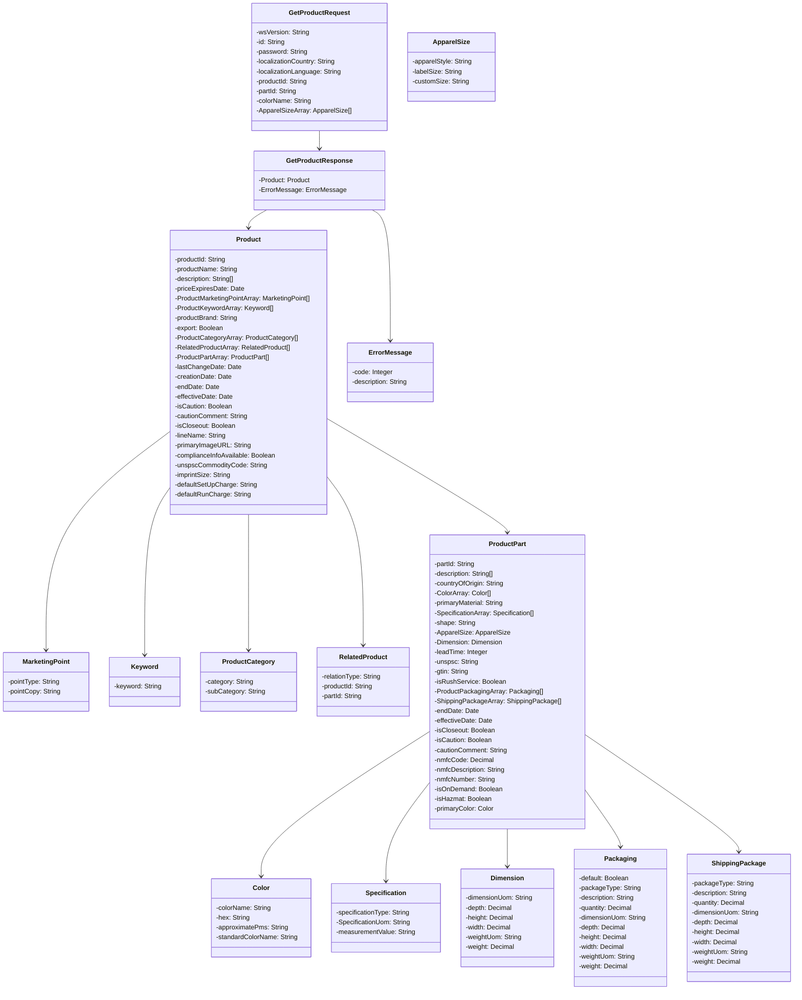

### **PROMOTIONAL PRODUCTS DATA INTERFACE SPECIFICATION FOR WEB SERVICES**

## **Product Data 1.0.0**

Version: 1.0.0

Date: 2016-06-08

**Document Change Log**

| Version | Date | Reason for Change | Author |
| --- | --- | --- | --- |
| 1.0.0 | 2016-06-08 | Initial Release | Tim Nale, Director IT BIC Graphic NA |

**Contributors**

The following have contributed to the creation of this specification:

**Design** : Tim Nale, Director of IT, BIC Graphic

**Contributors** :

- Paul Fleischman, Technical Lead, PCNA
- Jon Norris, VP of Operations, Starline

**Product Data**

There will be four functions available as part of this web service.

- [getProduct()](#getproduct)
- [getProductDateModified()](#getproductdatemodified)
- [getProductCloseOut()](#getproductcloseout)
- [getProductSellable()](#getproductsellable)

### getProduct()

This function will provide the detail product data based on a specific ProductId or any additional optional subset filtering provided at the request.

### **Request:** GetProductRequest

| **Field** | **Description** | **Data Type** | **Required?** |
| --- | --- | --- | --- |
| wsVersion | The Standard Version of the Web Service being referenced. Values are enumerated \{1.0.0\} | 64 STRING | TRUE |
| id | The customer Id or any other agreed upon Id. | 64 STRING | TRUE |
| password | The password associated with the Id | 64 STRING | FALSE |
| localizationCountry | ISO 3166-1 Alpha 2 code for Country Example: CA=Canada US=United States | 2 STRING | TRUE |
| localizationLanguage | ISO 639-1 Alpha 2 code for Language Example: en = English fr = French | 2 STRING | TRUE |
| productId | Item's ID | 64 STRING | TRUE |
| partId | The Supplier specific PartId; commonly referred to as a sku | 64 STRING | FALSE |
| colorName | A specific part color for this product | 64 STRING | FALSE |
| [ApparelSizeArray](#apparelsize-object) | Used for returning specific apparel sizes. Array of ApparelSize objects | ARRAY | FALSE |

### **Reply:** GetProductResponse

| **Field** | **Description** | **Data Type** | **Required?** |
| --- | --- | --- | --- |
| [Product](#product-object) | Product Information | OBJECT | FALSE |
| [ErrorMessage](#errormessage-object) | Response for any error requiring notification to requestor | OBJECT | FALSE |

### **Product Object**

| **Field** | **Description** | **Data Type** | **Required?** |
| --- | --- | --- | --- |
| productId | The associated product. | 64 STRING | TRUE |
| productName | The Supplier name for the product | 256 STRING | TRUE |
| description | Basic product description or bulleted list of descriptions. | 2048 STRING ARRAY | TRUE |
| [ProductMarketingPointArray](#productmarketingpoint-object) | Marketing points type and content. An array of MarketingPoint objects. | OBJECT ARRAY | FALSE |
| [ProductKeywordArray](#productkeyword-object) | Array of keywords often used in searching for this product. An array of ProductKeyword objects. | OBJECT ARRAY | FALSE |
| productBrand | The specific product brand | 64 STRING | FALSE |
| export | Product status for export | NILLABLE BOOLEAN | TRUE |
| [ProductCategoryArray](#productcategory-object) | The product's categorization array. An array of ProductCategory objects. | OBJECT ARRAY | FALSE |
| [RelatedProductArray](#relatedproduct-object) | Products related to the quested product as Substitutable, CompanionSell, or Common Grouping (Family). An array of RelatedProduct objects. | OBJECT ARRAY | FALSE |
| [ProductPartArray](#productpart-object) | All part specific product data. An array of ProductPart objects. | OBJECT ARRAY | TRUE |
| lastChangeDate | The date time stamp of the most recent change to this data in ISO 8601 format | ISO 8601 DATE | TRUE |
| creationDate | The date time stamp when this products data initially became available in ISO 8601 format | ISO 8601 DATE | TRUE |
| endDate | The Date this Product expires from Supplier availability in ISO 8601 format | ISO 8601 DATE | FALSE |
| effectiveDate | The Date this Product initially becomes available from the Supplier in ISO 8601 format | ISO 8601 DATE | FALSE |
| isCaution | Cautionary status to review for specific warnings about using product data | NILLABLE BOOLEAN | TRUE |
| cautionComment | Product cautionary comments | 1024 STRING | FALSE |
| isCloseout | Indicates if the product is a closeout | NILLABLE BOOLEAN | TRUE |
| lineName | Line Name / Division to which this product belongs | 64 STRING | FALSE |

### **ProductCategory Object**

| **Field** | **Description** | **Data Type** | **Required?** |
| --- | --- | --- | --- |
| category | Product category | 256 STRING | TRUE |
| subCategory | Product subcategory | 256 STRING | FALSE |

### **ProductMarketingPoint Object**

| **Field** | **Description** | **Data Type** | **Required?** |
| --- | --- | --- | --- |
| pointType | Basic category or type of marketing point being made. e.g. Highlights, Size, Safety | 64 STRING | FALSE |
| pointCopy | Marketing bullet or point copy | 1024 STRING | TRUE |

### **ProductKeyword Object**

| **Field** | **Description** | **Data Type** | **Required?** |
| --- | --- | --- | --- |
| keyword | A product keyword commonly utilized for search or other functions | 64 STRING | TRUE |

### **RelatedProduct Object**

| **Field** | **Description** | **Data Type** | **Required?** |
| --- | --- | --- | --- |
| relationType | The relationship type between two products | 64 STRING | TRUE |
| productId | Product Id | 64 STRING | TRUE |
| partId | Part specific Id | 64 STRING | FALSE |

### **ProductPart Object**

| **Field** | **Description** | **Data Type** | **Required?** |
| --- | --- | --- | --- |
| partId | The part Id | 64 STRING | TRUE |
| description | Description | 2048 STRING ARRAY | FALSE |
| countryOfOrigin | Country of Origin  ISO 3166-1 Alpha 2 code for Country Example: CA=Canada; US=United States | 2 STRING | FALSE |
| [ColorArray](#color-object) | Information about the part colors | OBJECT ARRAY | FALSE |
| primaryMaterial | Primary material of construction | 64 STRING | FALSE |
| [SpecificationArray](#specification-object) | Specifications | OBJECT ARRAY | FALSE |
| shape | General shape | 64 STRING | FALSE |
| [ApparelSize](#apparelsize-object) | Used to describe an apparel size | OBJECT | FALSE |
| [Dimension](#dimension-object) | Physical dimensions and weight | OBJECT | FALSE |
| leadTime | Lead time in days | INT | FALSE |
| unspsc | United Nations Standard Products and Services Code (UNSPSC) | 8 STRING | FALSE |
| gtin | Global Trade Item Number (GTIN) | 14 STRING | FALSE |
| isRushService | Rush service | NILLABLE BOOLEAN | TRUE |
| [ProductPackagingArray](#productpackaging-object) | Packaging option details; e.g. Gift Box, Cello Pack, Sleeve. An array of ProductPackaging objects. | OBJECT ARRAY | FALSE |
| [ShippingPackageArray](#shippingpackage-object) | Shipping package option details for the partPackaging Default package type; e.g. Carton, Box, Pallet. An array of ShippingPackage objects. | OBJECT ARRAY | FALSE |
| endDate | The date this part expires from supplier availability in ISO 8601 format | ISO 8601 DATE | FALSE |
| effectiveDate | The Date this Part initially becomes available from the Supplier in ISO 8601 format | ISO 8601 DATE | FALSE |
| isCloseout | Indicates if a closeout | NILLABLE BOOLEAN | TRUE |
| isCaution | Cautionary status to review for specific warnings about using product data | NILLABLE BOOLEAN | TRUE |
| cautionComment | Cautionary comments | 1024 STRING | FALSE |
| nmfcCode | National Motor Freight Classification Code | DECIMAL | FALSE |
| nmfcDescription | National Motor Freight Classification Description | 1024 STRING | FALSE |
| nmfcNumber | National Motor Freight Classification Number | 64 STRING | FALSE |
| isOnDemand | Manufactured on demand / Made to order | NILLABLE BOOLEAN | TRUE |
| isHazmat | Contains hazardous material. A nil value indicates this it is unknown or the data is not available by the supplier. | NILLABLE BOOLEAN | TRUE |

### **Color Object**

| **Field**      | **Description**                                                          | **Data Type** | **Required?** |
| -------------- | ------------------------------------------------------------------------ | ------------- | ------------- |
| colorName      | Supplier specific color name. Go to market color                         | 64 STRING     | TRUE          |
| hex            | The HEX code representation. This is not a supplement for product color but data used for generating web user interfaces. | 64 STRING | FALSE |
| approximatePms | The PMS code representation. This is not a supplement for product color. | 64 STRING     | FALSE         |

### **Specification Object**

| **Field** | **Description** | **Data Type** | **Required?** |
| --- | --- | --- | --- |
| specificationType | The type of specification | 64 STRING FACIT | TRUE |
| SpecificationUom | Specification unit of measure | 64 STRING | TRUE |
| measurementValue | Specification Measurement Value | 64 STRING | TRUE |

### **ApparelSize Object**

| **Field**    | **Description** | **Data Type**   | **Required?** |
| ------------ | --------------- | --------------- | ------------- |
| apparelStyle | Apparel style   | 64 STRING FACIT | TRUE          |
| labelSize    | The apparel items tagged size. e.g. XS, S, M, L, etc. | 6 STRING FACIT | TRUE |
| customSize   | Used to communicate custom size when labelSize is CUSTOM. | 64 STRING | FALSE |

### **Dimension Object**

| **Field**    | **Description** | **Data Type** | **Required?** |
| ------------ | --------------- | ------------- | ------------- |
| dimensionUom | The dimensional unit of measure | 2 STRING FACIT | TRUE |
| depth        | The depth/length of the part using the unit of measure specified in dimensionUom | DECIMAL | FALSE |
| height       | The height of the part using the unit of measure specified in dimensionUom | DECIMAL | FALSE |
| width        | The width of the part using the unit of measure specified in dimensionUom | DECIMAL | FALSE |
| weightUom    | The weight unit of measure for the part | 2 STRING FACIT | TRUE |
| weight       | The weight of the part using the unit of measure specified in dimensionUom | DECIMAL | FALSE |

### **ProductPackaging Object**

| **Field** | **Description** | **Data Type** | **Required?** |
| --- | --- | --- | --- |
| default | Boolean flag identifying the single default packaging for this package | BOOLEAN | TRUE |
| packageType | The packaging specific type for this partId e.g. Gift Box, Cello Pack, Sleeve | 256 STRING | TRUE |
| description | The Packaging specific description | 2048 STRING | FALSE |
| quantity | The partId unit Quantity included within this specific Packaging Option | DECIMAL | TRUE |
| dimensionUom | The unit of measure for the package | 2 STRING FACIT | TRUE |
| depth | The depth/length of the package in the dimensionUom unit of measure | DECIMAL | FALSE |
| height | The height of the package in the dimensionUom unit of measure | DECIMAL | FALSE |
| width | The width of the package in the dimensionUom unit of measure | DECIMAL | FALSE |
| weightUom | The weight unit of measure for the packageType | 2 STRING FACIT | TRUE |
| weight | The weight of the specific packageType | DECIMAL | FALSE |

### **ShippingPackage Object**

| **Field**    | **Description** | **Data Type** | **Required?** |
| ------------ | --------------- | ------------- | ------------- |
| packageType  | The shipping package specific type for this shipping package e.g. Box, Carton, etc. | 256 STRING | TRUE |
| description  | The shipping package specific description | 2048 STRING | FALSE |
| quantity     | The partId unit quantity included within this specific shipping packaging option | DECIMAL | TRUE |
| dimensionUom | The weight unit of measure for the packageType | 2 STRING FACIT | TRUE |
| depth | The depth/length of the shipping package in the dimensionUom unit of measure | DECIMAL | FALSE |
| height | The height of the shipping package in the dimensionUom unit of measure | DECIMAL | FALSE |
| width | The width of the shipping package in the dimensionUom unit of measure | DECIMAL | FALSE |
| weightUom | The weight unit of measure for the packageType | 2 FACIT STRING | TRUE |
| weight | The weight of the specific packageType | DECIMAL | FALSE |

### getProductDateModified()

This function will provide the list of Product Ids and optional Part Ids for all items which have changed since the date supplied in the request.

**Request:** GetProductDateModifiedRequest

| **Field** | **Description** | **Data Type** | **Required?** |
| --- | --- | --- | --- |
| wsVersion | The Standard Version of the Web Service being referenced. Values are enumerated \{1.0.0\} | 64 STRING | TRUE |
| id | The customer Id or any other agreed upon Id. | 64 STRING | TRUE |
| password | The password associated with the Id | 64 STRING | FALSE |
| changeTimeStamp | Beginning date time since last change in UTC | ISO 8601 DATE | TRUE |

### **Reply:** GetProductDateModifiedResponse

| **Field**          | **Description** | **Data Type** | **Required?** |
| ------------------ | --------------- | --- | --- |
| [productChangeArray](#productchange-object) | Array listing of all Product and Part specific Ids which have changed since the reference date requested (lastChangeDate). An array of ProductChange objects. | OBJECT ARRAY | TRUE |
| [ErrorMessage](#errormessage-object) | Response for any error requiring notification to requestor | OBJECT | FALSE |

### **ProductChange Object**

| **Field** | **Description** | **Data Type** | **Required?** |
| --------- | --------------- | --- | --- |
| productId | The associated product | 64 STRING | TRUE |
| partId    | The associated part | 64 STRING | FALSE |

### getProductCloseOut()

This function will provide a list of Product Ids and optional Part Ids for all items which currently have an isCloseOut value of TRUE.

### **Request:** GetProductCloseOutRequest

| **Field** | **Description** | **Data Type** | **Required?** |
| --- | --- | --- | --- |
| wsVersion | The Standard Version of the Web Service being referenced. Values are enumerated \{1.0.0\} | 64 STRING | TRUE |
| id | The customer Id or any other agreed upon Id. | 64 STRING | TRUE |
| password | The password associated with the Id | 64 STRING | FALSE |

### **Reply:** GetProductCloseOutResponse

| **Field** | **Description** | **Data Type** | **Required?** |
| --- | --- | --- | --- |
| [ProductCloseOutArray](#productcloseout-object) | All product and part specific Ids which are on closeout. An array of ProductCloseOut objects. | OBJECT ARRAY | TRUE |
| [ErrorMessage](#errormessage-object) | Response for any error requiring notification to requestor | OBJECT | FALSE |

**ProductCloseOut Object**

| **Field** | **Description** | **Data Type** | **Required?** |
| --- | --- | --- | --- |
| productId | The associated product | 64 STRING | TRUE |
| partId | The associated part | 64 STRING | FALSE |

### getProductSellable()

This function will provide a list of Product Ids and optional Part Ids along with their status of available to sell (Sellable TRUE or FALSE).

### **Request:** GetProductSellableRequest

| **Field** | **Description** | **Data Type** | **Required?** |
| --- | --- | --- | --- |
| wsVersion | The Standard Version of the Web Service being referenced. Values are enumerated \{1.0.0\} | 64 STRING | TRUE |
| id | The customer Id or any other agreed upon Id. | 64 STRING | TRUE |
| password | The password associated with the Id | 64 STRING | FALSE |
| productId | The associated product | 64 STRING | FALSE |
| partId | The associated part | 64 STRING | FALSE |
| isSellable | Indicates if sellable | BOOLEAN | TRUE |

### **Reply:** GetProductSellableResponse

| **Field** | **Description** | **Data Type** | **Required?** |
| --- | --- | --- | --- |
| [ProductSellableArray](#productsellable-object) | Array listing of all product and part specific Ids along with sellable status. An array of ProductSellable objects. | OBJECT ARRAY | TRUE |
| [ErrorMessage](#errormessage-object) | Response for any error requiring notification to requestor | OBJECT | FALSE |

### **ProductSellable Object**

| **Field** | **Description** | **Data Type** | **Required?** |
| --- | --- | --- | --- |
| productId | The associated product | 64 STRING | TRUE |
| partId | The associated part | 64 STRING | FALSE |

**Enumerated Type Restrictions**

| wsVersion | The Standard Version of the Web Service being referenced | 64 STRING FACET | 1.0.0 |
| --- | --- | --- | --- |
| dimensionUom | The dimensional unit of measure | 64 STRING FACET | MM (Millimeter) CM (Centimeter) MR (Meter) IN (Inch) FT (Feet) YD (Yards) |
| weightUom | The weight unit of measure | 2 STRING FACET | ME (Milligram) KG (Kilogram) OZ (Ounce) LB (Pound) |
| relationType | The relationship type between the two products | 64 STRING FACET | Substitute Companion Sell Common Grouping |
| specificationType | List of possible values. The type of specification. | 64 STRING FACET | Length Thickness Radius Volume Capacity Memory Data Ports Capacitance Voltage Point Size Sheet Size Sheet Count Pockets Inseam Bust Chest Waist Hips Cup Rise Neck Thigh Shoulders Sleeve Device Size |
| apparelStyle | List of possible values. e.g. Ladies, Men, Youth, etc. | 64 STRING FACET | Unisex Youth Girls Boys Womens WomensTall Mens MensTall |
| labelSize | List of possible values. The apparel items tagged size. e.g. XS, S, M, XL, etc. | 4 STRING FACET | OSFA (One Size Fits All) 4XS (4 Extra Small) 3XS (3 Extra Small) 2XS (2 Extra Small) XS (Extra Small) S M L XL (Extra Large) 2XL (2 Extra Large) 3XL (3 Extra Large) 4XL (4 Extra Large) 5XL (5 Extra Large) CUSTOM |

### ErrorMessage Object

| **Field** | **Description** | **Data Type** | **Required?** |
| --- | --- | --- | --- |
| code | The numerical value of the code | NUMBER | YES |
| description | Response for any error requiring notification to requestor | 256 STRING | YES |

**Standardized Codes:**  The range of 100-199 has been reserved for standardized error codes.  The number 999 has been reserved for an error codes that is a "General Error - Contact System Service Provider"

| **Code** | **Description** |
| -------- | --- |
| 100      | ID (customerID) not found |
| 104 | This account is unauthorized to use this service.  Please contact the service provider |
| 105 | Authentication Credentials failed |
| 110 | Authentication Credentials required |
| 115 | wsVersion not found |
| 120 | The following field(s) are required [Comma Delimited field names] |
| 125 | Not Supported |
| 130 | Product Id not found |
| 135 | Product color not found |
| 140 | Part Id not found |
| 145 | Part color not found |
| 150 | Part size not found |
| 999 | General Error – Contact the System Service Provider |

### **Code Samples**

To be published under separate specification: " "

**DATA MINING / ABUSE GUIDELINE**

The use of services detailed within this specification are to be conducted within the current guidelines of the "Interface Data Use Guidelines Standards"

**Validation of Services**

Before you publish your endpoint, please ensure that it adheres to the promostandards.org spec by using the web service validation tool.

[https://services.promostandards.org/webserviceValidator/home](https://services.promostandards.org/webserviceValidator/home)

Select the service, version, method and input your endpoint.  If the endpoint is correct you should receive a message of:

"The XML response is valid."

### Diagrams

