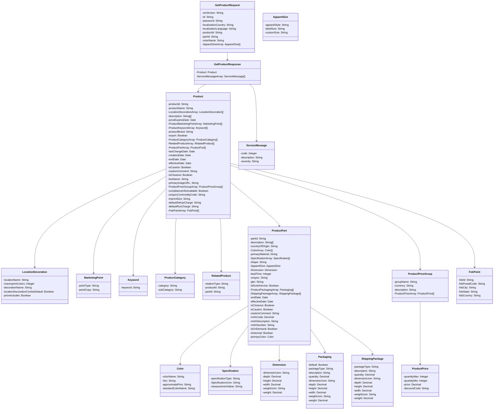

### **PROMOTIONAL PRODUCTS DATA INTERFACE SPECIFICATION FOR WEB SERVICES**

## **Product Data 2.0.0**

#### **DOCUMENT CHANGE LOG**
| Version | Date       | Reason for Change    | Authors          |
|---------|------------|----------------------|------------------|
| 2.0.0   | 10/23/2019 | Initial Release      | See Contributors |

#### **CONTRIBUTORS**
- Paul Fleischman, Technical Lead, PCNA
- Jon Norris, VP of Operations, Starline
- Tim Dietrich, PromoStandards Consultant
- Raj Mukherjee, Director of Integrations And ERP at Hit Promotional Products
- Mike Olivieri, Manager of Integrations and Web Applications at BIC Graphic North America
- Max Stepanskiy, Executive Director, Enterprise Architecture at Advertising Specialty Institute

## Abstract and Recommended Audience

This document describes the technologies for integration of suppliers and distributors in the
Promotional Products Industry. This document will discuss in detail the technology required in
order to build the interface. Additionally, this document will provide sample code in order to
use the interface.

This document will assume that the reader is fluent in web based technologies, and has
knowledge of the language they plan to consume the web service in.

## Background Information

All specifications will be built using the Simple Object Access Protocol (SOAP) over HTTPS as the
foundation for the web services protocol stack in order to provide a standards based secure
form of communication.
More information on SOAP can be found at [w3](http://www.w3.org/TR/soap12-part1/)

## PRODUCT DATA

There will be four functions available as part of this web service.
- [getProduct()](#getproduct)
- [getProductDateModified()](#getproductdatemodified)
- [getProductCloseOut()](#getproductcloseout)
- [getProductSellable()](#getproductsellable)

---

## `getProduct()`

This function provides the detailed product data based on a specific ProductId or any additional optional subset filtering provided at the request.

### REQUEST: `GetProductRequest`

| Field                | Description                                               | Data Type | Required? |
|----------------------|-----------------------------------------------------------|-----------|-----------|
| wsVersion            | The Standard Version of the Web Service being referenced. Values are enumerated \{1.0.0\} | 64 STRING | TRUE      |
| id                   | The customer Id or any other agreed upon Id.              | 64 STRING | TRUE      |
| password             | The password associated with the Id                       | 64 STRING | FALSE     |
| localizationCountry  | ISO 3166-1 Alpha 2 code for Country (Example: CA=Canada; US=United States) | 2 STRING | TRUE      |
| localizationLanguage | ISO 639-1 Alpha 2 code for Language (Example: en = English; fr = French)   | 2 STRING | TRUE      |
| productId            | Item’s ID                                                 | 64 STRING | TRUE      |
| partId               | The Supplier specific PartId; commonly referred to as a sku | 64 STRING | FALSE     |
| colorName            | A specific part color for this product                    | 64 STRING | FALSE     |
| [ApparelSizeArray](#apparelsize-object)     | Used for returning specific apparel sizes. Array of ApparelSize objects. | ARRAY     | FALSE     |

### REPLY: `GetProductResponse`

| Field                | Description                                               | Data Type | Required? |
|----------------------|-----------------------------------------------------------|-----------|-----------|
| [Product](#product-object)              | Product Information                                       | OBJECT    | FALSE     |
| [ServiceMessageArray](#servicemessage-object)  | An array of ServiceMessage objects.                       | ARRAY     | FALSE     |

### `Product` Object

| Field                   | Description                                               | Data Type | Required? |
|-------------------------|-----------------------------------------------------------|-----------|-----------|
| productId               | The associated product.                                   | 64 STRING | TRUE      |
| productName             | The Supplier name for the product                         | 256 STRING| TRUE      |
| [LocationDecorationArray](#locationdecorationarray)| An array of Location Decoration objects                | OBJECT ARRAY | TRUE      |
| description             | Basic product description or bulleted list of descriptions. | 2048 STRING ARRAY | TRUE     |
| priceExpiresDate        | The date that the pricing in the ProductPriceGroupArray portion of the response expires. | ISO 8601 DATE | FALSE |
| [ProductMarketingPointArray](#productmarketingpoint-object) | Marketing points type and content.  An array of MarketingPoint objects. | OBJECT ARRAY | FALSE |
| [ProductKeywordArray](#productkeyword-object)     | Array of keywords often used in searching for this product.  An array of ProductKeyword objects. | OBJECT ARRAY | FALSE |
| productBrand            | The specific product brand                                | 64 STRING | FALSE     |
| export                  | Product status for export                                 | NILLABLE BOOLEAN | TRUE |
| [ProductCategoryArray](#productcategory-object)    | The product’s categorization array. An array of ProductCategory objects. | OBJECT ARRAY | FALSE |
| [RelatedProductArray](#relatedproduct-object)     | Products related to the quested product as Substitutable, CompanionSell, or Common Grouping (Family). An array of RelatedProduct objects. | OBJECT ARRAY | FALSE |
| [ProductPartArray](#productpart-object)        | All part specific product data. An array of ProductPart objects. | OBJECT ARRAY | TRUE |
| lastChangeDate          | The date time stamp of the most recent change to this data in ISO 8601 format           | ISO 8601 DATE | TRUE  |
| creationDate            | The date time stamp when this products data initially became available in ISO 8601 format | ISO 8601 DATE | TRUE  |
| endDate                 | The Date this Product expires from Supplier availability in ISO 8601 format | ISO 8601 DATE | FALSE  |
| effectiveDate           | The Date this Product initially becomes available from the Supplier in ISO 8601 format | ISO 8601 DATE | FALSE  |
| isCaution               | Cautionary status to review for specific warnings about using product data.         | NILLABLE BOOLEAN | TRUE |
| cautionComment          | Product cautionary comments                               | 1024 STRING | FALSE     |
| isCloseout              | Indicates if the product is a closeout                    | NILLABLE BOOLEAN | TRUE |
| lineName                | Line Name / Division to which this product belongs        | 64 STRING | FALSE     |
| primaryImageURL         | The URL of the product’s primary image. Any valid URL can be returned including prefixes like http and ftp. | 1024 STRING | FALSE |
| [ProductPriceGroupArray](#productpricegroup-object)   | Marketing-oriented pricing information. Represented as an array of Product Price objects. | OBJECT ARRAY | FALSE |
| complianceInfoAvailable | Indicates if there is information about this product via the Product Safety & Compliance service.                                | NILLABLE BOOLEAN | FALSE |
| unspscCommodityCode     | The United Nations Standard Products and Services Code® (UNSPSC®) that best describes this product. Note that the enumerated values are the UNSPSC "Commodity" codes. For more information, refer to https://www.unspsc.org | INT | FALSE |
| imprintSize             | The imprint Size | 256 STRING | FALSE |
| defaultSetUpCharge      | The default setup charge for this product. Can be a textual description. | 1024 STRING | FALSE |
| defaultRunCharge        | The default RUN charge for this product. Can be a textual description. | 1024 STRING | FALSE |
| FobPointArray           | An array of FOB points object | ARRAY | TRUE |

### `LocationDecorationArray`

An array of `LocationDecoration` objects that provide information about the decoration locations available for a product.

### `LocationDecoration` Object

| Field                          | Description                                                   | Data Type  | Required? |
|--------------------------------|---------------------------------------------------------------|------------|-----------|
| locationName                   | The name of the decoration location.                          | 255 STRING | TRUE      |
| maxImprintColors               | The maximum number of imprint colors available, based on a decoration location and type. | INTEGER   | FALSE     |
| decorationName                 | The name of the decoration method or type.                    | 64 STRING  | TRUE      |
| locationDecorationComboDefault | Indicates if this is the default location for the decoration. | BOOLEAN    | TRUE      |
| priceIncludes                  | Indicates if the price includes this decoration.              | BOOLEAN    | TRUE      |

### `ProductCategory` Object

| Field                   | Description                                               | Data Type  | Required? |
|-------------------------|-----------------------------------------------------------|------------|-----------|
| category                | Product category                                          | 256 STRING | TRUE      |
| subCategory             | Product subcategory                                       | 256 STRING | FALSE     |

### `ProductMarketingPoint` Object

| Field                   | Description                                               | Data Type | Required? |
|-------------------------|-----------------------------------------------------------|-----------|-----------|
| pointType               | Basic category or type of marketing point being made. e.g. Highlights, Size, Safety | 64 STRING | FALSE     |
| pointCopy               | Marketing bullet or point copy                            | 1024 STRING | TRUE      |

### `ProductKeyword` Object

| Field               | Description                                               | Data Type  | Required? |
|---------------------|-----------------------------------------------------------|------------|-----------|
| keyword             | A product keyword commonly utilized for search or other functions   | 64 STRING | TRUE      |

### `RelatedProduct` Object

| Field          | Description                                      | Data Type | Required? |
|----------------|--------------------------------------------------|-----------|-----------|
| relationType   | The relationship type between two products.      | 64 STRING | TRUE      |
| productId      | Product Id associated with the related product.  | 64 STRING | TRUE      |
| partId         | Part specific Id associated with the related product. | 64 STRING | FALSE     |

### `ProductPriceGroup` Object

| Field          | Description                                                      | Data Type | Required? |
|----------------|------------------------------------------------------------------|-----------|-----------|
| groupName      | The relationship type between two products.                      | 64 STRING | FALSE     |
| currency       | Currency for this price group based on [iso4217](http://www.isotc211.org/iso4217/) |  3 FACIT  | TRUE      | 
| description    | Descrition of the group price                                    | 64 STRING | FALSE     |
| [ProductPriceArray](#productprice-object) | Array of ProductPrice Objects         | ARRAY     | FALSE     |

### `ProductPrice` Object

| Field          | Description                                      | Data Type | Required? |
|----------------|--------------------------------------------------|-----------|-----------|
| quantityMin    | minimun quanity for this price to kick in        | INTEGER   | TRUE      |
| quantityMax    | maximum quanity for this price                   | INTEGER   | FALSE     |
| price          | List Price                                       | DECIMAL   | TRUE      |
| discountCode   | Discount available                               | STRING    | FALSE     |

### `ProductPart`

An array of `ProductPart` objects that provide detailed information about the specific parts of a product.

### `ProductPart` Object

| Field                 | Description                                      | Data Type | Required? |
|-----------------------|--------------------------------------------------|-----------|-----------|
| partId                | The part Id                                      | 64 STRING | TRUE      |
| description           | Description or bulleted list of descriptions.    | 2048 STRING (ARRAY) | FALSE |
| countryOfOrigin       | Country of Origin in ISO 3166-1 Alpha 2 code format (Example: CA=Canada; US=United States) | 2 STRING | FALSE |
| [ColorArray](#color-object)            | Information about the part colors. An array of `Color` objects. | OBJECT ARRAY | FALSE |
| primaryMaterial       | Primary material of construction | 64 STRING | FALSE |
| [SpecificationArray](#specification-object)    | Specifications OBJECT | ARRAY | FALSE |
| shape                 | General shape       | 64 STRING | FALSE |
| [ApparelSize](#apparelsize-object) | Used to describe an apparel size | OBJECT | FALSE |
| [Dimension](#dimension-object)  | Physical dimensions and weight | OBJECT | FALSE |
| leadTime | Lead time in days | INT | FALSE |
| unspsc | United Nations Standard Products and Services Code (UNSPSC) | 8 STRING | FALSE |
| gtin | Global Trade Item Number (GTIN) | 14 STRING | FALSE |
| isRushService | Rush service | NILLABLE BOOLEAN | TRUE |
| [ProductPackagingArray](#productpackaging-object) | Packaging option details; e.g. `Gift Box`, `Cello Pack`, `Sleeve`. An array of `ProductPackaging` objects. | OBJECT ARRAY | FALSE |
| [ShippingPackageArray](#shippingpackage-object) | Shipping package option details for the partPackaging Default package type; e.g. `Carton`, `Box`, `Pallet`. An array of `ShippingPackage` objects. | OBJECT ARRAY | FALSE |
| endDate | The date this part expires from supplier availability in ISO 8601 format | ISO 8601 DATE | FALSE |
| effectiveDate | The date this part initially becomes available from the supplier in ISO 8601 format | ISO 8601 DATE | FALSE |
| isCloseout | Indicates if a closeout | NILLABLE BOOLEAN | TRUE |
| isCaution | Cautionary status to review for specific warnings about using product data | NILLABLE BOOLEAN | TRUE |
| cautionComment | Cautionary comments | 1024 STRING | FALSE |
| nmfcCode | National Motor Freight Classification Code | DECIMAL | FALSE |
| nmfcDescription | National Motor Freight Classification Description | 1024 STRING | FALSE |
| nmfcNumber | National Motor Freight Classification Number | 64 STRING | FALSE |
| isOnDemand | Manufactured on demand / Made to order | NILLABLE BOOLEAN | TRUE |
| isHazmat | Contains hazardous material. A nil value indicates this it is unknown or the data is not available by the supplier. | NILLABLE BOOLEAN | TRUE |
| [primaryColor](#color-object) | The "go to market" color. Represented as a Color Object. | OBJECT | FALSE |

### Color Object

| Field               | Description                                                                                   | Data Type  | Required? |
|---------------------|-----------------------------------------------------------------------------------------------|------------|-----------|
| colorName           | Supplier specific color name. Go to market color.                                             | 64 STRING  | TRUE      |
| hex                 | The HEX code representation. This is not a supplement for product color but data used for generating web user interfaces. | 64 STRING  | FALSE     |
| approximatePms      | The PMS code representation. This is not a supplement for product color.                      | 64 STRING  | FALSE     |
| standardColorName   | The standard color that best describes this color. Eventually may become an enumeration.      | 64 STRING  | FALSE     |

### ApparelSize Object

| Field          | Description                                               | Data Type | Required? |
|----------------|-----------------------------------------------------------|-----------|-----------|
| apparelStyle   | Apparel style                                             | 64 STRING | TRUE      |
| labelSize      | The apparel items tagged size. e.g. XS, S, M, L, etc.     | 6 STRING  | TRUE      |
| customSize     | Used to communicate custom size when labelSize is CUSTOM. | 64 STRING | FALSE     |

### Dimension Object

| Field          | Description                                                                      | Data Type | Required? |
|----------------|----------------------------------------------------------------------------------|-----------|-----------|
| dimensionUom   | The dimensional unit of measure                                                  | 2 STRING  | TRUE      |
| depth          | The depth/length of the part using the unit of measure specified in dimensionUom | DECIMAL   | FALSE     |
| height         | The height of the part using the unit of measure specified in dimensionUom       | DECIMAL   | FALSE     |
| width          | The width of the part using the unit of measure specified in dimensionUom        | DECIMAL   | FALSE     |
| weightUom      | The weight unit of measure for the part                                          | 2 STRING FACIT | TRUE |
| weight         | The weight of the part using the unit of measure specified in dimensionUom       | DECIMAL   | FALSE     |

### ProductPackaging Object

An array of `ProductPackaging` objects that provide details about the packaging options available for a product, such as Gift Box, Cello Pack, Sleeve, etc.

### ProductPackaging Object

| Field                  | Description                                                              | Data Type   | Required? |
|------------------------|--------------------------------------------------------------------------|-------------|-----------|
| packageType            | The specific type of product packaging, e.g., Box, Carton, etc.          | 256 STRING  | TRUE      |
| description            | Description or details of the product packaging.                         | 2048 STRING | FALSE     |
| quantity               | The partId unit quantity included within this specific packaging option. | DECIMAL     | TRUE      |
| dimensionUom           | The unit of measure for the package dimensions.                          | 2 STRING    | TRUE      |
| depth                  | The depth/length of the package using the specified unit of measure.     | DECIMAL     | FALSE     |
| height                 | The height of the package using the specified unit of measure.           | DECIMAL     | FALSE     |
| width                  | The width of the package using the specified unit of measure.            | DECIMAL     | FALSE     |

### ShippingPackage Object

An array of `ShippingPackage` objects that provide details about the shipping packaging options available for a product, such as Carton, Box, Pallet, etc.

### ShippingPackage Object

| Field                  | Description                                      | Data Type | Required? |
|------------------------|--------------------------------------------------|-----------|-----------|
| packageType            | The shipping package specific type for this shipping package e.g. Box, Carton, etc. | 256 STRING | TRUE |
| description            | The shipping package specific description. | 2048 STRING | FALSE |
| quantity               | The partId unit quantity included within this specific shipping packaging option. | DECIMAL | TRUE |
| dimensionUom           | The weight unit of measure for the packageType. | 2 STRING | TRUE |
| depth                  | The depth/length of the shipping package in the dimensionUom unit of measure. | DECIMAL | FALSE |

### Specification Object

| Field               | Description                                      | Data Type | Required? |
|---------------------|--------------------------------------------------|-----------|-----------|
| specificationType   | The type of specification                        | 64 STRING | TRUE      |
| SpecificationUom    | Specification unit of measure                    | 64 STRING | TRUE      |
| measurementValue    | Specification Measurement Value                  | 64 STRING | TRUE      |

---

## `getProductDateModified()`

This function provides the list of Product Ids and optional Part Ids for all items which have changed since the date supplied in the request.

### REQUEST: `GetProductDateModifiedRequest`

| Field            | Description                                               | Data Type | Required? |
|------------------|-----------------------------------------------------------|-----------|-----------|
| wsVersion        | The Standard Version of the Web Service being referenced. Values are enumerated \{1.0.0\} | 64 STRING | TRUE      |
| id               | The customer Id or any other agreed upon Id.              | 64 STRING | TRUE      |
| password         | The password associated with the Id                       | 64 STRING | FALSE     |
| changeTimeStamp  | Beginning date time since last change in UTC              | ISO 8601 DATE | TRUE  |

### REPLY: `GetProductDateModifiedResponse`

| Field                      | Description                                               | Data Type | Required? |
|----------------------------|-----------------------------------------------------------|-----------|-----------|
| [ProductDateModifiedArray](#productdatemodified-object)   | Array listing of all Product and Part specific Ids which have changed since the reference date requested (lastChangeDate). An array of ProductChange objects. | OBJECT ARRAY | TRUE |
| [ServiceMessageArray](#servicemessage-object)        | An array of ServiceMessage objects.                       | ARRAY     | FALSE     |

### `ProductDateModified` Object

| Field       | Description                       | Data Type | Required? |
|-------------|-----------------------------------|-----------|-----------|
| productId   | The associated product            | 64 STRING | TRUE      |
| partId      | The associated part               | 64 STRING | FALSE     |

---

## `getProductCloseOut()`

This function provides a list of Product Ids and optional Part Ids for all items which currently have an `isCloseOut` value of TRUE.

### REQUEST: `GetProductCloseOutRequest`

| Field            | Description                                               | Data Type | Required? |
|------------------|-----------------------------------------------------------|-----------|-----------|
| wsVersion        | The Standard Version of the Web Service being referenced. Values are enumerated \{1.0.0\} | 64 STRING | TRUE      |
| id               | The customer Id or any other agreed upon Id.              | 64 STRING | TRUE      |
| password         | The password associated with the Id                       | 64 STRING | FALSE     |

### REPLY: `GetProductCloseOutResponse`

| Field                      | Description                                               | Data Type | Required? |
|----------------------------|-----------------------------------------------------------|-----------|-----------|
| [ProductCloseOutArray](#productcloseout-object)       | All product and part specific Ids which are on closeout. An array of `ProductCloseOut` objects. | OBJECT ARRAY | FALSE |
| [ServiceMessageArray](#servicemessage-object)        | An array of ServiceMessage objects.                       | ARRAY     | FALSE     |

### `ProductCloseOut` Object

| Field       | Description                       | Data Type | Required? |
|-------------|-----------------------------------|-----------|-----------|
| productId | The associated product            | 64 STRING | TRUE      |
| partId    | The associated part               | 64 STRING | FALSE     |

---

## `getProductSellable()`

This function provides a list of Product Ids and optional Part Ids along with their status of available to sell (Sellable TRUE or FALSE).

### REQUEST: `GetProductSellableRequest`

| Field               | Description                                               | Data Type | Required? |
|---------------------|-----------------------------------------------------------|-----------|-----------|
| wsVersion           | The Standard Version of the Web Service being referenced. Values are enumerated \{1.0.0\} | 64 STRING | TRUE      |
| id                  | The customer Id or any other agreed upon Id.              | 64 STRING | TRUE      |
| password            | The password associated with the Id                       | 64 STRING | FALSE     |
| productId           | The associated product                                    | 64 STRING | FALSE     |
| partId              | The associated part                                       | 64 STRING | FALSE     |
| localizationCountry | ISO 3166-1 Alpha 2 code for Country (Example: CA=Canada)  | 2 STRING  | TRUE      |

### REPLY: `GetProductSellableResponse`

| Field                 | Description                                               | Data Type | Required? |
|-----------------------|-----------------------------------------------------------|-----------|-----------|
| [ProductSellableArray](#productsellable-object)  | Array listing of all product and part specific Ids along with sellable status. An array of ProductSellable objects. | OBJECT ARRAY | TRUE |
| [ServiceMessageArray](#servicemessage-object)        | An array of ServiceMessage objects.                       | ARRAY     | FALSE     |

### `ProductSellable` Object

| Field          | Description                       | Data Type | Required? |
|----------------|-----------------------------------|-----------|-----------|
| productId      | The associated product            | 64 STRING | TRUE      |
| partId         | The associated part               | 64 STRING | FALSE     |
| culturePoint   | The culture point                 | 64 STRING | FALSE     |

### `ServiceMessage` Object

| Field          | Description                       | Data Type | Required? |
|----------------|-----------------------------------|-----------|-----------|
| code           | The numerical value of the code   | INTEGER | TRUE |
| description    | Response for any message requiring notification to requestor | 256 STRING | TRUE |
| severity       | The severity of the message.  Values are enumerated: \{Error, Information, Warning\} | FACET 256 STRING | TRUE |

### Enumerated Type Restrictions

| Field             | Description                                               | Data Type       | Values      |
|------------------ |-----------------------------------------------------------|---------------- | ----------- |
| wsVersion         | The Standard Version of the Web Service being referenced | 64 STRING FACIT | 2.0.0  |
| dimensionUom      | The dimensional unit of measure | 64 STRING FACIT | MM (Millimeter) CM (Centimeter) MR (Meter) IN (Inch) FT (Feet) YD (Yards) |
| weightUom         | The weight unit of measure | 2 STRING FACIT | ME (Milligram) KG (Kilogram) OZ (Ounce) LB (Pound) |
| relationType      | The relationship type between the two products | 64 STRING FACIT | Substitute Companion Sell Common Grouping |
| specificationType | List of possible values.  The type of specification. | 64 STRING FACIT | Length Thickness Radius Volume Capacity Memory Data Ports Capacitance Voltage Point Size Sheet Size Sheet Count Pockets Inseam Bust Chest Waist Hips Cup Rise Neck Thigh Shoulders Sleeve Device Size |
| apparelStyle      | List of possible values. e.g. Ladies, Men, Youth, etc. | 64 STRING FACIT | Unisex Youth Girls Boys Womens WomensTall MensMensTall |
| labelSize         | List of possible values.  The apparel items tagged size. e.g. XS, S, M, XL, etc. | 4 STRING FACIT | OSFA (One Size Fits All) 4XS (4 Extra Small) 3XS (3 Extra Small) 2XS (2 Extra Small) XS (Extra Small) S M L XL (Extra Large) 2XL (2 Extra Large) 3XL (3 Extra Large) 4XL (4 Extra Large) 5XL (5 Extra Large) CUSTOM |

**Standardized Codes:**  The range of 100-199 has been reserved for standardized error codes. The number 999 has been reserved for an error codes that is a “General Error - Contact System Service Provider”

| Code   | Description                  |
| ------ | ---------------------------- |
| 100    | ID (customerID) not found    |
| 104    | This account is unauthorized to use this service.  Please contact the service provider |
| 105    | Authentication Credentials failed   |
| 110    | Authentication Credentials required |
| 115    | wsVersion not found |
| 120    | The following field(s) are required [Comma Delimited field names] |
| 125    | Not Supported |
| 130    | Product Id not found |
| 135    | Product color not found |
| 140    | Part Id not found |
| 145    | Part color not found |
| 150    | Part size not found |
| 999    | General Error – Contact the System Service Provider |

## DATA MINING / ABUSE GUIDELINE
The use of services detailed within this specification are to be conducted within the current
guidelines of the “Interface Data Use Guidelines Standards”

## VALIDATION OF SERVICES
Before you publish your endpoint, please ensure that it adheres to the promostandards.org spec by
using the web service validation tool.
https://services.promostandards.org/webserviceValidator/home
Select the service, version, method and input your endpoint. If the endpoint is correct you should
receive a message of:

"The XML response is valid."

## Diagrams

