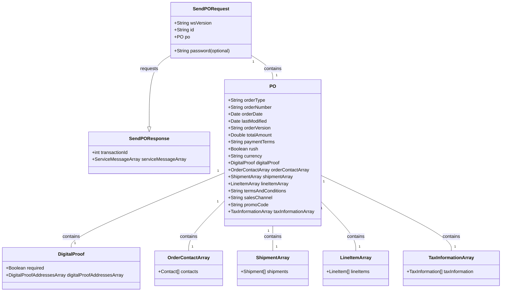
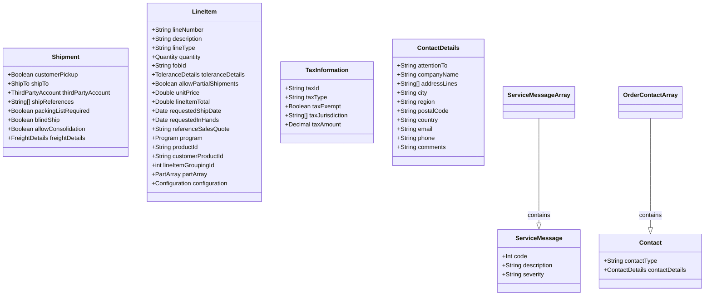

# PROMOTIONAL PRODUCTS DATA INTERFACE SPECIFICATION FOR WEB SERVICES

 ## Purchase Order Service

**Version**: 1.0.0  
**Release Date**: 2018-07-01

## **Document Change Log**

| Version | Date       | Reason for Change                                              | Author                                                      |
|---------|------------|----------------------------------------------------------------|----------------------------|
| 1.0.0   | 2018-07-01 | v1.0.0 publish                                                 | See contributors section   |

## Contributors

The following have contributed to the creation of this specification:

- Eric Shonebarger, CIO Hit Promotional Products, Inc
- Jon Norris, VP of Operations Starline
- Paul Fleischman, Technical Lead PCNA
- Dustin Kessler, Enterprise Architect, Staples Promotional Products
- Steve Luisser, VP of R&D, Essent

## Abstract and Recommended Audience

This document describes the technologies for integration of suppliers and distributors in the Promotional Products Industry. This document will discuss in detail the technology required in order to build the interface. Additionally, this document will provide sample code in order to use the interface.

This document will assume that the reader is fluent in web based technologies, and has knowledge of the language they plan to consume the web service in.

## Background Information
All specifications will be built using the Simple Object Access Protocol (SOAP) over HTTPS as the foundation for the web services protocol stack in order to provide a standards based secure form of communication.

More information on SOAP can be found at [w3](http://www.w3.org/TR/soap12-part1/)

## **Service Details:**
- [getSupportedOrderTypes](#function-getsupportedordertypes)
- [sendPO](#function-sendpo)

## Function: getSupportedOrderTypes()

This function returns the supported Order Types the vendor accepts.

### Request: `getSupportedOrderTypesRequest`

| Field      | Description                                                     | WSDL Data Type | SQL Data Type | Required? |
|------------|-----------------------------------------------------------------|----------------|---------------|-----------|
| wsVersion  | The Standard Version of the Web Service being referenced. Values are enumerated \{1.0.0\} | STRING    | VARCHAR(64)  | TRUE      |
| id         | The customerId or any other agreed upon Id.                      | STRING         | VARCHAR(64)   | TRUE      |
| password   | The password associated with the customerId.                    | STRING         | VARCHAR(64)   | FALSE     |

---

### Response: `getSupportedOrderTypesResponse`

| Field                  | Description                                                                                              | WSDL Data Type | SQL Data Type | Required? |
|------------------------|----------------------------------------------------------------------------------------------------------|----------------|---------------|-----------|
| SupportedOrderTypes[]  | An array of supported order types for this supplier. Signifies which order types the supplier supports. Values are enumerated: “Blank”, “Sample”, “Simple” “Configured” | ARRAY     | ARRAY         | FALSE     |
| [ServiceMessageArray](#object-servicemessage)    | An array of ServiceMessage objects.                                                                      | OBJECT        | OBJECT        | FALSE     |

### Function: sendPO()

This function will send a configured purchase order to a vendor. The purchase order is designed to work in conjunction with data from the Promostandards Product Pricing and Configuration web service. More information on Product Pricing and Configuration can be found at http://promostandards.org.

Absolutely! Here's the markdown documentation based on the provided details:

### Request: `sendPORequest`

| Field      | Description                                                            | WSDL Data Type | SQL Data Type | Required? |
|------------|------------------------------------------------------------------------|----------------|---------------|-----------|
| wsVersion  | The Standard Version of the Web Service being referenced. Values are enumerated \{1.0.0\} | STRING   | VARCHAR(64)  | TRUE      |
| id         | The customer Id or any other agreed upon Id.                           | STRING         | VARCHAR(64)   | TRUE      |
| password   | The password associated with the customer Id.                           | STRING         | VARCHAR(64)   | FALSE     |
| [PO](#po-object)         | The object containing the Purchase Order                               | OBJECT        | OBJECT        | TRUE      |

### PO Object

| Field               | Description                                                                                                                                                               | WSDL Data Type    | SQL Data Type | Required? |
|---------------------|---------------------------------------------------------------------------------------------------------------------------------------------------------------------------|-------------------|---------------|-----------|
| orderType           | The type of data transferred in the request with enumerated values: Blank, Sample, Simple, Configured                                                                     | ENUMERATED STRING | VARCHAR(64)   | TRUE      |
| orderNumber         | Purchase order number                                                                                                                                                     | STRING            | VARCHAR(64)   | TRUE      |
| orderDate           | The date and time of the purchase order                                                                                                                                   | DATE              | DATE          | TRUE      |
| lastModified        | The date and time the purchase order was last modified                                                                                                                   | DATE              | DATE          | FALSE     |
| totalAmount         | The total dollar amount of the purchase order                                                                                                                            | DOUBLE            | DECIMAL(12,4) | TRUE      |
| paymentTerms        | The terms of the purchase order.  i.e. NET15, NET30, etc.                                                                                                                | STRING            | STRING        | FALSE     |
| rush                | Used to indicate a rush on the purchase order                                                                                                                             | BOOLEAN           | BOOLEAN       | TRUE      |
| currency            | The currency the purchase order is transacted in ISO4217 format                                                                                                          | STRING            | VARCHAR(3)    | TRUE      |
| [DigitalProof](#po-object)        | An object containing preproduction digital proof information                                                                                                             | OBJECT            | OBJECT        | FALSE     |
| [OrderContactArray](#object-contact)   | An array of contact information                                                                                                                                          | ARRAY             | ARRAY         | FALSE     |
| [ShipmentArray](#object-shipment)       | Any array of purchase order shipments                                                                                                                                    | OBJECT ARRAY      | OBJECT ARRAY  | TRUE      |
| [LineItemArray](#object-lineitem)       | An array of purchase order line items                                                                                                                                    | ARRAY             | ARRAY         | TRUE      |
| termsAndConditions  | The terms and conditions for this purchase order.  Information that is order specific or information dealing with the configuration or shipment of the order should not be entered here. | STRING  | VARCHAR(MAX)  | TRUE      |
| salesChannel        | The sales channel                                                                                                                                                        | STRING            | VARCHAR(64)   | FALSE     |
| promoCode           | The promotion code                                                                                                                                                       | STRING            | VARCHAR(64)   | FALSE     |
| [TaxInformationArray](#object-taxinformation) | An array of TaxInformation objects related to calculating taxes                                                                                                          | ARRAY             | ARRAY         | FALSE     |

### Object: `DigitalProof`

| Field                    | Description                                                                                                                                                               | WSDL Data Type | SQL Data Type | Required? |
|--------------------------|---------------------------------------------------------------------------------------------------------------------------------------------------------------------------|----------------|---------------|-----------|
| required                 | A Boolean value set to TRUE indicates a proof is required for this purchase order; the value is FALSE otherwise.                                                          | BOOLEAN        | BOOLEAN       | TRUE      |
| [DigitalProofAddressesArray](#object-digitalproofaddress) | An array containing DigitalProofAddress objects.                                                                                                                        | ARRAY          | ARRAY         | TRUE      |

### Object: `DigitalProofAddress`

| Field                | Description                                                                           | WSDL Data Type | SQL Data Type | Required? |
|----------------------|---------------------------------------------------------------------------------------|----------------|---------------|-----------|
| type                 | The type of address of the digital proof.  Values are enumerated: Email, Webservice   | STRING         | VARCHAR(64)   | TRUE      |
| email                | The address that the digital proof should be sent to prior to production.             | STRING         | VARCHAR(128)  | TRUE      |
| lineItemGroupingId   | What line item group does this proof address link to                                  | INT            | INT           | TRUE      |

### Object: `TaxInformation`

| Field               | Description                                                                                                                        | WSDL Data Type       | SQL Data Type | Required? |
|---------------------|------------------------------------------------------------------------------------------------------------------------------------|----------------------|---------------|-----------|
| taxId               | The purchasers tax identifier                                                                                                      | STRING               | VARCHAR(64)   | TRUE      |
| taxType             | The type of tax the identifier applies to. Values are enumerated: “Hst-Gst”, “Pst”, “SalesTax”                                    | ENUMERATED STRING    | VARCHAR(64)   | TRUE      |
| taxExempt           | Tax Except                                                                                                                         | BOOLEAN              | BOOLEAN       | TRUE      |
| taxJurisdiction     | Tax Jurisdictions                                                                                                                  | UNBOUNDED STRING ARRAY | VARCHAR(64) | TRUE      |
| taxAmount           | The amount of tax for this purchase order                                                                                          | DECIMAL              | DECIMAL       | FALSE     |

### Object: `LineItem`

| Field                    | Description                                                                                                                                                                                                                                                                                                              | WSDL Data Type    | SQL Data Type | Required? |
|--------------------------|--------------------------------------------------------------------------------------------------------------------------------------------------------------------------------------------------------------------------------------------------------------------------------------------------------------------------|-------------------|---------------|-----------|
| lineNumber               | The line number of the line item                                                                                                                                                                                                                                                                                        | STRING            | VARCHAR(64)   | TRUE      |
| description              | The description of the line item. For simple order type (not using a configuration), use this field to explain the details.                                                                                                                                                                                             | STRING            | VARCHAR(MAX)  | TRUE      |
| lineType                 | The type of order; values are enumerated: “New” –A new purchase order with no prior order reference, “Repeat” —An exact repeat of a previous purchase order with the vendor, “Reference” –An order that has the same artwork as a previous order.                                                                         | ENUMERATED STRING | VARCHAR(64)   | TRUE      |
| [Quantity](#object-quantity)                 | The quantity object that contains the value and unit of measure                                                                                                                                                                                                                                                        | OBJECT            | OBJECT        | FALSE     |
| fobId                    | Used to indicate the FOB point. Use fobId from the supplier’s Product Pricing and Configuration Service to populate this information.                                                                                                                                                                                   | STRING            | VARCHAR(64)   | FALSE     |
| [ToleranceDetails](#object-tolerancedetails)         | The object containing how tolerant this line is to overrun and underruns.                                                                                                                                                                                                                                              | OBJECT            | OBJECT        | TRUE      |
| allowPartialShipments    | Allow partial shipments of this line item                                                                                                                                                                                                                                                                              | BOOLEAN           | BOOLEAN       | TRUE      |
| unitPrice                | The unit price of the line item                                                                                                                                                                                                                                                                                        | DOUBLE            | DECIMAL(12,4) | FALSE     |
| lineItemTotal            | The total for the line item                                                                                                                                                                                                                                                                                            | DOUBLE            | DECIMAL(12,4) | TRUE      |
| requestedShipDate        | The date the line item is requested to ship from the FOB point.                                                                                                                                                                                                                                                       | DATE              | DATE          | FALSE     |
| requestedInHands         | The date the line item is requested to arrive at the shipping destination                                                                                                                                                                                                                                             | DATE              | DATE          | FALSE     |
| referenceSalesQuote      | The sales quote number associated with this purchase order line (if applicable).                                                                                                                                                                                                                                       | VARCHAR(64)       | VARCHAR(64)   | FALSE     |
| [Program](#object-program)                  | Program pricing information.                                                                                                                                                                                                                                                                                          | OBJECT            | OBJECT        | FALSE     |
| endCustomerSalesOrder    | The distributor’s order number provided to the end customer                                                                                                                                                                                                                                                           | VARCHAR(64)       | VARCHAR(64)   | FALSE     |
| productId                | The manufacturer’s product id associated with the configuration data.                                                                                                                                                                                                                                                 | STRING            | VARCHAR(64)   | FALSE     |
| customerProductId        | The distributor’s product id                                                                                                                                                                                                                                                                                          | STRING            | VARCHAR(64)   | FALSE     |
| lineItemGroupingId       | An identifier that allows configuration data to be spread out among multiple purchase order lines. Keep lineItemGroupingID unique when referencing the same product on the purchase order. Any change to the product, location, decoration, or artwork should produce a unique lineItemGroupingID to the purchase order. | INT               | INT           | FALSE     |
| [PartArray](#object-part)                | An array of product part information. This array should be populated with information from the supplier’s PromoStandards Product Pricing and Configuration service                                                                                                                                                      | ARRAY             | ARRAY         | FALSE     |
| [Configuration](#object-configuration)            | An object containing line item configuration data                                                                                                                                                                                                                                                                     | OBJECT            | OBJECT        | FALSE     |

### Object: `ToleranceDetails`

| Field     | Description                                                                                                                                                                                                                                               | WSDL Data Type    | SQL Data Type | Required? |
|-----------|-----------------------------------------------------------------------------------------------------------------------------------------------------------------------------------------------------------------------------------------------------------|-------------------|---------------|-----------|
| tolerance | An enumerator specifying the quantity tolerance allowed: AllowOverRun, AllowUnderrun, AllowOverrunOrUnderrun, ExactOnly. Specifying AllowOverRun, AllowUnderrun or AllowOverrunOrUnderrun without a value and uom will result in the supplier’s discretion. | ENUMERATED STRING | VARCHAR(64)   | TRUE      |
| value     | The overrun/underrun permitted. This element is ignored if ExactOnly is specified for tolerance.                                                                                                                                                          | DECIMAL           | DECIMAL(12,4) | FALSE     |
| uom       | The unit of measure for value element; enumerated values are: \{Percent, Quantity\}. This element is ignored if ExactOnly is specified for tolerance.                                                                                                         | ENUMERATED STRING | VARCHAR(10)   | FALSE     |

### Object: `Program`

| Field | Description                                                                                       | WSDL Data Type | SQL Data Type | Required? |
|-------|---------------------------------------------------------------------------------------------------|----------------|---------------|-----------|
| id    | The program id associated with this purchase order line (if applicable).                           | VARCHAR(64)    | VARCHAR(64)   | FALSE     |
| name  | The program name associated with this purchase order line (if applicable).                         | VARCHAR(64)    | VARCHAR(64)   | FALSE     |

### Object: `Quantity`

| Field | Description                                                                                       | WSDL Data Type     | SQL Data Type | Required? |
|-------|---------------------------------------------------------------------------------------------------|--------------------|---------------|-----------|
| value | The quantity value                                                                                | DECIMAL            | DECIMAL(12,4) | TRUE      |
| uom   | The unit of measure; values are enumerated. Values are: \{BX, CA, DZ, EA, KT, PR, PK, RL, ST, SL, TH\}. Enumerations: BX - Box, CA - Case, DZ - Dozen, EA - Each, KT - Kit, PR - Pair, PK - Package, RL - Roll, ST - Set, SL - Sleeve, TH - Thousand | ENUMERATED STRING | VARCHAR(2)     | TRUE      |

### Object: `Configuration`

| Field                             | Description                                                                                                                                            | WSDL Data Type     | SQL Data Type | Required? |
|-----------------------------------|--------------------------------------------------------------------------------------------------------------------------------------------------------|--------------------|---------------|-----------|
| referenceNumber                   | The previous order number that this purchase order is referencing                                                                                      | STRING             | VARCHAR(64)   | FALSE     |
| referenceNumberType               | The type of the prior order reference; values are enumerated: “PurchaseOrder”,”SalesOrder”, “JobOrWorkOrder”                                           | ENUMERATED STRING  | VARCHAR(64)   | FALSE     |
| preProductionProof                | Indicates that this line item is for a pre-production proof                                                                                            | BOOLEAN            | BOOLEAN       | TRUE      |
| [ChargeArray](#object-charge)     | An array of charge information. This array should be populated with information from the supplier’s PromoStandards Product Pricing and Configuration service | ARRAY              | ARRAY         | FALSE     |
| [LocationArray](#object-location) | An array of Decoration Location Information. This array should be populated with information from the supplier’s PromoStandards Product Pricing and Configuration service  | ARRAY              | ARRAY         | FALSE     |

### Object: `Part`

| Field             | Description                                                                                                                      | WSDL Data Type     | SQL Data Type  | Required? |
|-------------------|----------------------------------------------------------------------------------------------------------------------------------|--------------------|----------------|-----------|
| partGroup         | An identifier that links common line item parts together                                                                         | STRING             | VARCHAR(64)    | FALSE     |
| partId            | The part Id from the supplier’s PromoStandards Product Pricing and Configuration service                                         | STRING             | VARCHAR(64)    | TRUE      |
| customerPartId    | How the part is being represented to the distributor’s customer                                                                  | STRING             | VARCHAR(64)    | FALSE     |
| customerSupplied  | The part will be supplied by the customer or another entity other than the supplier                                              | BOOLEAN            | BOOLEAN        | TRUE      |
| description       | The description from the supplier’s PromoStandards Product Pricing and Configuration service                                      | STRING             | VARCHAR(MAX)   | FALSE     |
| [Quantity](#object-quantity)          | The quantity object that contains the value and unit of measure                                                                  | OBJECT             | OBJECT         | TRUE      |
| locationLinkId    | An array of location link Ids. This links the part to its configured locations                                                   | ARRAY OF INTEGERS  | INT[]          | FALSE     |
| unitPrice         | The price of the part being referenced                                                                                           | DECIMAL            | DECIMAL(12,4)  | FALSE     |
| extendedPrice     | The unitPrice multiplied by the Quantity value                                                                                   | DECIMAL            | DECIMAL(12,4)  | FALSE     |
| [ShipmentLinkArray](#object-shipmentlink) | Link this part and a specified quantity to one or many shipments                                                                 | OBJECT ARRAY       | OBJECT ARRAY   | FALSE     |

### Object: `ShipmentLink`

| Field       | Description                                                          | WSDL Data Type  | SQL Data Type | Required? |
|-------------|----------------------------------------------------------------------|-----------------|---------------|-----------|
| shipmentId  | The shipment Id                                                      | INT             | INT           | TRUE      |
| [Quantity](#object-quantity) | The quantity object that contains the value and unit of measure      | OBJECT          | OBJECT        | TRUE      |

### Object: `Charge`

| Field           | Description                                                                                                                     | WSDL Data Type      | SQL Data Type | Required? |
|-----------------|---------------------------------------------------------------------------------------------------------------------------------|----------------------|---------------|-----------|
| chargeId        | The chargeId from the supplier’s PromoStandards Product Pricing and Configuration service                                       | STRING               | VARCHAR(64)   | TRUE      |
| chargeName      | The chargeName from the supplier’s PromoStandards Product Pricing and Configuration service                                      | STRING               | VARCHAR(128)  | FALSE     |
| description     | The charge description from the supplier’s PromoStandards Product Pricing and Configuration service                             | STRING               | VARCHAR(MAX)  | FALSE     |
| chargeType      | The type of charge.  Values are enumerated \{Freight, Order, Run, Setup\}                                                         | ENUMERATED STRING    | VARCHAR(64)   | TRUE      |
| [Quantity](#object-quantity)        | The quantity object that contains the value and unit of measure                                                                 | OBJECT               | OBJECT        | TRUE      |
| unitprice       | The price of the charge being referenced                                                                                        | DECIMAL              | DECIMAL(12,4) | FALSE     |
| extendedPrice   | The unitPrice multiplied by the Quantity value                                                                                  | DECIMAL              | DECIMAL(12,4) | FALSE     |

### Object: `Location`

| Field          | Description                                                                                                                                               | WSDL Data Type | SQL Data Type | Required? |
|----------------|-----------------------------------------------------------------------------------------------------------------------------------------------------------|----------------|---------------|-----------|
| locationLinkId | An identifier to be used within the Part Array to link configured locations to a part. Due to different colors and sizes, identical locations may need to be decorated differently | INT            | INT           | TRUE      |
| locationId     | The locationId from the supplier’s PromoStandards Product Pricing and Configuration service                                                               | INT            | INT           | TRUE      |
| locationName   | The locationName from the supplier’s PromoStandards Product Pricing and Configuration service                                                            | STRING         | VARCHAR(128)  | FALSE     |
| [DecorationArray](#object-decoration)| An array of product decoration information                                                                                                                | ARRAY          | ARRAY         | TRUE      |

### Object: `Decoration`

| Field                      | Description                                                                                                                       | WSDL Data Type | SQL Data Type | Required? |
|----------------------------|-----------------------------------------------------------------------------------------------------------------------------------|----------------|---------------|-----------|
| decorationId               | The decorationId from the supplier’s PromoStandards Product Pricing and Configuration service                                     | INT            | INT           | TRUE      |
| decorationName             | The decorationName from the supplier’s PromoStandards Product Pricing and Configuration service                                   | STRING         | VARCHAR(128)  | FALSE     |
| [Artwork](#object-artwork) | The object containing the details of the artwork                                                                                  | OBJECT         | OBJECT        | TRUE      |

### Object: `Artwork`

| Field            | Description                                                                                                                                          | WSDL Data Type | SQL Data Type | Required? |
|------------------|------------------------------------------------------------------------------------------------------------------------------------------------------|----------------|---------------|-----------|
| refArtworkId     | A pre-shared artwork Id that can be used by the supplier to find and reference the artwork                                                           | STRING         | VARCHAR(64)   | FALSE     |
| description      | A textual description of the artwork being provided                                                                                                  | STRING         | VARCHAR(MAX)  | FALSE     |
| [Dimensions](#object-dimensions)       | The dimensions of the artwork                                                                                                                        | OBJECT         | OBJECT        | FALSE     |
| [ArtworkFileArray](#object-artworkfile) | An array of artwork file data                                                                                                                        | ARRAY          | ARRAY         | FALSE     |
| instructions     | Any instructions regarding the processing or modification of artwork. Adding instructions will cause delays in processing                              | STRING         | VARCHAR(MAX)  | FALSE     |
| [Layers](#object-layers)           | An object that explains how the artwork layers or stops will be handled                                                                              | OBJECT         | OBJECT        | FALSE     |
| [TypesetArray](#object-typeset)     | An array of typeset data                                                                                                                             | ARRAY          | ARRAY         | FALSE     |
| totalStitchCount | The total stitch count for the specified embroidery art                                                                                              | INT            | INT           | FALSE     |

### Object: `ArtworkFile`

| Field              | Description                                                                                                                                   | WSDL Data Type      | SQL Data Type | Required? |
|--------------------|-----------------------------------------------------------------------------------------------------------------------------------------------|----------------------|---------------|-----------|
| fileName           | The file name and extension only of the artwork                                                                                               | STRING               | VARCHAR(256)  | TRUE      |
| fileLocation       | The exact path/location to the artwork                                                                                                        | STRING               | VARCHAR(1024) | TRUE      |
| transportMechanism | The mechanism that will be used to transport the artwork; values are enumerated: “Email”, “Url”, “Ftp”, “ArtworkToFollow”                       | ENUMERATED STRING    | VARCHAR(64)   | TRUE      |
| artworkType        | The purpose of the artwork file; values are enumerated: “ProductionReady”, “VirtualProof”, “SupplierArtTemplate”, “NonProductionReady”          | ENUMERATED STRING    | VARCHAR(64)   | TRUE      |

### Object: `Dimensions`

| Field                      | Description                                                                                                                                                             | WSDL Data Type      | SQL Data Type   | Required? |
|----------------------------|-------------------------------------------------------------------------------------------------------------------------------------------------------------------------|----------------------|-----------------|-----------|
| geometry                   | The geometry of the decoration. Values are enumerated: \{Circle, Rectangle, Other\}                                                                                        | ENUMERATED STRING    | VARCHAR(64)     | TRUE      |
| useMaxLocationDimensions   | Use the maximum allowed imprint dimensions for this location. If this is set to true, all other dimension information is ignored except for geometry                       | BOOLEAN              | BOOLEAN         | TRUE      |
| height                     | The height of the artwork; leave blank if the imprint is not rectangular                                                                                                | DECIMAL              | DECIMAL(12,4)   | FALSE     |
| width                      | The width of artwork; leave blank if the imprint is not rectangular                                                                                                     | DECIMAL              | DECIMAL(12,4)   | FALSE     |
| diameter                   | The diameter of the artwork; leave blank if the imprint is not circular                                                                                                 | DECIMAL              | DECIMAL(12,4)   | FALSE     |
| uom                        | The unit of measure for the decoration area in ISO 20022 [ISO 20022 UOM](https://www.iso20022.org/standardsrepository/public/wqt/Description/mx/dico/codesets/_Y4XF0tp-Ed-ak6NoX_4Aeg_385163498) | ENUMERATED STRING    | VARCHAR(64)     | FALSE     |

### Object: `Layers`

| Field            | Description                                                         | WSDL Data Type   | SQL Data Type   | Required? |
|------------------|---------------------------------------------------------------------|------------------|-----------------|-----------|
| colorSystem      | The color system to use: Cmyk, Other, Pms, Rgb, Thread              | ENUMERATED STRING| ENUMERATED STRING| TRUE      |
| [LayerOrStopArray](#object-layerorstop) | An array of layers for the artwork                                  | OBJECT ARRAY     | OBJECT ARRAY    | TRUE      |

### Object: `LayerOrStop`

| Field        | Description                                               | WSDL Data Type | SQL Data Type | Required? |
|--------------|-----------------------------------------------------------|----------------|---------------|-----------|
| nameOrNumber | The name or number of the layer/stop                       | STRING         | VARCHAR(64)   | TRUE      |
| description  | A human readable description of the layer                  | STRING         | VARCHAR(MAX)  | TRUE      |
| color        | The color value that corresponds to the colorSystem defined| STRING         | VARCHAR(64)   | TRUE      |

### Object: `Typeset`

| Field          | Description                               | WSDL Data Type | SQL Data Type | Required? |
|----------------|-------------------------------------------|----------------|---------------|-----------|
| sequenceNumber | The order of the typeset information      | INT            | INT           | TRUE      |
| value          | The typeset to be used on the order       | STRING         | VARCHAR(1024) | TRUE      |
| font           | The font to use for the typeset           | STRING         | VARCHAR(64)   | FALSE     |
| fontSize       | The font size to use for the typeset      | DECIMAL        | DECIMAL       | FALSE     |

### Object: `Shipment`

| Field                | Description                                                                                                                                                                          | WSDL Data Type | SQL Data Type | Required? |
|----------------------|--------------------------------------------------------------------------------------------------------------------------------------------------------------------------------------|----------------|---------------|-----------|
| customerPickup       | The shipment will be a pickup and will not be shipped.                                                                                                                              | BOOLEAN       | BOOLEAN      | TRUE      |
| [ShipTo](#object-shipto)               | The object containing the ship to information                                                                                                                                       | OBJECT        | OBJECT       | TRUE      |
| [ThirdPartyAccount](#object-thirdpartyaccount)    | The object containing the third party information for the shipping account to use and the business entity that is paying for the shipping. Known as ship using this account.           | OBJECT        | OBJECT       | FALSE     |
| shipReferences       | Array of two strings max of identifiers used as the reference fields used during the shipping process. A shipReference can be a PO number, customer number, company name, etc.         | STRING ARRAY  | VARCHAR(64)   | FALSE     |
| packingListRequired  | Packing list required                                                                                                                                                               | BOOLEAN       | BOOLEAN      | TRUE      |
| blindShip            | Require blind shipping                                                                                                                                                              | BOOLEAN       | BOOLEAN      | TRUE      |
| allowConsolidation   | Allow consolidation of shipments                                                                                                                                                   | BOOLEAN       | BOOLEAN      | TRUE      |
| [FreightDetails](#object-freightdetails)       | The details on the freight: carrier and service                                                                                                                                     | OBJECT        | OBJECT       | TRUE      |
| comments             | Comments regarding the shipment for further clarification. Note: Use comments only when necessary, as it may cause delays in order processing.                                        | STRING        | VARCHAR(MAX) | FALSE     |

### Object: `FreightDetails`

| Field    | Description                                                                                                            | WSDL Data Type | SQL Data Type | Required? |
|----------|------------------------------------------------------------------------------------------------------------------------|----------------|---------------|-----------|
| carrier  | The carrier name of the shipping vendor being requested (e.g. “UPS”, “FEDEX”, etc.)                                    | STRING         | VARCHAR(64)   | TRUE      |
| service  | The service code of the shipping vendor for the service being requested (e.g. GROUND, 2DAY, NEXTDAY, etc.)              | STRING         | VARCHAR(64)   | TRUE      |

### Object: `ShipTo`

| Field          | Description                                                      | WSDL Data Type | SQL Data Type | Required? |
|----------------|------------------------------------------------------------------|----------------|---------------|-----------|
| shipmentId     | The shipment id that can be referenced in the ShipmentLink object. | INT            | INT           | TRUE      |
| [ContactDetails](#object-contactdetails) | The object containing the third party contact details            | OBJECT        | OBJECT       | TRUE      |

### Object: `ThirdPartyAccount`

| Field          | Description                                                        | WSDL Data Type | SQL Data Type | Required? |
|----------------|--------------------------------------------------------------------|----------------|---------------|-----------|
| accountName    | The name of the account that will be used for shipping.            | STRING         | VARCHAR(64)   | TRUE      |
| accountNumber  | The number of the account that will be used for shipping.          | STRING         | VARCHAR(64)   | TRUE      |
| [ContactDetails](#object-contactdetails) | The object containing the third party contact details              | OBJECT        | OBJECT       | TRUE      |

### Object: `Contact`

| Field           | Description                                                                                                               | WSDL Data Type      | SQL Data Type | Required? |
|-----------------|---------------------------------------------------------------------------------------------------------------------------|---------------------|---------------|-----------|
| contactType     | The type of contact. Values are enumerated: \{“Art”, “Bill”, “Expeditor”, “Order”, “Sales”, “Ship”, “Sold”\}              | ENUMERATED STRING   | VARCHAR(64)   | TRUE      |
| [ContactDetails](#object-contactdetails)  | The object that contains the details about the contact.                                                                   | OBJECT              | OBJECT        | TRUE      |
| accountName     | The name of the account that will be invoiced for the purchase order. Should be populated when the contactType is Bill.   | STRING              | VARCHAR(64)   | FALSE     |
| accountNumber   | The number of the account that will be invoiced for the purchase order. Should be populated when the contactType is Bill. | STRING              | VARCHAR(64)   | FALSE     |

### Object: `ContactDetails`

| Field       | Description                                                                                                                                                                                     | WSDL Data Type | SQL Data Type | Required? |
|-------------|-------------------------------------------------------------------------------------------------------------------------------------------------------------------------------------------------|----------------|---------------|-----------|
| attentionTo | Attention To (first and last name of contact)                                                                                                                                                   | STRING         | VARCHAR(35)   | FALSE     |
| companyName | Company Name                                                                                                                                                                                    | STRING         | VARCHAR(35)   | FALSE     |
| address1    | Address line 1                                                                                                                                                                                  | STRING         | VARCHAR(35)   | FALSE     |
| address2    | Address line 2                                                                                                                                                                                  | STRING         | VARCHAR(35)   | FALSE     |
| address3    | Address line 3                                                                                                                                                                                  | STRING         | VARCHAR(35)   | FALSE     |
| city        | The city                                                                                                                                                                                        | STRING         | VARCHAR(30)   | FALSE     |
| region      | The 2 character US state abbreviation or 2-3 character non-US region.                                                                                                                           | STRING         | VARCHAR(3)    | FALSE     |
| postalCode  | The postal code                                                                                                                                                                                 | STRING         | VARCHAR(10)   | FALSE     |
| country     | The country in ISO 3166-2 format                                                                                                                                                                | STRING         | VARCHAR(2)    | FALSE     |
| email       | The Email                                                                                                                                                                                       | STRING         | VARCHAR(128)  | FALSE     |
| phone       | The phone number                                                                                                                                                                                | STRING         | VARCHAR(32)   | FALSE     |
| comments    | Comments regarding the contact for further clarification. Note: Use comments only when absolutely necessary, as it may cause delays in order processing.                                        | STRING         | VARCHAR(MAX)  | FALSE     |

### Object: `SendPOResponse`

| Field               | Description                                                                                                                                                                                                                                                                                                                                        | WSDL Data Type | SQL Data Type | Required? |
|---------------------|----------------------------------------------------------------------------------------------------------------------------------------------------------------------------------------------------------------------------------------------------------------------------------------------------------------------------------------------------|----------------|---------------|-----------|
| transactionId       | The transaction identifier in response indicating a successful transfer of a schematically valid PO payload. Details provided regarding further order processing and potential errors.                                                                                                                                                          | INT            | INT           | FALSE     |
| [ServiceMessageArray](#object-contactdetails) | An array of ServiceMessage objects.                                                                                                                                                                                                                                                                                                               | OBJECT         | OBJECT       | FALSE     |

---

## Appendix A: Service Messages

### Object: `ServiceMessage`

| Field       | Description                                                                              | WSDL Data Type   | SQL Data Type | Required? |
|-------------|------------------------------------------------------------------------------------------|------------------|---------------|-----------|
| code        | The numerical value of the code                                                          | INT              | INT           | TRUE      |
| description | Response for any message requiring notification to requestor                             | STRING           | VARCHAR(256)  | TRUE      |
| severity    | The severity of the message. Values are enumerated: \{Error, Information, Warning\}      | ENUMERATED STRING| VARCHAR(64)   | TRUE      |

### Standardized Codes

Note: The range of `100-199` has been reserved for standardized error codes. The number `999` has been reserved for an error codes that is a “General Error - Contact System Service Provider”.

| Code | Description                                                                                                   |
|------|---------------------------------------------------------------------------------------------------------------|
| 100  | ID (customerID) not found                                                                                     |
| 104  | This account is unauthorized to use this service. Please contact the service provider                         |
| 105  | Authentication Credentials failed                                                                             |
| 110  | Authentication Credentials required                                                                           |
| 115  | wsVersion not found                                                                                           |
| 120  | The following field(s) are required [Comma Delimited field names]                                             |
| 125  | Not Supported                                                                                      |
| 999  | General Error – Contact the System Service Provider Details: [Details]                                        |

### Service Specific Code

Note: These error codes are only for this service.

| Code | Description                                                                                                                                                                                    |
|------|------------------------------------------------------------------------------------------------------------------------------------------------------------------------------------------------|
| 200  | Duplicated transaction detected. PO was not submitted.                                                                                                                                         |
| 210  | Data violation: \{0\} (Occurs when a supplier does a pre-check on the data and finds that there is a mismatch of data and/or there are incorrect calculations)                                 |
| 220  | Field is not supported: \{0\}                                                                                                                                                                  |
| 230  | Field is partially supported: \{0\} (Use in situations where a supplier cannot accommodate different line level in-hands dates, fobs, etc. The responder will explain in the message what the course of action will be.) |
| 240  | The following is not supported by the Simple order type: \{0\}                                                                                                                                 |
| 250  | The PO is received but there may be a delay in processing.                                                                                                                                     |

## Diagrams

### SendPO Function

### Class Diagram for ServiceMessage and Additional Components

